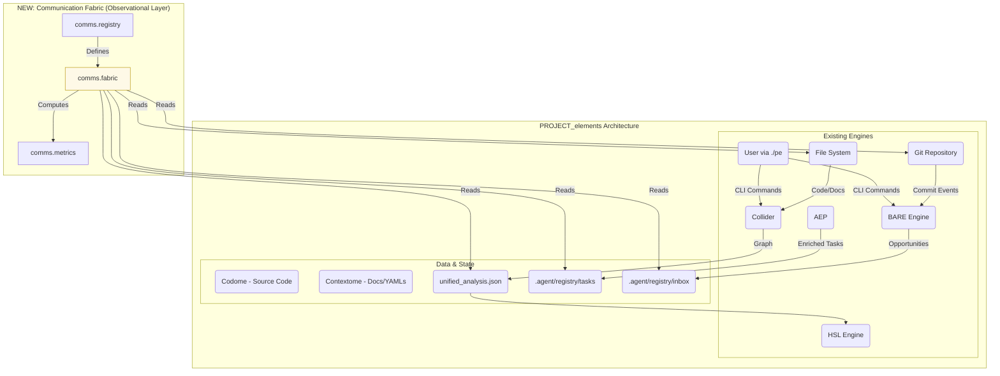

# Communication Architecture Recommendations

**Generated:** 2026-01-26T16:27:35.217283
**Model:** Gemini 2.5 Pro
**Context:** 10 curated files (~17,725 tokens)

---

As the senior software architect for PROJECT_elements, I have reviewed the communication systems analysis and the current architecture. The 82% alignment is a strong foundation, and the gaps identified are primarily in quantification and formalization. This architectural update will introduce the **Communication Fabric**, a new analysis layer designed to fully integrate communication theory, making it as fundamental as the Codome/Contextome duality.

This document outlines the specifications for this update, adhering to the provided constraints.

---

# Architectural Update: The Communication Fabric

## Executive Summary

To elevate PROJECT_elements to 100% alignment with communication theory, we will introduce the **Communication Fabric**. This is not a new runtime engine but an **analytical overlay** that observes, measures, and models the flow of information between existing components (Collider, BARE, HSL, etc.).

This fabric will be implemented as a new subsystem, `.agent/intelligence/comms`, which formalizes the system's channels, messages, and feedback loops. It introduces a suite of quantifiable metrics—Entropy, Channel Capacity, SNR, Redundancy, and Feedback Latency—that transform abstract theoretical concepts into actionable engineering data.

This update will provide a new, powerful lens for understanding system health, identifying bottlenecks, and optimizing the flow of information, enabling novel capabilities in automated governance and architectural validation.

---

## 1. COMMUNICATION LAYER SPECIFICATION

The Communication Fabric is an observational layer that integrates with the existing system without modifying its core components.

### 1.1 Architectural Placement

The fabric operates at the meta-level, treating the outputs of engines like Collider and BARE as messages transmitted over defined channels.



### 1.2 New Modules & Files

The new subsystem will be housed within `.agent/intelligence/`.

-   **`/.agent/intelligence/comms/`**: Root directory for the new subsystem.
    -   **`fabric.py`**: The main orchestrator. Loads registry definitions and coordinates metric calculations across the system.
    -   **`metrics.py`**: Concrete implementations of all communication metrics (Entropy, SNR, etc.).
    -   **`registry.py`**: A loader and validator for the communication model definitions.
-   **`/.agent/registry/comms/`**: Data definitions for the fabric.
    -   **`channels.yaml`**: Formal specification of all communication channels.
    -   **`messages.yaml`**: Registry of all recognized message types.
    -   **`feedback_loops.yaml`**: Definitions of all cybernetic loops for latency tracking.
-   **`/.agent/specs/COMMUNICATION_MODEL.md`**: A human-readable documentation of the communication architecture, derived from the YAML definitions.

### 1.3 Integration with Existing Components

The fabric integrates by observing the artifacts produced and consumed by existing engines.

-   **Collider**: The `unified_analysis.json` is treated as a high-entropy message. The fabric will calculate its information density (entropy) to measure analysis richness.
-   **BARE**: The creation of `OPP-XXX.yaml` files by BARE (triggered by git commits) is a message transmission. The fabric will measure the latency and success rate (SNR) of this `Git -> BARE -> Inbox` channel.
-   **HSL**: HSL violation reports are high-value "Signal" (or "Noise" if ignored). The fabric will parse HSL logs to compute the SNR for architectural governance.
-   **AEP**: The process of enriching an `OPP` to a `TASK` is a feedback loop. The fabric will measure its latency (`F`).
-   **User (`./pe`)**: CLI commands are low-entropy messages. Their frequency can be analyzed from system logs to understand user interaction patterns.

---

## 2. METRICS SCHEMA

These metrics will be implemented in `.agent/intelligence/comms/metrics.py` and provide a quantitative basis for communication health.

| Metric | ID | Scope | Definition | How to Calculate |
| :--- | :- | :--- | :--- | :--- |
| **Entropy** | `H` | Per file, per message type | The measure of information content and unpredictability. `H = -Σ p(x) log₂(p(x))` | For source code (`.py`), `p(x)` is the frequency of AST node types. For structured data (`.yaml`), `p(x)` is the frequency of distinct values. |
| **Channel Capacity** | `C` | Per channel | The theoretical maximum rate of information transfer. | Defined as a benchmarked throughput rate. Git: `commits/day`. Gemini API: `requests/min`. File System: `MB/s`. Stored in `channels.yaml`. |
| **Signal-to-Noise Ratio** | `SNR` | Per domain | The ratio of meaningful, value-adding events (Signal) to wasteful or erroneous events (Noise). | `SNR = Σ(Signal Events) / Σ(Noise Events)`. Signal: Non-reverted commits, completed tasks, passing tests. Noise: Reverted commits, abandoned tasks, HSL violations, new bugs. |
| **Redundancy Index** | `R` | System-wide | The measure of "wasted" bits in a message; can be good (for error correction) or bad (bloat). `R = 1 - H_actual / H_max` | A weighted average of: 1. Code duplication percentage (from a tool like `simian`). 2. Boilerplate ratio in config files. |
| **Feedback Latency** | `F` | Per loop | The time delay between an action and the system's response. | Calculated by parsing timestamps from trigger and response events defined in `feedback_loops.yaml`. E.g., `Timestamp(HSL report) - Timestamp(associated commit)`. |

---

## 3. SIGN TAXONOMY

We will classify all project artifacts to better understand how meaning is conveyed. This will be implemented as a classifier in the fabric and can be used to tag files in analysis outputs.

| Sign Type | Definition | PROJECT_elements Examples | Classification Heuristic |
| :--- | :--- | :--- | :--- |
| **Icon** | The signifier resembles the signified. | - `Mermaid` diagrams in Markdown <br> - `./pe viz` 3D graph output <br> - Traffic-light status indicators in reports | Artifact is primarily for visual representation of structure or state. Check file extensions (`.html`, `.svg`) or content (Mermaid syntax). |
| **Index** | The signifier has a direct, causal link to the signified. | - `Log files` (indicate activity) <br> - `Stack traces` (indicate error cause) <br> - `Git commit hashes` (indicate change provenance) <br> - `Confidence scores` (indicate evidence strength) | Artifact is a machine-generated record of a past event. Look for timestamps, hashes, log formats, or structured metric data. |
| **Symbol** | The relationship is arbitrary and based on convention. | - `Source code` (`class`, `def`) <br> - `File extensions` (`.py`, `.yaml`) <br> - `Identifiers` (`TASK-XXX`, `CARD-ANA-001`) <br> - `Status codes` (`READY`, `COMPLETE`) | Artifact's meaning is defined by a formal language specification, project glossary, or documented convention. This is the default for most of `Codome` and `Contextome`. |

---

## 4. IMPLEMENTATION ROADMAP

### Phase 1: Core Metrics & Scaffolding (2 Sprints)

1.  **Setup**: Create the directory structure (`.agent/intelligence/comms/`, `.agent/registry/comms/`).
2.  **Data Models**: Populate `channels.yaml`, `messages.yaml`, `feedback_loops.yaml` with initial definitions from the existing analysis.
3.  **Implement Metrics**: Code the initial metric calculators in `metrics.py` for **Entropy (H)** and **Feedback Latency (F)**.
4.  **CLI Foundation**: Create `./pe comm report`, a simple command to run H and F calculations on a few hardcoded targets and print the results to stdout.

### Phase 2: Integration & Advanced Metrics (4 Sprints)

1.  **Git Integration**: Enhance the fabric to parse `git log` history.
2.  **Implement SNR**: Develop the Signal vs. Noise event classifiers and implement the SNR calculation over specified time windows.
3.  **Implement Redundancy**: Integrate a code duplication analysis tool (e.g., `pmd-cpd`, `simian`) and build the weighted Redundancy Index (`R`).
4.  **Channel Capacity**: Benchmark key channels (Git, FS) and codify their capacity (`C`) in `channels.yaml`.
5.  **CLI Expansion**: Add subcommands like `./pe comm measure snr --domain=Pipeline`.

### Phase 3: Visualization, Automation & Governance (3 Sprints)

1.  **Dashboard**: Create a rich console dashboard for `./pe comm status`.
2.  **Taxonomy Classifier**: Implement the sign classifier (`./pe comm classify <path>`).
3.  **Reporting**: Automate the generation of weekly communication health reports in Markdown, stored in `.agent/intelligence/metrics/`.
4.  **HSL Integration**: Define communication health thresholds (e.g., `SNR_governance > 10.0`, `F_hsl_loop < 26h`). Add a new HSL rule that triggers a violation if these metrics are breached, making the system self-regulating.

---

## 5. NEW CLI COMMANDS

A new command suite, `./pe comm`, will be the primary user interface for the Communication Fabric.

```bash
# Main dashboard showing key health indicators
./pe comm status

# Generate a detailed Markdown report
./pe comm report --output .agent/intelligence/reports/comm_report_$(date +%Y%m%d).md

# Measure a specific metric for a given target
./pe comm measure entropy --file standard-model-of-code/src/core/full_analysis.py
./pe comm measure snr --domain Governance --period 30d
./pe comm measure latency --loop HSL_Validation_Loop

# Classify artifacts according to the sign taxonomy
./pe comm classify context-management/docs/PROJECTOME.md  # Output: Symbol
./pe comm classify project-map.md                          # Output: Icon (due to Mermaid)
./pe comm classify .logs/bare.log                          # Output: Index

# List registered communication components
./pe comm list channels
./pe comm list messages
./pe comm list loops
```

---

## 6. DATA MODEL

The following YAML schemas will define the communication model in a machine-readable format.

### `/.agent/registry/comms/channels.yaml`

```yaml
# Schema for defining communication channels in PROJECT_elements
channels:
  - id: git_vcs
    description: "Tracks changes to the Codome and Contextome via Git."
    medium: VCS
    capacity:
      value: 20
      unit: commits/day # Based on historical average
    sources: [Human, BARE_Engine]
    receivers: [BARE_Engine, HSL_Engine, Human]
    noise_sources:
      - "Reverted commits"
      - "Commits that break tests"
      - "Style-only commits with no functional change"

  - id: gemini_api
    description: "Communication with Google's Gemini models for analysis and enrichment."
    medium: Network
    capacity:
      value: 10
      unit: requests/min # Hard limit from API provider
    sources: [AEP, BARE_Engine, User]
    receivers: [Gemini_Backend]
    noise_sources:
      - "Rate limiting errors"
      - "Network failures"
      - "Malformed prompts"
      - "Hallucinated or irrelevant responses"
```

### `/.agent/registry/comms/messages.yaml`

```yaml
# Schema for defining message types
messages:
  - id: task_definition
    description: "A structured YAML file defining a unit of work."
    format: YAML
    structure_type: structured
    typical_entropy_range: [0.2, 0.5] # Low entropy due to template
    example_path: ".agent/registry/tasks/TASK-XXX.yaml"

  - id: unified_analysis_graph
    description: "The complete semantic graph of the codebase from the Collider."
    format: JSON
    structure_type: semi-structured
    typical_entropy_range: [0.7, 0.9] # High entropy due to complexity
    example_path: "unified_analysis.json"

  - id: cli_command
    description: "A command issued by a user via the './pe' entrypoint."
    format: Text
    structure_type: structured
    typical_entropy_range: [0.1, 0.3] # Low entropy due to finite grammar
    example_path: null
```

### `/.agent/registry/comms/feedback_loops.yaml`

```yaml
# Schema for defining cybernetic feedback loops
feedback_loops:
  - id: hsl_validation_loop
    description: "Maintains architectural integrity by detecting and reporting drift daily."
    type: Negative # Stabilizing
    trigger_event:
      name: "Daily cron schedule (6AM)"
      measurement_method: "parse_cron_log"
    response_event:
      name: "HSL report generated in .agent/intelligence/drift/"
      measurement_method: "check_file_mtime"
    latency_target:
      value: 24
      unit: hours

  - id: test_suite_loop
    description: "Maintains code correctness by running tests on each commit."
    type: Negative # Stabilizing
    trigger_event:
      name: "Git commit to a feature branch"
      measurement_method: "parse_git_log_for_commit_time"
    response_event:
      name: "CI/CD pipeline test completion"
      measurement_method: "parse_ci_log_for_status_time"
    latency_target:
      value: 10
      unit: minutes
```
