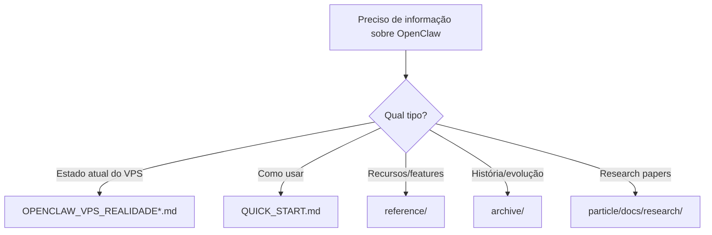

# OpenClaw - Plano de Limpeza de Documentação

**Objetivo:** Uma única fonte de verdade, remover duplicações e informações incorretas.

---

## 📍 Estado Atual

### ✅ FONTE DA VERDADE (Manter)
```
/Users/lech/PROJECTS_all/PROJECT_elements/openclaw-implementation/
└── OPENCLAW_VPS_REALIDADE_2026-02-06.md  ← VERDADE ABSOLUTA
```

### 📦 Mover para /archive (Histórico, não deletar)

```bash
# Docs antigas/incorretas (manter como histórico)
openclaw-implementation/archive/
├── OPENCLAW_NATIVE_FEATURES.md
├── N8N_VS_OPENCLAW.md
├── OPENCLAW_ARCHITECTURE.md
└── docs/
    ├── OPENCLAW_CRITICAL_AUDIT_20260204.md
    ├── COMO_USAR_OPENCLAW.md
    └── OPENCLAW_INSTALL_PIPELINE.md
```

### 📚 Manter (Research - útil como referência)
```
particle/docs/research/perplexity/
├── 20260204_*.md  (25 arquivos de research)
└── openclaw_*.md
```

**Razão:** Research papers são úteis para entender recursos, mesmo que não reflitam configuração atual.

### 🗑️ Deletar ou Consolidar

```bash
# ~/.claude - Consolidar em arquivo único
~/.claude/openclaw-implementation-study.md  → Deletar (coberto pela REALIDADE)
~/.claude/openclaw-native-features-catalog.md → Mover para reference/

# wave/tools/ai/openclaw-implementation - Revisar utilidade
wave/tools/ai/openclaw-implementation/openclaw.json → Comparar com VPS, deletar se igual
wave/tools/ai/openclaw-implementation/00-start/OPENCLAW-PERPLEXITY-GUIDELINES.md → Mover para archive
wave/tools/ai/openclaw-implementation/01-guides/CLAUDE_OPENCLAW_HANDBOOK.md → Atualizar ou deletar
```

---

## 🎯 Estrutura Final Proposta

```
openclaw-implementation/
├── OPENCLAW_VPS_REALIDADE_2026-02-06.md  ← VERDADE (estado atual)
├── QUICK_START.md                         ← Novo (como usar)
├── BACKUP_RESTORE.md                      ← Novo (procedimentos)
├── TROUBLESHOOTING.md                     ← Novo (problemas comuns)
│
├── reference/                             ← Recursos úteis
│   ├── openclaw-native-features-catalog.md
│   ├── model-providers.md
│   └── skills-catalog.md
│
├── archive/                               ← Histórico (read-only)
│   ├── 2026-02-04/
│   │   ├── COMO_USAR_OPENCLAW.md
│   │   ├── OPENCLAW_CRITICAL_AUDIT_20260204.md
│   │   └── OPENCLAW_INSTALL_PIPELINE.md
│   └── research/
│       ├── OPENCLAW_ARCHITECTURE.md
│       └── N8N_VS_OPENCLAW.md
│
└── scripts/                               ← Automação
    ├── backup-openclaw.sh
    ├── restore-openclaw.sh
    ├── health-check.sh
    └── ssh-harden.sh
```

---

## 📋 Ações Necessárias

### 1. Mover para Archive
```bash
cd ~/PROJECTS_all/PROJECT_elements/openclaw-implementation

# Criar estrutura
mkdir -p archive/2026-02-04
mkdir -p archive/research
mkdir -p reference

# Mover docs antigas
mv archive/OPENCLAW_NATIVE_FEATURES.md archive/research/
mv archive/N8N_VS_OPENCLAW.md archive/research/
mv archive/OPENCLAW_ARCHITECTURE.md archive/research/
mv docs/OPENCLAW_CRITICAL_AUDIT_20260204.md archive/2026-02-04/
mv docs/COMO_USAR_OPENCLAW.md archive/2026-02-04/
mv docs/OPENCLAW_INSTALL_PIPELINE.md archive/2026-02-04/
```

### 2. Limpar ~/.claude
```bash
# Mover para reference
mv ~/.claude/openclaw-native-features-catalog.md \
   ~/PROJECTS_all/PROJECT_elements/openclaw-implementation/reference/

# Deletar (coberto pela REALIDADE)
rm ~/.claude/openclaw-implementation-study.md
```

### 3. Revisar wave/tools/ai/openclaw-implementation
```bash
# Comparar config com VPS
diff wave/tools/ai/openclaw-implementation/openclaw.json \
     <(ssh rainmaker cat /root/.openclaw/openclaw.json)

# Se diferente, manter com nota
# Se igual, deletar
```

### 4. Criar Novos Docs
- [ ] QUICK_START.md - Como usar OpenClaw no dia-a-dia
- [ ] BACKUP_RESTORE.md - Procedimentos de backup/restore
- [ ] TROUBLESHOOTING.md - Problemas comuns e soluções

### 5. Atualizar README
- [ ] Criar/atualizar README.md apontando para OPENCLAW_VPS_REALIDADE como fonte

---

## ⚠️ Regras de Manutenção

1. **NUNCA deletar** - Apenas mover para `archive/`
2. **Data nos nomes** - Arquivos de estado devem ter data (YYYY-MM-DD)
3. **Única verdade** - Apenas um arquivo "REALIDADE" por vez
4. **Archive imutável** - Nunca editar `archive/`, apenas adicionar
5. **Reference estável** - Docs em `reference/` são recursos atemporais

---

## 🔍 Como Saber o Que é Verdade



**Prioridade:**
1. `OPENCLAW_VPS_REALIDADE_*.md` ← VERDADE sobre estado atual
2. `QUICK_START.md` ← Operações do dia-a-dia
3. `reference/` ← Recursos e features
4. `archive/` ← História e evolução
5. `particle/docs/research/` ← Research papers

---

## ✅ Checklist de Execução

- [ ] Criar estrutura de diretórios (archive/, reference/, scripts/)
- [ ] Mover docs antigas para archive/2026-02-04/
- [ ] Mover research para archive/research/
- [ ] Mover openclaw-native-features para reference/
- [ ] Limpar ~/.claude
- [ ] Revisar wave/tools/ai/openclaw-implementation/
- [ ] Criar QUICK_START.md
- [ ] Criar BACKUP_RESTORE.md
- [ ] Criar TROUBLESHOOTING.md
- [ ] Atualizar/criar README.md
- [ ] Verificar que REALIDADE é a única verdade

---

## 🎓 Lição Aprendida

**Problema:** Múltiplas "fontes de verdade" desincronizadas
**Solução:**
- Uma única verdade: `OPENCLAW_VPS_REALIDADE_*.md`
- Histórico preservado: `archive/`
- Recursos atemporais: `reference/`
- Nunca deletar, sempre arquivar

**Regra de Ouro:** Quando o estado real diverge da documentação, **atualize a doc, não ignore a realidade**.

---

Data: 2026-02-06
Autor: Claude Opus 4.6
Status: Pendente execução
