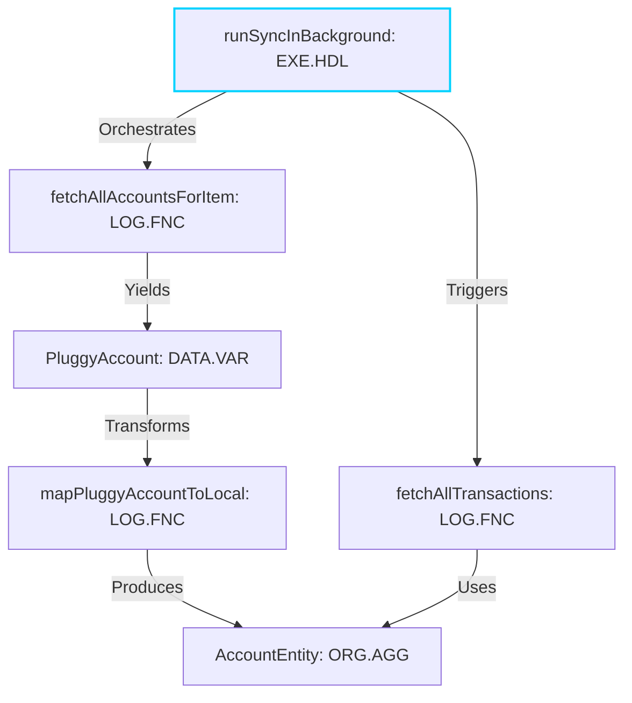

# Standard Model for Computer Language (Spectrometer)

**A Unified Scientific Notation for Software Architecture**


The **Spectrometer** is an instrument for analyzing codebases using a standardized, polyglot taxonomy. It converts raw code into **Semantic IDs**—self-describing identifiers that encode architectural role, behavior, and quality signals into a format optimized for both human understanding and LLM consumption.

---

## 🏗️ The "Single Truth" Architecture

To ensure reproducible science, every analysis run is governed by a strict configuration contract.

### 1. The Contract (Config Versioning)
Every run generates a unique **Config Hash** based on the exact combination of:
- **Taxonomy Version**: The ontology definition (currently `1.1.0`).
- **Ruleset Version**: The heuristic logic (currently `2025.12.20-Confidence`).
- **Runtime Settings**: Strict mode, LLM enablement, etc.

This hash matches the output artifacts to the exact engine state that produced them, enabling auditability.

### 2. The Taxonomy (Two-Tier Ontology)
We employ a two-tier classification system to balance stability with granularity:

*   **Tier 1: Canonical Types (30 Roles)**  
    The stable, universal architectural vocabulary (e.g., `Controller`, `Entity`, `Repository`, `ValueObject`). These 30 types map across all languages and frameworks.
    
*   **Tier 2: Atomic Constructs (167 Atoms)**  
    The fine-grained syntax elements (e.g., `ClassDecorator`, `FunctionDefinition`, `ImportFrom`). These are the raw building blocks that the engine aggregates into canonical types.

### 3. Semantic IDs
The core output is a list of Semantic IDs. Unlike opaque identifiers (e.g., `func_123`), these are self-contained knowledge packets:

```text
ORG.AGG.M|dddpy.domain.model|TodoItem|confidence:95|smell:god_class=20.5|mutable:true|bases:1|a5f2
```

| Segment | Value | Meaning |
|:---|:---|:---|
| **Classification** | `ORG.AGG.M` | **Org**anization continent, **Agg**regate fundamental, **M**olecule level. |
| **Location** | `dddpy.domain.model` | The fully qualified path (file/module). |
| **Name** | `TodoItem` | The entity name. |
| **Confidence** | `confidence:95` | The engine's certainty (0-100) based on signal strength. |
| **Quality** | `smell:god_class=20.5` | Architectural smells detected (e.g., God Class risk score). |
| **Properties** | `mutable:true` | Behavioral and structural attributes. |

---

## 🚀 Quick Start

### Installation

```bash
git clone https://github.com/leolech14/standard-model-for-computer-language.git
cd standard-model-for-computer-language
pip install -r requirements.txt
```

### Usage

**1. Full Audit (Recommended)**
Run the complete health check and analysis pipeline. reliable for verifying system state.
```bash
python3 cli.py audit /path/to/target_repo
```

**2. Standard Analysis**
Analyze a repository and generate reports.
```bash
python3 cli.py analyze /path/to/target_repo
```

**Output:**
Results are saved to `output/learning/` (or `output/audit/`), containing:
- `LEARNING_SUMMARY.md`: High-level executive report.
- `semantic_ids.json`: The raw dataset of generated Semantic IDs.
- `graph.json`: The architectural dependency graph.

---

## 🧠 Heuristics & Scoring

The engine uses a weighted scoring system to assign types with confidence:

| Signal Source | Confidence | Description |
|:---|:---:|:---|
| **High Fidelity** | **95%** | Tree-sitter exact matches, explicit decorators (e.g., `@fastapi.post`, `@dataclass`). |
| **Naming Convention** | **70%** | Strong naming patterns (e.g., `UserController`, `PaymentRepository`). |
| **Structural** | **60%** | Shape-based guessing (e.g., Class with `id` field ≈ Entity). |
| **Fallback** | **50%** | Default classification based on syntax type only. |

### Smell Dimensions
We treat architectural smells (like **God Class**) not as separate types but as dimensional attributes. A class can be an `Entity` and also have a `god_class` score of 85.0, preserving its architectural identity while flagging its quality issues.

---

## 🗺️ The Standard Model (4 Continents)

The taxonomy organizes all code into 4 "Continents":

1.  **DATA (The Foundation)**: Primitives, Variables, Constants.
2.  **LOGIC (The Flow)**: Functions, Control Structures, Expressions.
3.  **ORGANIZATION (The Structure)**: Classes, Modules, Packages, Namespaces.
4.  **EXECUTION (The Runtime)**: Threads, Handlers, Entry Points, Probes.

---

## 💡 Use Cases

### 1. Architectural Audits
Instantly visualize the structural integrity of a codebase. Identify "Antimatter" (God Classes), circular dependencies, and layer violations (e.g., Domain Logic importing Infrastructure).

### 2. Legacy Migration
When moving a monolith to microservices, use Spectrometer to identify **Seams**—natural boundaries where modules are decoupled. The `SemanticID` graph makes these seams explicit.

### 3. LLM Context Optimization
Raw code is expensive to tokenize. Semantic IDs provide a **lossy compression** of the entire codebase structure (reducing token count by ~95%) while preserving the architectural relationships needed for reasoning.

---

## 🕸️ Visualizing the Graph (Mapping & Optimization)

The engine produces a `graph.json` that maps the codebase as a directed graph:
- **Nodes**: Semantic IDs (Classes, Functions, Modules).
- **Edges**: Dependencies (Imports, Inheritance, Calls).

### Optimization Strategy
By mapping the graph, you can target optimization efforts:
*   **High Fan-In Nodes**: Critical infrastructure; optimize for stability.
*   **High Complexity + High Churn**: Refactoring targets ("Hotspots").
*   **God Classes**: Nodes with excessive `smell:god_class` scores (>70) should be split to reduce cognitive load.

### Example: Project Atman (Financial Sync Engine)
mapped from `output/atman_current/graph.json`:



---

## Contributing

This is an open scientific instrument. We welcome contributions to refine the taxonomy (`patterns/canonical_types.json`) or improve language support in the `TreeSitterUniversalEngine`.

**License**: MIT
