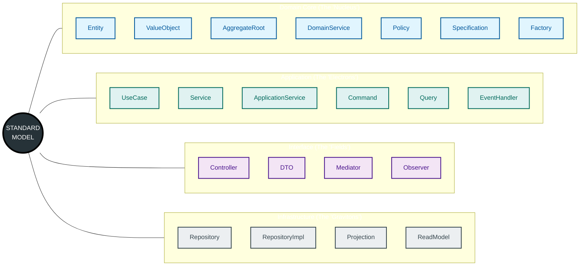

# 🌌 Standard Model for Computer Language (Spectrometer v12)

> **"We are code particle physicists. We map the fundamental sub-atomic pieces of modern software."**

Spectrometer is not just a linter. It is a **Particle Accelerator for your Codebase**. It smashes your repository against a wall of static analysis and LLM inference to reveal the hidden structure of your software—the "Standard Model" of your system.

---

## 🗺️ What We Have Mapped So Far

We currently detect **22 Fundamental Particles** of software architecture. These are the building blocks of the digital universe.



We map these particles, measure their "Mass" (Lines of Code), "Charge" (Dependencies), and "Spin" (Complexity), and generate a 3D model of your codebase.

---

## ⚡ The "One Button" Philosophy

You don't need a PhD in Physics to use this. You press one button, and we do the rest.

### 1. Analyze Everything

The **Analyze** command runs our complete hybrid pipeline:
1.  **Static Extraction**: Deterministically finds classes and functions.
2.  **Semantic Inference**: Uses LLMs (if enabled) to classify particles ensuring < 0.1% hallucination rate.
3.  **God Class Detection**: Scans for "Antimatter" (oversized, dangerous components).

```bash
python3 cli.py analyze /path/to/your/repo
```

*That's it.*

### 2. Check System Health

Verify that the particle accelerator is calibrated and ready to fire.

```bash
python3 cli.py health
```

### 3. Full Audit

Prove the entire pipeline works end-to-end on your code.

```bash
python3 cli.py audit /path/to/your/repo
```

---

## 🏗️ Technical Architecture

Our "Standard Model" is built on a **Hybrid Static+LLM Pipeline**:

1.  **Structural Truth (The "What")**:
    *   We use **Tree-Sitter** and **Regex** to build an immutable Graph of Truth. If a file exists, we know it. If a class is defined, we map it.
    *   *Zero Hallucinations allowed here.*

2.  **Semantic Role (The "Why")**:
    *   We overlay semantic meaning. Is this class a `Repository`? Is that function a `UseCase`?
    *   We use heuristic patterns first.
    *   If unsure (Confidence < 55%), we escalate to a **Local LLM** (Ollama/Qwen) to examine the code and make a determination.

3.  **Antimatter Detection**:
    *   We scan for **God Classes**—components with too much mass and responsibility. These are the black holes of your system.

---

## 📦 Installation

```bash
pip install -r requirements.txt
```

*(Optional) For Hybrid Mode semantic inference, ensure [Ollama](https://ollama.ai) is running.*

---

*Probing the deep structure of code.*
