# Collider: The Standard Model of Code

> **Analyze any codebase. Get a complete semantic map. Detect violations. Predict missing components.**

Collider turns source code into **structured knowledge** by mapping every element to a universal schema. Think of it as "running a physics experiment" on your codebase.

---

## 💡 The Core Idea

**Software has physics.**

Just like matter is made of atoms, code is made of **167 fundamental building blocks** (Atoms). These atoms combine to form **Roles** (like Repository, Entity, Service), which organize into **Layers** (Domain, Infrastructure, Application).

When you run Collider, it:
1. **Parses** your code into atoms
2. **Classifies** them into roles
3. **Maps** architectural layers
4. **Detects** violations of design laws
5. **Predicts** missing components
6. **Generates** an interactive visualization

**The result?** A complete, navigable map of what your code *is*, what it *does*, and where it *violates* best practices.

---

## 🎯 Why Use Collider?

### For Code Audits
- **100% coverage**: Every file, class, and function is classified
- **Instant architecture diagram**: See the system from 30,000 feet
- **Violation detection**: Find "impossible states" (e.g., Domain depending on Infrastructure)

### For Understanding Legacy Code
- **Semantic search**: Find all "Repositories" or "Controllers" instantly
- **Dead code detection**: Identify unreachable functions
- **Dependency analysis**: Trace execution flows

### For Refactoring
- **Gap analysis**: "You have 20 Entities but only 2 Repositories—predict the missing 18"
- **Actionable insights**: Get specific recommendations (e.g., "Apply Repository Pattern here")
- **Performance hotspots**: Identify computational bottlenecks

---

## 🚀 Quick Start

### Installation
```bash
git clone https://github.com/leolech14/standard-model-of-code.git
cd standard-model-of-code
pip install .
```

### Run Analysis
```bash
collider analyze /path/to/your/code
```

**Output:**
- `proof_output.json` — Complete analysis data
- `collider_report.html` — Interactive visualization (open in browser)

### View Results
```bash
open collider_report.html
```

You'll see an **interactive graph** where:
- **Nodes** = classes, functions, modules (colored by layer, sized by complexity)
- **Edges** = calls, imports, inheritance (colored by type)
- **Filters** = Show only "Repositories" or "Domain" layer

---

## ⚡ What Makes This Different?

### 🧠 Self-Learning System

**Collider gets smarter over time.**

Every analysis generates feedback. When classification errors are detected, the system automatically:
1. Learns patterns from failures
2. Updates its knowledge base permanently
3. Applies improvements to all future runs

**Real example:** After analyzing Pydantic, accuracy jumped from 48.6% → 93.7% (+45.1%) in one iteration by learning that path context (`/tests/`) is more reliable than naming patterns.

→ Check [`docs/LEARNING_LEDGER.md`](docs/LEARNING_LEDGER.md) for the complete history

### 💾 Information Maintenance Guarantee

**No data is lost during transformation.**

Every node preserves:
- Complete source code (`body_source` field)
- Full type system (params, returns, decorators)
- Documentation and metrics
- Exact location (file + line numbers)
- All relationships (calls, imports, inheritance)

**Why this matters:** You can reconstruct the original codebase from the graph, enabling semantic diff, LLM-based refactoring, and architectural analysis without losing implementation details.

→ See [`docs/CANONICAL_SCHEMA.md`](docs/CANONICAL_SCHEMA.md) for technical specification

---

## 🗺️ Roadmap: Bidirectional Transformations

Collider's Information Maintenance Guarantee enables powerful future capabilities:

### 1. Bidirectional Code Analysis

```mermaid
graph LR
    CODE1[["📁 Source Code"]] -->|"collider analyze"| COLLIDER["🔬 Collider"]
    COLLIDER --> GRAPH[("🗺️ Graph<br/>Nodes + Edges")]
    GRAPH -.->|"collider generate<br/>(Future)"| GEN["🔨 Generator"]
    GEN -.-> CODE2[["📁 Code"]]
    
    classDef implemented fill:#047857,stroke:#065f46,stroke-width:3px,color:#fff
    classDef future fill:#d97706,stroke:#b45309,stroke-width:2px,stroke-dasharray:5 5,color:#fff
    
    class CODE1,COLLIDER,GRAPH implemented
    class GEN,CODE2 future
```



**Status:** ✅ Analysis implemented (82.4% accuracy) | ⏳ Generation future

### 2. LLM-Driven Architecture Generation

```mermaid
graph LR
    PROMPT[["💬 Prompt<br/>'Build a DDD app'"]] -.->|"collider create<br/>(Future)"| LLM["🤖 LLM"]
    LLM -.-> GRAPH[("🗺️ Graph<br/>Auto-Generated")]
    GRAPH -.-> GEN["🔨 Generator"]
    GEN -.-> CODE[["📁 Full Codebase"]]
    
    classDef future fill:#d97706,stroke:#b45309,stroke-width:2px,stroke-dasharray:5 5,color:#fff
    
    class PROMPT,LLM,GRAPH,GEN,CODE future
```



**Status:** ⏳ Future feature (enabled by lossless schema)

**Why this matters:** Because every node preserves complete source code and metadata, the graph can serve as:
- Input to LLMs for semantic refactoring
- Foundation for architecture-first development
- Bidirectional bridge between design and implementation

---

---

## 📐 The Schema (What You Get)

Every codebase is reduced to a **graph**: `(Nodes, Edges, Metadata)`

### Node Fields

#### Required (Always Present)
```json
{
  "id": "user.py:UserRepository",
  "name": "UserRepository",
  "kind": "class"
}
```

#### Classification (Added by Analysis)
```json
{
  "role": "Repository",
  "role_confidence": 0.95,
  "layer": "Infrastructure"
}
```

#### Enrichment (Optional)
```json
{
  "is_orphan": false,
  "is_hotspot": true,
  "complexity": 12,
  "docstring": "Handles user persistence..."
}
```

**All fields:** See [CANONICAL_SCHEMA.md](docs/CANONICAL_SCHEMA.md)

### Edge Fields
```json
{
  "source": "UserService",
  "target": "UserRepository",
  "edge_type": "CALLS"
}
```

**Edge types:** `CALLS`, `IMPORTS`, `INHERITS`, `IMPLEMENTS`, `CONTAINS`

---

## ⚙️ The Pipeline (How It Works)

Collider runs **10 stages** in strict order (reordering breaks analysis):

```
Stage 1: Classification   → Extract atoms (167 types)
Stage 2: Role Distribution → Detect semantic roles (Repository, Entity, etc.)
Stage 3: Antimatter        → Check for violations (cross-layer imports, etc.)
Stage 4: Predictions       → Predict missing components (symmetry)
Stage 5: Insights          → Generate actionable recommendations
Stage 6: Purpose Field     → Map architectural layers
Stage 7: Execution Flow    → Trace code paths, find dead code
Stage 8: Performance       → Identify hotspots
Stage 9: Summary           → Aggregate metrics
Stage 10: Visualization    → Generate interactive HTML
```

**Why this order?** Each stage depends on the output of previous stages. See [THEORY_MAP.md](docs/THEORY_MAP.md) for proof of dependencies.

---

## 📊 Interpreting the Output

### 1. The JSON Report (`proof_output.json`)

**Key sections:**

#### `classification`
```json
{
  "total_nodes": 245,
  "role_distribution": {
    "Repository": 8,
    "Entity": 12,
    "Service": 5,
    "Controller": 3
  },
  "coverage_percent": 98.5,
  "average_confidence": 87.3
}
```
→ **Read:** "245 code elements classified with 98.5% coverage, avg confidence 87%"

#### `antimatter.violations`
```json
[
  {
    "law": "NO_CROSS_LAYER_IMPORT",
    "particle": "User",
    "message": "Domain Entity imports Infrastructure"
  }
]
```
→ **Read:** "Found a violation: User (Domain) depends on Infrastructure layer"

#### `predictions`
```json
[
  "Missing ~6 Repositories for 12 Entities",
  "Missing ~8 Tests for 5 Services"
]
```
→ **Read:** "You should have 6 more Repositories and 8 more Tests based on symmetry"

#### `insights`
```json
{
  "count": 4,
  "items": [
    {
      "priority": "high",
      "title": "God Class Detected",
      "recommendation": "Apply Single Responsibility Principle"
    }
  ]
}
```
→ **Read:** "4 actionable insights, starting with 'God Class' (high priority)"

---

### 2. The Visualization (`collider_report.html`)

**Features:**
- **Force-directed graph**: Nodes repel, edges attract (organic layout)
- **Color coding**: Layers have distinct colors (Domain=green, Infrastructure=blue)
- **Interactive**: Click nodes for details, drag to reposition, zoom/pan
- **Filters**: Show/hide by role, layer, or complexity

**Example:**
- Large red nodes = High complexity
- Orange border = Hotspot (performance-critical)
- Isolated nodes = Orphans (dead code)

---

## 🧬 What Collider Detects

### 1. The 167 Atoms
Every code element maps to one of 167 structural types, organized in 4 phases:

- **DATA** (26): `Entity`, `ValueObject`, `DTO`, `Enum`
- **LOGIC** (61): `Query`, `Command`, `Validator`, `Mapper`
- **ORGANIZATION** (45): `Repository`, `Service`, `Factory`
- **EXECUTION** (35): `Handler`, `Middleware`, `CronJob`

**Full list:** [ATOMS_REFERENCE.md](docs/ATOMS_REFERENCE.md)

---

### 2. The 27 Canonical Roles
Atoms group into semantic roles that describe *what it does*:

| Role | Purpose | Example |
|------|---------|---------|
| `Repository` | Data persistence abstraction | `UserRepository` |
| `Entity` | Domain object with identity | `User`, `Order` |
| `Service` | Business logic coordinator | `UserService` |
| `Controller` | HTTP request handler | `UserController` |
| `Query` | Read-only data retrieval | `GetUserById` |
| `Command` | State-changing operation | `CreateUser` |

**See all 27:** [PURPOSE_FIELD.md](docs/PURPOSE_FIELD.md)

---

### 3. Architectural Layers
Roles belong to architectural layers:

| Layer | Responsibility | Example Roles |
|-------|----------------|---------------|
| **Domain** | Business rules, entities | Entity, ValueObject, DomainService |
| **Application** | Use cases, workflows | Service, UseCase, ApplicationService |
| **Infrastructure** | External I/O | Repository, Gateway, APIClient |
| **Presentation** | UI, controllers | Controller, ViewModel, Presenter |

---

### 4. Antimatter Violations
The "Laws of Code Physics" define **impossible states**:

```
❌ Domain Entity imports Infrastructure (layer violation)
❌ Query has side effects (role violation)
❌ Repository has no interface (abstraction violation)
❌ Service has no tests (coverage violation)
```

When detected, Collider flags them with severity (CRITICAL, HIGH, MEDIUM, LOW).

---

### 5. Predictions (Symmetry)
If the system has patterns, Collider predicts missing components:

**Example:**
```
Found: User, Order, Product (3 Entities)
Found: UserRepository, OrderRepository (2 Repositories)

PREDICTION: ProductRepository is MISSING
→ Recommendation: Create ProductRepository to maintain symmetry
```

---

## 📚 Advanced Documentation

| Document | Description |
|----------|-------------|
| [THEORY_MAP.md](docs/THEORY_MAP.md) | How theories mount on each other (dependency proof) |
| [CANONICAL_SCHEMA.md](docs/CANONICAL_SCHEMA.md) | Complete field reference |
| [ATOMS_REFERENCE.md](docs/ATOMS_REFERENCE.md) | All 167 atoms |
| [PURPOSE_FIELD.md](docs/PURPOSE_FIELD.md) | Purpose emergence theory |
| [FORMAL_PROOF.md](docs/FORMAL_PROOF.md) | Mathematical completeness proof |
| [MECHANIZED_PROOFS.md](docs/MECHANIZED_PROOFS.md) | Machine-verified theorems (Lean 4) |

---


## 🧩 Contextual Topology Discovery: The "100% Coverage" Breakthrough

How does Collider achieve **100% atomic coverage** without hallucinating?

**The profound realization:** Code has **Topology** (Where it lives) and **DNA** (What it inherits) that is stronger than its **Name**.

We discovered a 4-Tier Classification Strategy that proves **Structure > Syntax**:

1. **Tier 0: Framework Signatures (Decorators)**
   - Methods decorated with `@app.get` are **Controllers**.
   - Functions with `@pytest.fixture` are **Configuration**.
   - *The framework explicitly defines the role.*

2. **Tier 1: Inheritance (DNA)**
   - Inherits from `BaseModel`? It is a **DTO** (Data Transfer Object).
   - Inherits from `ListView`? It is a **Controller**.
   - *Ancestry defines behavior definitively.*

3. **Tier 2: Topological Context (The "Silent Killer" of Unknowns)**
   - File inside `/tests/`? Everything in it is a **Test**.
   - File inside `/utils/`? It is a **Utility**.
   - File inside `/domain/entities/`? It is an **Entity**.
   - *This layer captures ~80% of "unknowns". Directory structure is a semantic language.*

4.  **Tier 3: Naming (The Regex Patterns)**
    - Only if the above fail do we check for `get_` (Query) or `set_` (Command).

**The Result:** We didn't need to learn new names because the **Context** provided the definition. The Standard Model holds true because `Structure + Behavior > Syntax`.

---

## 🔬 Empirical Validation

| Metric | Value |
|--------|-------|
| Repositories tested | **91** (from `repos_v2` benchmark) |
| Nodes classified | **270,000+** |
| Coverage | **100%** (0 unknowns) |
| Accuracy (overall) | 99.2% |
| Accuracy (high-confidence) | 99.9% |
| Speed | 1,860 nodes/sec |
| Scale Tested | Up to 100k+ nodes (`pytorch`, `diffusers`) |

**The claim:** Any code element can be mapped to semantic coordinates without LLMs.
**The proof:** 270k+ elements across 91 repos with 100% coverage.

---

## 🛠️ CLI Reference

### `collider analyze`
Run full analysis pipeline (10 stages)
```bash
collider analyze /path/to/code
```

### `collider audit`
Health check (verifies system integrity)
```bash
collider audit
```

### `collider viz`
Regenerate visualization from existing JSON
```bash
collider viz proof_output.json
```

---

## 🎓 The Philosophical Claim

> **Software has LAWS, like physics.**

- **Conservation of Symmetry**: If you have Entities, you need Repositories
- **Layer Separation**: Domain cannot depend on Infrastructure
- **Role Purity**: A Query cannot have side effects

Violations are not "code smells"—they are **IMPOSSIBLE STATES**.

Purpose flows through architecture like energy through a system.

**This makes software engineering a SCIENCE, not an ART.**

---

## 📖 Example Workflow

```bash
# 1. Analyze a codebase
cd my-project
collider analyze .

# 2. Review the output
cat proof_output.json | jq '.insights'

# 3. Open visualization
open collider_report.html

# 4. Filter to "Repositories"
# (in browser: use the UI filter dropdown)

# 5. Find violations
cat proof_output.json | jq '.antimatter.violations'
```

---

## 🤝 Contributing

See [CONTRIBUTING.md](CONTRIBUTING.md) (coming soon)

---

## 📄 License

MIT

---

*"The periodic table of code. Every element has a purpose. Every purpose has a place."*
