# Collider: The Standard Model of Code Particles

> **Analyze any codebase. Get a complete semantic map. Detect violations. Predict missing components.**

---

## 🏛️ Two Pillars

This project has two sides. Pick your path:

| Pillar | Purpose | Start Here |
|--------|---------|------------|
| **📚 THEORY** | Understand the model | [`docs/THEORY_MAP.md`](docs/THEORY_MAP.md) |
| **🔧 TOOL** | Use or develop Collider | [`CLAUDE.md`](CLAUDE.md) |

### Theory (The "Why")
The **Standard Model of Code** is a theoretical framework that treats code like physics:
- **Atoms**: 167 structural types (Entity, Repository, Service...)
- **Dimensions**: 8-dimensional classification (RPBL + 4 more)
- **Layers**: Architectural strata (Domain, Infrastructure, Application...)

→ Go to [`docs/`](docs/) to explore the theory.

### Tool (The "How")
**Collider** is the implementation that applies the theory:
```bash
./collider full /path/to/repo --output /tmp/analysis
```
→ Go to [`src/core/`](src/core/) to develop the tool.

---

## 🤖 FOR AI: The Missing Semantic Layer

> **"CODE IS NOT TEXT. CODE IS ARCHITECTURE."**

**The Problem**: When codebases reach medium size, AI loses coherent understanding. LLMs see code as tokens to predict, not architecture to reason about.

**The Solution**: The Standard Model provides a **semantic scaffold** that gives AI:
- Structural understanding at every scale (16 levels from Bit to Universe)
- 8-dimensional classification of every code entity
- Graph relationships, not just file contents  
- Architectural reasoning, not text prediction

**The Vision**: With this model, AI thinks about your application as an **engineer/architect**, not as a **writer/typist**.

| AI Without Standard Model | AI With Standard Model |
|---------------------------|------------------------|
| Sees tokens | Sees structure |
| Predicts next text | Understands purpose |
| Loses context at scale | Maintains coherent graph |
| "Writer's view" | "Architect's view" |

---

## 🧠 The Intelligence Suite (NEW)

Collider includes a **4-Lens Intelligence System** that transforms raw metrics into actionable insights:

### The Four Lenses

| Lens | Question | Output |
|------|----------|--------|
| **Mirror** (Topology) | "What shape am I?" | `STAR_HUB`, `MESH`, `ISLANDS` |
| **Translator** (Semantics) | "What domain do I speak?" | `Finance`, `DevTools`, `Ops` |
| **Possibility** (Strategy) | "What could I become?" | Architectural potentials |
| **Win** (Prescription) | "What do I unlock?" | Step-by-step recipes |

### Quick Start

```bash
# Full analysis with all lenses
./collider full /path/to/repo --output /tmp/analysis

# View the report
cat /tmp/analysis/output.md
```

### Sample Output

```markdown
## VISUAL REASONING (The 'Shape')
**Overall Shape**: `STAR_HUB`
Dominated by central hub 'SchemaRepository.get' (Star Topology).

## DOMAIN CONTEXT (Business Meaning)
**Inferred Domain**: `Finance/FinTech`

## ACTIONABLE IMPROVEMENTS
### 1. [CRITICAL] Untangle Dependency Cycles
**Target**: `Modules`
**Prescription**:
1. Apply Dependency Inversion Principle
2. Extract shared interfaces to a neutral package
```

---

## 💡 The Core Idea


**Standardized consistency at scale.**

Using the physics analogy: just as matter can be modeled as atoms, **Collider employs an empirically validated schema** to map code into **atomic base components**. These map to a set of **Canonical Roles** (like Repository, Entity, Service), which organize into **Layers** (Domain, Infrastructure, Application).

When you run Collider, it:
1. **Parses** your code into atoms
2. **Classifies** them into roles
3. **Maps** architectural layers
4. **Detects** violations of architectural rules
5. **Predicts** missing components
6. **Generates** an interactive visualization

**The result?** A complete, navigable map of what your code *is*, what it *does*, and where it *deviates* from best practices.

### The "User Repository" Story: A Concrete Example

To understand how Collider works, let's look at a common scenario:

1.  **Input**: You have a file `user_repo.py` containing a class `UserRepository`.
2.  **Analysis**: Collider decomposes it into atomic units (methods, types).
3.  **Classification**: Based on its inheritance and location, it is identified as a **Repository** (Role) belonging to the **Infrastructure** (Layer).
4.  **Detection**: If this class imports a `Domain` entity directly but violates dependency inversion, Collider flags it as a **"Cross-Layer Violation"**. This isn't just a linter error; it's an architectural insight based on the system's topology.

---

## 🔬 Evidence for a Standard Model

Before asking you to believe in the theory, here is the evidence that code follows structural principles:

| Metric | Value |
|--------|-------|
| Repositories tested | **91** (from `repos_v2` benchmark) |
| Nodes classified | **270,000+** |
| Coverage | **100%** (0 unknowns) |
| Accuracy (overall) | 99.2% |
| Accuracy (high-confidence) | 99.9% |
| Speed | 1,860 nodes/sec |
| Scale Tested | Up to 100k+ nodes (`pytorch`, `diffusers`) |

**The Hypothesis:** Most "unknown" code in large projects actually follows strict topological and structural patterns.
**The Result:** By mapping these patterns (Context + Inheritance), we achieved 100% classification coverage across 91 diverse repositories without relying on AI guessing.

---

## 🎯 Why Use Collider?

### For Code Audits
- **100% coverage**: Every file, class, and function is classified
- **Instant architecture diagram**: See the system from 30,000 feet
- **Violation detection**: Find "invalid states" (e.g., Domain depending on Infrastructure)

### For Understanding Legacy Code
- **Semantic search**: Find all "Repositories" or "Controllers" instantly
- **Dead code detection**: Identify unreachable functions
- **Dependency analysis**: Trace execution flows

### For Refactoring
- **Gap analysis**: "You have 20 Entities but only 2 Repositories—predict the missing 18"
- **Actionable insights**: Get specific recommendations (e.g., "Apply Repository Pattern here")
- **Performance hotspots**: Identify computational bottlenecks

---

## 🚀 Quick Start

### Installation
```bash
git clone https://github.com/leolech14/standard-model-of-code.git
cd standard-model-of-code
pip install .
```

### Run Analysis
```bash
collider analyze /path/to/your/code
```

**Output:**
- `proof_output.json` — Complete analysis data
- `collider_report.html` — Interactive visualization (open in browser)

### View Results
```bash
open collider_report.html
```

You'll see an **interactive graph** where:
- **Nodes** = classes, functions, modules (colored by layer, sized by complexity)
- **Edges** = calls, imports, inheritance (colored by type)
- **Filters** = Show only "Repositories" or "Domain" layer

---

## ⚡ What Makes This Different?

### 🧠 Deterministic Analysis
We initially built an AI learning engine but discovered that it was unnecessary for structural analysis. Code structures tend to follow predictable patterns (Topology, Inheritance, Frameworks). By mapping these patterns, we achieve **100% coverage** in our benchmarks without the hallucination risks of LLMs.

**Real example:** We achieved 100% coverage on large repos like `pytorch` not by "learning" new names, but by discovering that 80% of "unknown" code lives in semantically structured directories (like `/tests/` or `/utils/`).

→ Read about this discovery: [`docs/THE_PIVOT.md`](docs/THE_PIVOT.md)

### 💾 Information Maintenance Guarantee
**No data is lost during transformation.**

Every node preserves:
- Complete source code (`body_source` field)
- Full type system (params, returns, decorators)
- Documentation and metrics
- Exact location (file + line numbers)
- All relationships (calls, imports, inheritance)

**Why this matters:** You can reconstruct the original codebase from the graph, enabling semantic diff, LLM-based refactoring, and architectural analysis without losing implementation details.

→ See [`docs/CANONICAL_SCHEMA.md`](docs/CANONICAL_SCHEMA.md) for technical specification

---

## 🗺️ Roadmap: Bidirectional Transformations

Collider's Information Maintenance Guarantee enables powerful future capabilities:

### 1. Bidirectional Code Analysis

```mermaid
graph LR
    CODE1[["📁 Source Code"]] -->|"collider analyze"| COLLIDER["🔬 Collider"]
    COLLIDER --> GRAPH[("🗺️ Graph<br/>Nodes + Edges")]
    GRAPH -.->|"collider generate<br/>(Proposed)"| GEN["🔨 Generator"]
    GEN -.-> CODE2[["📁 Code"]]
    
    classDef implemented fill:#047857,stroke:#065f46,stroke-width:3px,color:#fff
    classDef future fill:#d97706,stroke:#b45309,stroke-width:2px,stroke-dasharray:5 5,color:#fff
    
    class CODE1,COLLIDER,GRAPH implemented
    class GEN,CODE2 future
```



**Status:** ✅ Analysis implemented (82.4% accuracy) | ⏳ Generation future

### 2. LLM-Driven Architecture Generation

```mermaid
graph LR
    PROMPT[["💬 Prompt<br/>'Build a DDD app'"]] -.->|"collider create<br/>(Proposed)"| LLM["🤖 LLM"]
    LLM -.-> GRAPH[("🗺️ Graph<br/>Auto-Generated")]
    GRAPH -.-> GEN["🔨 Generator"]
    GEN -.-> CODE[["📁 Full Codebase"]]
    
    classDef future fill:#d97706,stroke:#b45309,stroke-width:2px,stroke-dasharray:5 5,color:#fff
    
    class PROMPT,LLM,GRAPH,GEN,CODE future
```



**Status:** ⏳ Future feature (enabled by lossless schema)

**Why this matters:** Because every node preserves complete source code and metadata, the graph can serve as:
- Input to LLMs for semantic refactoring
- Foundation for architecture-first development
- Bidirectional bridge between design and implementation

---

---

## 📐 The Schema (What You Get)

Every codebase is reduced to a **graph**: `(Nodes, Edges, Metadata)`

### Node Fields

#### Required (Always Present)
```json
{
  "id": "user.py:UserRepository",
  "name": "UserRepository",
  "kind": "class"
}
```

#### Classification (Added by Analysis)
```json
{
  "role": "Repository",
  "role_confidence": 0.95,
  "layer": "Infrastructure"
}
```

#### Enrichment (Optional)
```json
{
  "is_orphan": false,
  "is_hotspot": true,
  "complexity": 12,
  "docstring": "Handles user persistence..."
}
```

**All fields:** See [CANONICAL_SCHEMA.md](docs/CANONICAL_SCHEMA.md)

### Edge Fields
```json
{
  "source": "UserService",
  "target": "UserRepository",
  "edge_type": "CALLS"
}
```

**Edge types:** `CALLS`, `IMPORTS`, `INHERITS`, `IMPLEMENTS`, `CONTAINS`

---

## ⚙️ The Pipeline (How It Works)

Collider runs **10 stages** in strict order (reordering breaks analysis):

```
Stage 1: Classification   → Extract atoms (167 types)
Stage 2: Role Distribution → Detect semantic roles (Repository, Entity, etc.)
Stage 3: Antimatter        → Check for violations (cross-layer imports, etc.)
Stage 4: Predictions       → Predict missing components (symmetry)
Stage 5: Insights          → Generate actionable recommendations
Stage 6: Purpose Field     → Map architectural layers
Stage 7: Execution Flow    → Trace code paths, find dead code
Stage 8: Performance       → Identify hotspots
Stage 9: Summary           → Aggregate metrics
Stage 10: Visualization    → Generate interactive HTML
```

**Why this order?** Each stage depends on the output of previous stages. See [THEORY_MAP.md](docs/THEORY_MAP.md) for proof of dependencies.

---

## 📊 Solving Developer Problems

Instead of just listing features, here is how Collider answers critical development questions:

### "How do I quickly understand this class?"
**Answer: Role Classification.**
Collider assigns one of our **standardized roles** (e.g., `Repository`, `Controller`) to every class, giving you instant context on its purpose.

### "Is my architecture leaking?"
**Answer: Structural Consistency Checks.**
Collider identifies **Dependency Violations**, such as a Domain Entity importing an Infrastructure component, flagging them as potential design flaws.

### "What is missing from my system?"
**Answer: Symmetry Predictions.**
If you have 12 Entities but only 2 Repositories, Collider detects the asymmetry and **predicts** the missing components, guiding your refactoring.

### "Where are the hidden risks?"
**Answer: Insight Generation.**
From "God Classes" to "Orphaned Code," Collider scans for patterns that indicate maintenance headaches before they become bugs.

---

## 🧬 What Collider Detects

### 1. The Atomic Schema
Our schema maps every code element to one of **167 structural types**, a number arrived at through empirical saturation testing:

- **DATA** (26): `Entity`, `ValueObject`, `DTO`, `Enum`
- **LOGIC** (61): `Query`, `Command`, `Validator`, `Mapper`
- **ORGANIZATION** (45): `Repository`, `Service`, `Factory`
- **EXECUTION** (35): `Handler`, `Middleware`, `CronJob`

**Full list:** [ATOMS_REFERENCE.md](docs/ATOMS_REFERENCE.md)

---

### 2. The Canonical Role Definitions
Atoms group into semantic roles that describe *what it does*:

| Role | Purpose | Example |
|------|---------|---------|
| `Repository` | Data persistence abstraction | `UserRepository` |
| `Entity` | Domain object with identity | `User`, `Order` |
| `Service` | Business logic coordinator | `UserService` |
| `Controller` | HTTP request handler | `UserController` |
| `Query` | Read-only data retrieval | `GetUserById` |
| `Command` | State-changing operation | `CreateUser` |

**See all 33:** [PURPOSE_FIELD.md](docs/PURPOSE_FIELD.md)

---

### 3. Architectural Layers
Roles belong to architectural layers:

| Layer | Responsibility | Example Roles |
|-------|----------------|---------------|
| **Domain** | Business rules, entities | Entity, ValueObject, DomainService |
| **Application** | Use cases, workflows | Service, UseCase, ApplicationService |
| **Infrastructure** | External I/O | Repository, Gateway, APIClient |
| **Presentation** | UI, controllers | Controller, ViewModel, Presenter |

---

## 📚 Advanced Documentation

| Document | Description |
|----------|-------------|
| [THEORY_MAP.md](docs/THEORY_MAP.md) | How theories mount on each other (dependency proof) |
| [CANONICAL_SCHEMA.md](docs/CANONICAL_SCHEMA.md) | Complete field reference |
| [ATOMS_REFERENCE.md](docs/ATOMS_REFERENCE.md) | All 167 atoms |
| [PURPOSE_FIELD.md](docs/PURPOSE_FIELD.md) | Purpose emergence theory |
| [FORMAL_PROOF.md](docs/FORMAL_PROOF.md) | Formal structure definition |
| [MECHANIZED_PROOFS.md](docs/MECHANIZED_PROOFS.md) | Machine-verified theorems (Lean 4) |
| [DISCOVERY_PROCESS.md](docs/DISCOVERY_PROCESS.md) | The narrative of how we mapped code structure |
| [THE_PIVOT.md](docs/THE_PIVOT.md) | Formal record of the shift from AI to Deterministic Analysis |

---


## 🧩 Contextual Topology Discovery: The "100% Coverage" Breakthrough

How does Collider achieve **100% atomic coverage** without hallucinating?

**The profound realization:** Code has **Topology** (Where it lives) and **DNA** (What it inherits) that is stronger than its **Name**.

We discovered a 4-Tier Classification Strategy that proves **Structure > Syntax**:

1. **Tier 0: Framework Signatures (Decorators)**
   - Methods decorated with `@app.get` are **Controllers**.
   - Functions with `@pytest.fixture` are **Configuration**.
   - *The framework explicitly defines the role.*

2. **Tier 1: Inheritance (DNA)**
   - Inherits from `BaseModel`? It is a **DTO** (Data Transfer Object).
   - Inherits from `ListView`? It is a **Controller**.
   - *Ancestry defines behavior definitively.*

3. **Tier 2: Topological Context (The "Silent Killer" of Unknowns)**
   - File inside `/tests/`? Everything in it is a **Test**.
   - File inside `/utils/`? It is a **Utility**.
   - File inside `/domain/entities/`? It is an **Entity**.
   - *This layer captures ~80% of "unknowns". Directory structure is a semantic language.*

4.  **Tier 3: Naming (The Regex Patterns)**
    - Only if the above fail do we check for `get_` (Query) or `set_` (Command).

**The Result:** We didn't need to learn new names because the **Context** provided the definition. The Standard Model holds true because `Structure + Behavior > Syntax`.

→ **Deep Dive:** Read the full story in [`docs/DISCOVERY_PROCESS.md`](docs/DISCOVERY_PROCESS.md) and the formal record in [`docs/THE_PIVOT.md`](docs/THE_PIVOT.md).

---

## 🎓 The Guiding Principle

> **Treat software engineering as a rigorous discipline.**

While creativity and ingenuity are irreplaceable, we believe that a foundation of verifiable principles elevates the practice of software engineering.

- **Symmetry**: Balanced architectures tend to be more robust.
- **Separation**: Clear boundaries between layers prevent entanglement.
- **Purity**: Predictable components are easier to test and maintain.

By making these principles measurable, we transform subjective "code smells" into objective, actionable data.

---

## 🤝 Contributing

See [CONTRIBUTING.md](CONTRIBUTING.md) (coming soon)

---

## 📄 License

MIT

---

*"The periodic table of code. Every element has a purpose. Every purpose has a place."*
