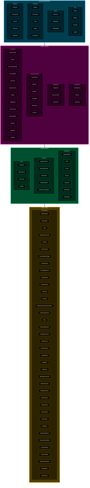

# THE 96 HADRONS OF THE STANDARD MODEL OF CODE
**Complete Particle Zoo — Flowchart View**

```mermaid
graph TD
    %% CLASSES DEFINITIONS
    classDef phase fill:#000,stroke:#fff,stroke-width:4px,color:#fff,font-size:20px;
    classDef cluster fill:#111,stroke:#666,stroke-width:2px,color:#fff;
    
    %% DATA FOUNDATIONS - CYAN THEME
    classDef cyanPhase fill:#003f4f,stroke:#00aaff,stroke-width:4px,color:#fff;
    classDef cyanQuark fill:#00222b,stroke:#0077aa,stroke-width:2px,color:#aeeeee;
    classDef cyanNode fill:#001116,stroke:#00aaff,stroke-width:1px,color:#fff;

    %% LOGIC & FLOW - MAGENTA THEME
    classDef magentaPhase fill:#4f003f,stroke:#ff00aa,stroke-width:4px,color:#fff;
    classDef magentaQuark fill:#2b0022,stroke:#aa0077,stroke-width:2px,color:#eeaeee;
    classDef magentaNode fill:#160011,stroke:#ff00aa,stroke-width:1px,color:#fff;

    %% ORGANIZATION - GREEN THEME
    classDef greenPhase fill:#004f2f,stroke:#00ff88,stroke-width:4px,color:#fff;
    classDef greenQuark fill:#002b1a,stroke:#00aa55,stroke-width:2px,color:#aeeeea;
    classDef greenNode fill:#00160d,stroke:#00ff88,stroke-width:1px,color:#fff;

    %% EXECUTION - AMBER THEME
    classDef amberPhase fill:#4f3f00,stroke:#ffaa00,stroke-width:4px,color:#fff;
    classDef amberQuark fill:#2b2200,stroke:#aa7700,stroke-width:2px,color:#eeeaee;
    classDef amberNode fill:#161100,stroke:#ffaa00,stroke-width:1px,color:#fff;


    subgraph PH_DATA["DATA FOUNDATIONS"]
        direction TB
        subgraph Q_BITS["Bits"]
            BitFlag
            BitMask
            ParityBit
            SignBit
        end
        subgraph Q_BYTES["Bytes"]
            ByteArray
            MagicBytes
            PaddingBytes
        end
        subgraph Q_PRIMITIVES["Primitives"]
            Boolean
            EnumValue
            Float
            Integer
            StringLiteral
        end
        subgraph Q_VARIABLES["Variables"]
            GlobalVar
            InstanceField
            LocalVar
            Parameter
            StaticField
        end
    end

    subgraph PH_LOGIC["LOGIC & FLOW"]
        direction TB
        subgraph Q_EXPRESSIONS["Expressions"]
            ArithmeticExpr
            CallExpr
            LiteralExpr
        end
        subgraph Q_STATEMENTS["Statements"]
            Assignment
            ExpressionStmt
            ReturnStmt
        end
        subgraph Q_CONTROL["Control Structures"]
            GuardClause
            IfBranch
            LoopFor
            LoopWhile
            SwitchCase
            TryCatch
        end
        subgraph Q_FUNCTIONS["Functions"]
            AsyncFunction
            Closure
            CommandHandler
            EventHandler
            Generator
            ImpureFunction
            Mapper
            Middleware
            PureFunction
            QueryHandler
            Reducer
            SagaStep
            Validator
        end
    end

    subgraph PH_ORG["ORGANIZATION"]
        direction TB
        subgraph Q_AGGREGATES["Aggregates"]
            AggregateRoot
            DTO
            Entity
            Factory
            Projection
            ReadModel
            ValueObject
        end
        subgraph Q_MODULES["Modules"]
            ApplicationPort
            BoundedContext
            DomainPort
            FeatureModule
            InfrastructureAdapter
        end
        subgraph Q_FILES["Files"]
            ConfigFile
            MigrationFile
            SourceFile
            TestFile
        end
    end

    subgraph PH_EXEC["EXECUTION"]
        direction TB
        subgraph Q_EXECUTABLES["Executables"]
            ABTestRouter
            APIHandler
            Actor
            BackgroundThread
            CLIEntry
            CacheWarmer
            CanaryDeployTrigger
            ChaosMonkey
            CircuitBreakerInit
            ConfigLoader
            ContainerEntry
            Coroutine
            CronJob
            DependencyInjectionContainer
            FeatureFlagCheck
            Fiber
            GracefulShutdown
            GraphQLResolver
            HealthCheck
            KubernetesJob
            LambdaEntry
            LoggerInit
            MainEntry
            MessageConsumer
            MetricsExporter
            MigrationRunner
            PanicRecover
            PluginLoader
            QueueWorker
            RateLimiter
            SeedData
            SelfHealingProbe
            ServerlessColdStart
            ServiceWorker
            TracerProvider
            WebSocketHandler
            WebWorker
            WorkerEntry
        end
    end

    %% RELATIONSHIPS
    PH_DATA ==> PH_LOGIC
    PH_LOGIC ==> PH_ORG
    PH_ORG ==> PH_EXEC

    %% APPLY STYLES - DATA
    class PH_DATA cyanPhase;
    class Q_BITS,Q_BYTES,Q_PRIMITIVES,Q_VARIABLES cyanQuark;
    class BitFlag,BitMask,ParityBit,SignBit cyanNode;
    class ByteArray,MagicBytes,PaddingBytes cyanNode;
    class Boolean,EnumValue,Float,Integer,StringLiteral cyanNode;
    class GlobalVar,InstanceField,LocalVar,Parameter,StaticField cyanNode;

    %% APPLY STYLES - LOGIC
    class PH_LOGIC magentaPhase;
    class Q_EXPRESSIONS,Q_STATEMENTS,Q_CONTROL,Q_FUNCTIONS magentaQuark;
    class ArithmeticExpr,CallExpr,LiteralExpr magentaNode;
    class Assignment,ExpressionStmt,ReturnStmt magentaNode;
    class GuardClause,IfBranch,LoopFor,LoopWhile,SwitchCase,TryCatch magentaNode;
    class AsyncFunction,Closure,CommandHandler,EventHandler,Generator,ImpureFunction magentaNode;
    class Mapper,Middleware,PureFunction,QueryHandler,Reducer,SagaStep,Validator magentaNode;

    %% APPLY STYLES - ORG
    class PH_ORG greenPhase;
    class Q_AGGREGATES,Q_MODULES,Q_FILES greenQuark;
    class AggregateRoot,DTO,Entity,Factory,Projection,ReadModel,ValueObject greenNode;
    class ApplicationPort,BoundedContext,DomainPort,FeatureModule,InfrastructureAdapter greenNode;
    class ConfigFile,MigrationFile,SourceFile,TestFile greenNode;

    %% APPLY STYLES - EXEC
    class PH_EXEC amberPhase;
    class Q_EXECUTABLES amberQuark;
    class ABTestRouter,APIHandler,Actor,BackgroundThread,CLIEntry,CacheWarmer amberNode;
    class CanaryDeployTrigger,ChaosMonkey,CircuitBreakerInit,ConfigLoader,ContainerEntry,Coroutine amberNode;
    class CronJob,DependencyInjectionContainer,FeatureFlagCheck,Fiber,GracefulShutdown,GraphQLResolver amberNode;
    class HealthCheck,KubernetesJob,LambdaEntry,LoggerInit,MainEntry,MessageConsumer amberNode;
    class MetricsExporter,MigrationRunner,PanicRecover,PluginLoader,QueueWorker,RateLimiter amberNode;
    class SeedData,SelfHealingProbe,ServerlessColdStart,ServiceWorker,TracerProvider amberNode;
    class WebSocketHandler,WebWorker,WorkerEntry amberNode;
```

