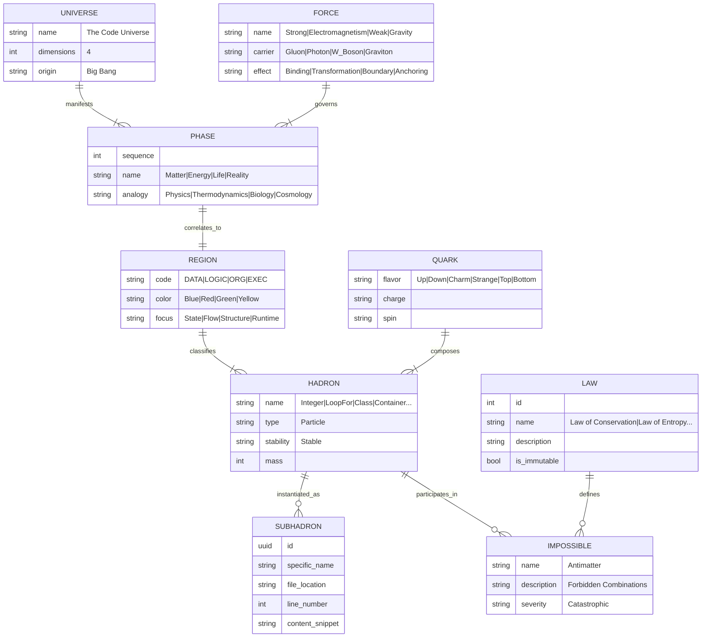

# THE STANDARD MODEL OF CODE
**Grand Unified Theory (GUT) - Entity Relationship Model**

## Entity Dictionaries

### **PHASE**
The four fundamental states of code existence, parallel to physical phases of matter.
- **Matter (Data):** Static information.
- **Energy (Logic):** Kinetic transformation.
- **Life (Organization):** Negentropic structure.
- **Reality (Execution):** The observable universe.

### **REGION**
The spatial domains where Hadrons reside.
- **DATA:** Bits, Primitives, State.
- **LOGIC:** Control Flow, Operations, Algorithms.
- **ORG:** Classes, Modules, files, directories.
- **EXEC:** Containers, Threads, Processes.

### **HADRON**
The 96 stable composite particles that make up all software.
Examples: `Integer`, `String`, `LoopFor`, `IfBranch`, `Class`, `Service`, `DockerContainer`.

### **FORCE**
The interactions that bind the universe together.
1.  **Strong Force:** Binds Data into Logic (Responsibility).
2.  **Electromagnetism:** COMPOSES Logic into Organization (Purity/Design).
3.  **Weak Force:** BOUNDARIES between contexts (Encapsulation).
4.  **Gravity:** ANCHORS Organization to Execution (Deployment).
