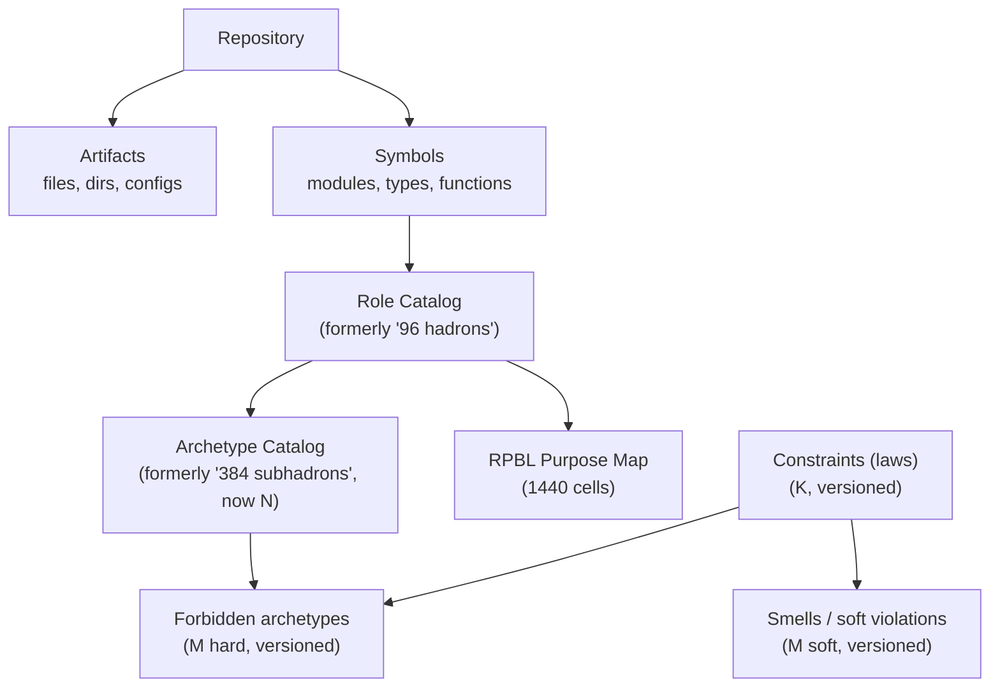
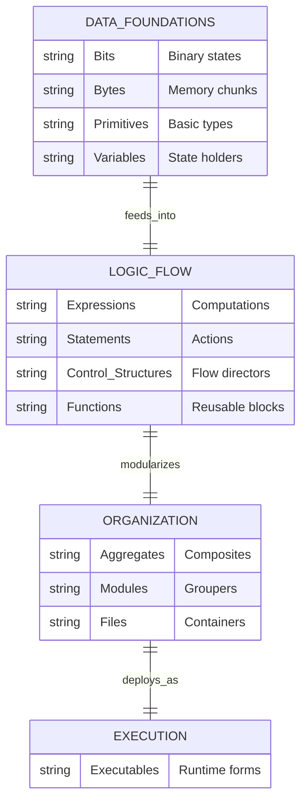

> ⚠️ **DEPRECATED (v5.0.0)**: The 1440 RPBL grid (Role × Phase × Boundary × Layer) is superseded by the current 8D model:
> - D1 WHAT (200 Atoms), D2 WHERE (Layer), D3 ROLE (33 Roles), D4 BOUNDARY, D5 STATE, D6 EFFECT, D7 LIFECYCLE/ACTIVATION, D8 TRUST/LIFETIME
> - See: `docs/STANDARD_CODE.md` for current taxonomy
>
> *Archived for historical reference. Do not use for new classification.*

# THE STANDARD MODEL OF CODE (Reframed)

This project is evolving from a “clean numeric hierarchy” into a more truthful, versioned system.

**Canonical reframing:** `STANDARD_MODEL_STRUCTURE.md`

Core corrections:
- `1440` is a **purpose map (RPBL coordinate space)**, not “1,440 code entities”.
- The counts for **constraints/laws**, **archetypes**, and **forbidden patterns** are **not fixed**; they must be allowed to grow with evidence.
- “Antimatter” needs a split between **hard impossibility** (constraint-violations) and **soft smells**.

## What is “real” vs “map”

- **Real (codebase entities):** artifacts, symbols, and dependency edges.
- **Map (descriptive space):** RPBL (`12×4×6×5=1440`) describes purpose/physics; components are placed onto it.

Current RPBL data: `1440_csv.csv`

---

# THE 12 FUNDAMENTALS (Families)
**A practical grouping for the role catalog.** (Not a claim that there are “only 12 fundamental code concepts”.)

---

# THE ROLE CATALOG (Hadrons) — Grouped by Fundamental Family
**Counts per family vary; this is a grouping, not a proof.**

```mermaid
erDiagram
    BITS ||--|{ BitFlag : contains
    BITS ||--|{ BitMask : contains

    BYTES ||--|{ ByteArray : contains

    PRIMITIVES ||--|{ Boolean : contains
    PRIMITIVES ||--|{ EnumValue : contains
    PRIMITIVES ||--|{ Float : contains
    PRIMITIVES ||--|{ Integer : contains
    PRIMITIVES ||--|{ StringLiteral : contains

    VARIABLES ||--|{ GlobalVar : contains
    VARIABLES ||--|{ InstanceField : contains
    VARIABLES ||--|{ LocalVar : contains
    VARIABLES ||--|{ Parameter : contains
    VARIABLES ||--|{ StaticField : contains

    EXPRESSIONS ||--|{ ArithmeticExpr : contains
    EXPRESSIONS ||--|{ CallExpr : contains
    EXPRESSIONS ||--|{ LiteralExpr : contains

    STATEMENTS ||--|{ Assignment : contains
    STATEMENTS ||--|{ ExpressionStmt : contains
    STATEMENTS ||--|{ ReturnStmt : contains

    CONTROL_STRUCTURES ||--|{ IfBranch : contains
    CONTROL_STRUCTURES ||--|{ LoopFor : contains
    CONTROL_STRUCTURES ||--|{ LoopWhile : contains
    CONTROL_STRUCTURES ||--|{ SwitchCase : contains
    CONTROL_STRUCTURES ||--|{ TryCatch : contains

    FUNCTIONS ||--|{ AsyncFunction : contains
    FUNCTIONS ||--|{ Closure : contains
    FUNCTIONS ||--|{ EventHandler : contains
    FUNCTIONS ||--|{ Generator : contains
    FUNCTIONS ||--|{ ImpureFunction : contains
    FUNCTIONS ||--|{ Mapper : contains
    FUNCTIONS ||--|{ Middleware : contains
    FUNCTIONS ||--|{ PureFunction : contains
    FUNCTIONS ||--|{ Validator : contains

    AGGREGATES ||--|{ DTO : contains
    AGGREGATES ||--|{ ReadModel : contains
    AGGREGATES ||--|{ AggregateRoot : contains
    AGGREGATES ||--|{ Entity : contains
    AGGREGATES ||--|{ Factory : contains
    AGGREGATES ||--|{ Projection : contains
    AGGREGATES ||--|{ ValueObject : contains

    MODULES ||--|{ ApplicationPort : contains
    MODULES ||--|{ BoundedContext : contains
    MODULES ||--|{ DomainPort : contains
    MODULES ||--|{ FeatureModule : contains
    MODULES ||--|{ InfrastructureAdapter : contains

    FILES ||--|{ ConfigFile : contains
    FILES ||--|{ MigrationFile : contains
    FILES ||--|{ SourceFile : contains
    FILES ||--|{ TestFile : contains

    EXECUTABLES ||--|{ Actor : contains
    EXECUTABLES ||--|{ APIHandler : contains
    EXECUTABLES ||--|{ BackgroundThread : contains
    EXECUTABLES ||--|{ CacheWarmer : contains
    EXECUTABLES ||--|{ ChaosMonkey : contains
    EXECUTABLES ||--|{ CircuitBreakerInit : contains
    EXECUTABLES ||--|{ CLIEntry : contains
    EXECUTABLES ||--|{ ConfigLoader : contains
    EXECUTABLES ||--|{ ContainerEntry : contains
    EXECUTABLES ||--|{ Coroutine : contains
    EXECUTABLES ||--|{ CronJob : contains
    EXECUTABLES ||--|{ DependencyInjectionContainer : contains
    EXECUTABLES ||--|{ FeatureFlagCheck : contains
    EXECUTABLES ||--|{ GracefulShutdown : contains
    EXECUTABLES ||--|{ GraphQLResolver : contains
    EXECUTABLES ||--|{ HealthCheck : contains
    EXECUTABLES ||--|{ KubernetesJob : contains
    EXECUTABLES ||--|{ LambdaEntry : contains
    EXECUTABLES ||--|{ LoggerInit : contains
    EXECUTABLES ||--|{ MainEntry : contains
    EXECUTABLES ||--|{ MessageConsumer : contains
    EXECUTABLES ||--|{ MetricsExporter : contains
    EXECUTABLES ||--|{ MigrationRunner : contains
    EXECUTABLES ||--|{ QueueWorker : contains
    EXECUTABLES ||--|{ RateLimiter : contains
    EXECUTABLES ||--|{ SeedData : contains
    EXECUTABLES ||--|{ SelfHealingProbe : contains
    EXECUTABLES ||--|{ WebSocketHandler : contains
    EXECUTABLES ||--|{ WorkerEntry : contains
```

