# Standard Model of Code - Hadrons Structure
## Mermaid Diagram Visualization

---

## 📊 COMPLETE HADRON CLASSIFICATION DIAGRAM


---

## 🎯 HADRON FORMATION RULES DIAGRAM


---

## 🌌 COMPLETE PARTICLE ZOO DIAGRAM

```mermaid
mindmap
  root((Standard Model<br/>of Code))
    12 Quarks
      Entity
        Has Identity
        Domain Object
      Aggregate
        Consistency Boundary
        Root Entity
      ValueObject
        Immutable
        No Identity
      Service
        Stateless
        Business Logic
      Repository
        Collection Access
        Persistence
      Factory
        Object Creation
        Complex Logic
      Specification
        Business Rule
        Predicate
      Event
        Domain Event
        Something Happened
      ReadModel
        Query Result
        Optimized for Read
      WriteModel
        Command Target
        Optimized for Write
      Projector
        Event→ReadModel
        Synchronization
      Application
        Use Case
        Orchestration

    96 Mesons
      Entity + Aggregate
        Domain Object Root
      ValueObject + Service
        Domain Logic
      Repository + Entity
        Persistence
      Event + Specification
        Rule Trigger
      ... 92 more combinations

    220 Baryons
      Entity + Value + Spec
        Validated Entity
      Service + Repo + Spec
        Filtered Access
      Entity + Event + Projector
        Sync to Read
      ... 217 more combinations

    126 Hypers
      Application Layer
        Complete Use Case
      Event Sourced
        Event Pattern
      Microservice
        Bounded Context
      ... 122 more combinations
```



---

## 📈 DIMENSIONAL INTERACTION DIAGRAM


---

## 🎭 LIFECYCLE TRANSITIONS DIAGRAM


---

## 🧬 ANTIMATTER DETECTION DIAGRAM


---

## 📊 STATISTICAL DISTRIBUTION


---

## 🔬 DETECTION FLOW DIAGRAM


---

## 🎯 COVERAGE MATRIX

```mermaid
gitgraph
    commit id: "Base Framework"
    branch enhanced
    checkout enhanced
    commit id: "+ Naming Patterns"
    commit id: "+ Multi-Resp Score"
    commit id: "100% VO Detection"
    checkout main
    merge enhanced
    commit id: "Production Ready"
```

---

## 💡 KEY INSIGHTS FROM THE DIAGRAMS

1. **Pattern Emergence**: Simple quarks combine into complex hadrons through force interactions
2. **Dimensional Constraints**: RPBL dimensions filter impossible combinations (antimatter)
3. **Hierarchical Structure**: From 12 basic quarks emerge 454 possible hadrons
4. **Detection Strategy**: Enhanced patterns capture previously missed combinations
5. **Evolution Path**: Simple additions achieve optimal coverage

---

> **Note**: These diagrams represent the complete theoretical framework of the Standard Model of Code, showing how 12 fundamental quarks combine through 4 fundamental forces to create 454 possible particles across 4 categories.