# DDD Architecture Patterns - Mermaid Diagram

```mermaid
graph TB
    %% Layers
    subgraph "Domain Layer (Core Business Logic)"
        direction TB

        %% Entities
        subgraph "Entities"
            E1[Entity_WithInvariants<br/>🏆 Valid<br/>🔮 98.7% rarity<br/>💎 Sphere with golden crown]
            E2[Entity_Immutable<br/>🏆 Valid<br/>🔮 12.4% rarity<br/>💎 Crystalline sphere]
            E4[Entity_WithIdentity<br/>🏆 Valid<br/>🔮 99.9% rarity<br/>💎 Glowing core sphere]

            E3[Entity_Stateless<br/>❌ Impossible<br/>Reason: Entity must have state<br/>💀 Vanishing black hole]
            E6[ValueObject_WithIdentity<br/>❌ Impossible<br/>Reason: ValueObject cannot have identity<br/>💀 Exploding ID cube]
            E7[ValueObject_Mutable<br/>❌ Impossible<br/>Reason: ValueObject must be immutable<br/>💀 Melting cube]
        end

        %% Value Objects
        subgraph "Value Objects"
            V1[ValueObject_Immutable<br/>🏆 Valid<br/>🔮 99.1% rarity<br/>💎 Crystalline cube]
            V2[ValueObject_WithValidationInConstructor<br/>🏆 Valid<br/>🔮 96.1% rarity<br/>💎 Shield at birth]

            V3[ValueObject_WithBehavior<br/>❌ Impossible<br/>Reason: Value objects must be anemic<br/>💀 Cube with gear]
        end

        %% Aggregates
        subgraph "Aggregates"
            A1[AggregateRoot_WithInvariants<br/>🏆 Valid<br/>🔮 89.3% rarity<br/>💎 Golden crown pulsing]
            A2[UserAggregate_WithBusinessInvariants<br/>🏆 Valid<br/>🔮 87.2% rarity<br/>💎 Strong glow crown]

            A3[AggregateRoot_WithPublicSetters<br/>❌ Impossible<br/>Reason: Must control state<br/>💀 Open lock crown]
        end

        %% Domain Services
        subgraph "Domain Services"
            DS1[DomainService_Orchestration<br/>🏆 Valid<br/>🔮 41.3% rarity<br/>💎 Gear with orbiting spheres]

            DS2[Service_GlobalState<br/>❌ Impossible<br/>Reason: Service must be stateless<br/>💀 Global chain gear]
        end

        %% Specifications
        subgraph "Specifications"
            S1[Specification_Composable<br/>🏆 Valid<br/>🔮 29.5% rarity<br/>💎 Composite glow diamond]
            S2[Specification_WithState<br/>❌ Impossible<br/>Reason: Must be stateless<br/>💀 Diamond with memory]
        end

        %% Domain Events
        subgraph "Domain Events"
            DE1[DomainEvent_Immutable<br/>🏆 Valid<br/>🔮 94.8% rarity<br/>💎 Crystalline envelope]
            DE2[DomainEvent_WithTimestampInPayload<br/>🏆 Valid<br/>🔮 89.7% rarity<br/>💎 Envelope with clock]

            DE3[DomainEvent_WithSideEffects<br/>❌ Impossible<br/>Reason: Events must be pure facts<br/>💀 Envelope on fire]
        end

        %% Policies
        subgraph "Policies"
            P1[Policy_WithSideEffects<br/>❌ Impossible<br/>Reason: Policy must be pure<br/>💀 Diamond with fire]
            P2[Policy_WithExternalCall<br/>❌ Impossible<br/>Reason: Policy must be pure<br/>💀 Diamond with plug]
        end

        %% Factories
        subgraph "Factories"
            F1[Factory_WithDependencyInjection<br/>🏆 Valid<br/>🔮 38.2% rarity<br/>💎 Spark with syringe]

            F2[Factory_WithValidation<br/>❌ Impossible<br/>Reason: Factory must not validate<br/>💀 Spark with shield]
        end
    end

    subgraph "Application Layer (Use Cases)"
        direction TB

        %% Command Handlers
        subgraph "Command Handlers"
            CH1[CommandHandler_Create<br/>🏆 Valid<br/>🔮 96.2% rarity<br/>💎 Gold ring octahedron]
            CH2[CommandHandler_Save<br/>🏆 Valid<br/>🔮 91.1% rarity<br/>💎 Thick gold ring]
            CH3[CreateUserCommandHandler_WithCompensation<br/>🏆 Valid<br/>🔮 8.9% rarity<br/>💎 Gold ring with red chain]

            CH4[CommandHandler_FindById<br/>❌ Impossible<br/>Reason: Cannot return data<br/>💀 Black hole octahedron]
            CH5[CommandHandler_WithDirectDB<br/>❌ Impossible<br/>Reason: Must use repository<br/>💀 Gold ring with database]
        end

        %% Query Handlers
        subgraph "Query Handlers"
            QH1[QueryHandler_FindById<br/>🏆 Valid<br/>🔮 98.7% rarity<br/>💎 Blue ring octahedron]
            QH2[QueryHandler_WithCaching<br/>🏆 Valid<br/>🔮 44.7% rarity<br/>💎 Blue ring with cache]

            QH3[QueryHandler_Save<br/>❌ Impossible<br/>Reason: Cannot mutate state<br/>💀 Black hole blue octahedron]
        end

        %% Event Handlers
        subgraph "Event Handlers"
            EH1[UserRegisteredEvent_ProjectedToReadModel<br/>🏆 Valid<br/>🔮 34.1% rarity<br/>💎 Purple pulse octahedron]
            EH2[EventHandler_WithOrderingGuarantee<br/>🏆 Valid<br/>🔮 29.1% rarity<br/>💎 Pulse with sequence]

            EH3[EventHandler_ReturnsValue<br/>❌ Impossible<br/>Reason: Fire-and-forget<br/>💀 Exploding octahedron]
        end

        %% Read Models
        subgraph "Read Models"
            RM1[ReadModel_Denormalized<br/>🏆 Valid<br/>🔮 67.8% rarity<br/>💎 Transparent blue sphere]

            RM2[ReadModel_WithBusinessLogic<br/>❌ Impossible<br/>Reason: Must be read-only<br/>💀 Transparent sphere with brain]
        end

        %% Application Services
        subgraph "Application Services"
            AS1[Service_WithDomainEvents<br/>🏆 Valid<br/>🔮 78.4% rarity<br/>💎 Gear with envelope]

            AS2[Service_WithPersistence<br/>❌ Impossible<br/>Reason: Service must not touch storage<br/>💀 Gear with database]
        end

        %% Use Cases
        subgraph "Use Cases"
            UC1[UseCase_WithInfrastructure<br/>❌ Impossible<br/>Reason: Must be pure<br/>💀 Diamond with plug]
        end
    end

    subgraph "Infrastructure Layer (Technical Details)"
        direction TB

        %% Repositories
        subgraph "Repositories"
            R1[Repository_WithCaching<br/>🏆 Valid<br/>🔮 52.8% rarity<br/>💎 Plug with cache glow]

            R2[Repository_PureFunction<br/>❌ Impossible<br/>Reason: Repository has I/O<br/>💀 Melting octahedron]
        end

        %% Adapters
        subgraph "Adapters"
            IA1[AntiCorruptionLayer_FullIsolation<br/>🏆 Valid<br/>🔮 28.4% rarity<br/>💎 Solid glow shield]

            IA2[Adapter_WithBusinessLogic<br/>❌ Impossible<br/>Reason: Must not contain business<br/>💀 Plug with brain]
        end

        %% Resilience Patterns
        subgraph "Resilience"
            RES1[CircuitBreaker_WithSuccessThreshold<br/>🏆 Valid<br/>🔮 58.7% rarity<br/>💎 Healing chain]
            RES2[Retry_WithJitter<br/>🏆 Valid<br/>🔮 91.3% rarity<br/>💎 Random arrow]
            RES3[Bulkhead_WithSemaphore<br/>🏆 Valid<br/>🔮 79.3% rarity<br/>💎 Wall with counter]

            RES4[CircuitBreaker_ThatNeverTrips<br/>❌ Impossible<br/>Reason: Defeats purpose<br/>💀 Always healing chain]
        end

        %% Messaging
        subgraph "Messaging"
            M1[OutboxPattern_WithManualCommit<br/>🏆 Valid<br/>🔮 45.1% rarity<br/>💎 Box with hand]
            M2[QueueWorker_WithDeadLetterExchange<br/>🏆 Valid<br/>🔮 89.6% rarity<br/>💎 Gear with skull box]

            M3[MessageConsumer_WithNoAck<br/>❌ Impossible<br/>Reason: Risk of message loss<br/>💀 Rabbit no receipt]
        end
    end

    subgraph "Interface Layer (API/CLI)"
        direction TB

        %% API Handlers
        subgraph "API Handlers"
            API1[APIHandler_WithValidation<br/>🏆 Valid<br/>🔮 88.3% rarity<br/>💎 Globe with shield]
            API2[OpenHostService_WithVersioning<br/>🏆 Valid<br/>🔮 38.9% rarity<br/>💎 Globe with V tags]

            API3[APIHandler_InternalOnly<br/>❌ Impossible<br/>Reason: API crosses boundary<br/>💀 Imploding globe]
        end

        %% GraphQL
        subgraph "GraphQL"
            GQL1[GraphQLResolver_WithDataLoader<br/>🏆 Valid<br/>🔮 88.3% rarity<br/>💎 Graph with batch]

            GQL2[GraphQLResolver_WithNPlusOne<br/>❌ Impossible<br/>Reason: Performance anti-pattern<br/>💀 Graph with explosion]
        end

        %% WebSocket
        subgraph "WebSocket"
            WS1[WebSocket_WithCompression<br/>🏆 Valid<br/>🔮 76.1% rarity<br/>💎 Compressed wave]

            WS2[WebSocket_WithNoPingPong<br/>❌ Impossible<br/>Reason: Connection drops<br/>💀 Wave no heartbeat]
        end
    end

    subgraph "Cross-Cutting Concerns"
        direction TB

        %% Configuration
        subgraph "Configuration"
            C1[ConfigLoader_WithVaultBackend<br/>🏆 Valid<br/>🔮 73.2% rarity<br/>💎 Gear with safe]
            C2[FeatureFlag_WithGradualRollout<br/>🏆 Valid<br/>🔮 82.7% rarity<br/>💎 Toggle with percentage]

            C3[ConfigLoader_WithHardcodedValues<br/>❌ Impossible<br/>Reason: Defeats purpose<br/>💀 Gear with stone tablet]
        end

        %% Observability
        subgraph "Observability"
            O1[Logger_WithAsyncAppender<br/>🏆 Valid<br/>🔮 88.9% rarity<br/>💎 Log with no block]
            O2[Tracer_WithHeadSampling<br/>🏆 Valid<br/>🔮 79.1% rarity<br/>💎 Wave with filter]
            O3[HealthCheck_WithReadinessProbe<br/>🏆 Valid<br/>🔮 92.6% rarity<br/>💎 Heart with ready light]

            O4[Logger_WithSyncWrites<br/>❌ Impossible<br/>Reason: Must be async<br/>💀 Log with chain]
        end

        %% Security
        subgraph "Security"
            SEC1[PluginLoader_WithSandbox<br/>🏆 Valid<br/>🔮 52.3% rarity<br/>💎 Plug with shield]

            SEC2[Container_WithPrivilegedMode<br/>❌ Impossible<br/>Reason: Security risk<br/>💀 Docker with crown]
        end
    end

    subgraph "Deployment & Architecture Patterns"
        direction TB

        %% Bounded Contexts
        subgraph "Bounded Contexts"
            BC1[BoundedContext_Isolated<br/>🏆 Valid<br/>🔮 67.2% rarity<br/>💎 Separate dodecahedron]
            BC2[BoundedContext_WithSharedKernel<br/>🏆 Valid<br/>🔮 19.6% rarity<br/>💎 Dodecahedron with bridge]

            BC3[BoundedContext_WithLeakyAbstraction<br/>❌ Impossible<br/>Reason: Must protect language<br/>💀 Cracked dodecahedron]
        end

        %% Context Mapping
        subgraph "Context Mapping"
            CM1[ContextMap_WithUpstreamDownstream<br/>🏆 Valid<br/>🔮 41.8% rarity<br/>💎 Map with arrows]

            CM2[CustomerSupplier_WithTightCoupling<br/>❌ Impossible<br/>Reason: Should be loose<br/>💀 Chain too thick]
        end

        %% Deployment
        subgraph "Deployment Patterns"
            DP1[Canary_WithGradualTraffic<br/>🏆 Valid<br/>🔮 71.4% rarity<br/>💎 Bird with percentage]
            DP2[Serverless_WithWarmContainers<br/>🏆 Valid<br/>🔮 69.4% rarity<br/>💎 Cloud with heat]

            DP3[CanaryDeploy_100Percent<br/>❌ Impossible<br/>Reason: Not a canary<br/>💀 Bird flying away]
        end

        %% Container Orchestration
        subgraph "Container Orchestration"
            CO1[Kubernetes_WithPodDisruptionBudget<br/>🏆 Valid<br/>🔮 79.4% rarity<br/>💎 Helm with safety net]
            CO2[Container_WithReadOnlyRoot<br/>🏆 Valid<br/>🔮 82.7% rarity<br/>💎 Docker with lock]

            CO3[Kubernetes_WithHostNetwork<br/>❌ Impossible<br/>Reason: Breaks isolation<br/>💀 Helm with broken wall]
        end
    end

    %% Connection Patterns
    E1 --> A1
    V1 --> A1
    DE1 --> EH1
    CH1 --> A1
    QH1 --> RM1
    R1 --> E1
    API1 --> CH1
    GQL1 --> QH1
    DS1 --> A1
    S1 --> QH1
    P1 -.-> E1
    F1 --> E1

    %% Cross-cutting connections
    C1 -.-> API1
    O1 -.-> CH1
    SEC1 -.-> IA1
    RES1 -.-> R1
    M1 -.-> EH1

    %% Pattern relationships
    BC1 --> CM1
    CM1 --> BC2
    DP1 --> BC1
    CO1 --> DP1

    %% Style definitions
    classDef valid fill:#e6ffed,stroke:#00a86b,stroke-width:2px,color:#1a1a1a
    classDef impossible fill:#ffe6e6,stroke:#ff4444,stroke-width:2px,color:#1a1a1a
    classDef domain fill:#f0f7ff,stroke:#0066cc,stroke-width:2px,color:#1a1a1a
    classDef application fill:#fff5e6,stroke:#ff9900,stroke-width:2px,color:#1a1a1a
    classDef infrastructure fill:#f5e6ff,stroke:#9933ff,stroke-width:2px,color:#1a1a1a
    classDef interface fill:#e6ffe6,stroke:#33cc33,stroke-width:2px,color:#1a1a1a
    classDef crosscutting fill:#ffe6f5,stroke:#ff33cc,stroke-width:2px,color:#1a1a1a
    classDef deployment fill:#e6f5ff,stroke:#0099ff,stroke-width:2px,color:#1a1a1a

    %% Apply styles
    class E1,E2,E4,V1,V2,A1,A2,DS1,S1,DE1,DE2,F1 valid,related
    class E3,E6,E7,V3,A3,DS2,S2,P1,P2,F2 impossible
    class CH1,CH2,CH3,QH1,QH2,EH1,EH2,RM1,AS1 valid
    class CH4,CH5,QH3,EH3,RM2,AS2,UC1 impossible
    class R1,IA1,RES1,RES2,RES3,M1,M2 valid
    class R2,IA2,RES4,M3 impossible
    class API1,API2,GQL1,WS1 valid
    class API3,GQL2,WS2 impossible
    class C1,C2,O1,O2,O3,SEC1 valid
    class C3,O4,SEC2 impossible
    class BC1,BC2,CM1,DP1,DP2,CO1,CO2 valid
    class BC3,CM2,DP3,CO3 impossible

    class E1,E2,E3,E4,E6,E7,V1,V2,V3,A1,A2,A3,DS1,DS2,S1,S2,DE1,DE2,P1,P2,F1,F2 domain
    class CH1,CH2,CH3,CH4,CH5,QH1,QH2,QH3,EH1,EH2,EH3,RM1,RM2,AS1,AS2,UC1 application
    class R1,R2,IA1,IA2,RES1,RES2,RES3,RES4,M1,M2,M3 infrastructure
    class API1,API2,API3,GQL1,GQL2,WS1,WS2 interface
    class C1,C2,C3,O1,O2,O3,O4,SEC1,SEC2 crosscutting
    class BC1,BC2,BC3,CM1,CM2,DP1,DP2,DP3,CO1,CO2,CO3 deployment
```

## Legend

### Symbols
- 🏆 **Valid Pattern**: Correct implementation following DDD principles
- ❌ **Impossible/Anti-pattern**: Violates fundamental principles
- 🔮 **Emergence Rarity**: How rarely this pattern appears in 2025 codebases
- 💎 **3D Visualization**: Visual metaphor for the pattern

### Layers
1. **Domain Layer**: Core business logic, entities, value objects
2. **Application Layer**: Use cases, command/query handlers
3. **Infrastructure Layer**: Technical implementation details
4. **Interface Layer**: APIs, CLI, external interfaces
5. **Cross-Cutting Concerns**: Configuration, logging, security
6. **Deployment & Architecture**: Bounded contexts, deployment patterns

### Key Insights
- **Most Common Valid Patterns**: Entity with identity (99.9%), Immutable value object (99.1%), Query by ID (98.7%)
- **Rarest Valid Patterns**: Command handler with compensation (8.9%), Bounded context with shared kernel (19.6%)
- **Most Common Anti-patterns**: Direct database access, breaking immutability, tight coupling
- **Architecture Trends**: Serverless, event sourcing, circuit breakers gaining adoption