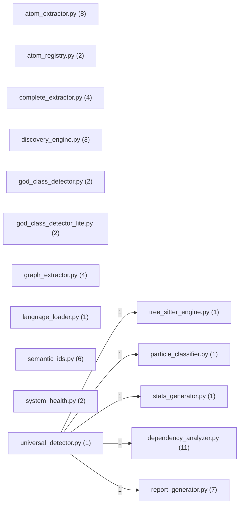

# Spectrometer Report — core

- Generated: 2025-12-14T14:38:57
- Repo root: `/mnt/data/spectrometer_system_audit/core`

## Summary
- Files analyzed: 17
- Components extracted: 56
- Recognized (non-Unknown): 3.6%
- Typed components: 2
- Unclassified components: 54

## Dependencies
- External packages (top): core(5), tree_sitter(2), tree_sitter_python(1), tree_sitter_typescript(1), tree_sitter_javascript(1), tree_sitter_go(1), tree_sitter_java(1), matplotlib(1), mpl_toolkits(1), numpy(1)

## Outputs
- Full component list: `components.csv`
- Raw particles: `particles.csv` (no IDs/deps)
- Full JSON: `results.json`

## Architecture (Mermaid)

## Unclassified Samples
| component_id | kind | name | file | line | evidence |
|---|---|---|---|---|---|
| `981df32a41e0` | class | `HadronLevel` | `atom_extractor.py` | 19 | `class HadronLevel(Enum):` |
| `4a68c1379305` | class | `Hadron` | `atom_extractor.py` | 27 | `class Hadron:` |
| `6589bc29a08a` | class | `AtomExtractor` | `atom_extractor.py` | 188 | `class AtomExtractor:` |
| `1eceeaca9e70` | class | `Email` | `atom_extractor.py` | 575 | `class Email:` |
| `8eecdd37a9ef` | function | `fetch_user` | `atom_extractor.py` | 589 | `async def fetch_user(user_id: str):` |
| `114996311be8` | function | `calculate_total` | `atom_extractor.py` | 593 | `def calculate_total(items: list) -> float:` |
| `bcc154f18505` | class | `AtomDefinition` | `atom_registry.py` | 21 | `class AtomDefinition:` |
| `2e09c553d85b` | class | `AtomRegistry` | `atom_registry.py` | 38 | `class AtomRegistry:` |
| `ede63b48bcb0` | class | `FunctionBody` | `complete_extractor.py` | 21 | `class FunctionBody:` |
| `2ba4735d6f19` | class | `ClassBody` | `complete_extractor.py` | 56 | `class ClassBody:` |
| `11426fe146b4` | class | `CompleteCodebase` | `complete_extractor.py` | 82 | `class CompleteCodebase:` |
| `936425e7c401` | class | `CompleteExtractor` | `complete_extractor.py` | 114 | `class CompleteExtractor:` |
| `49e9d4b239e9` | class | `ResolvedDependency` | `dependency_analyzer.py` | 12 | `class ResolvedDependency:` |
| `dfe6084437ed` | function | `_posix` | `dependency_analyzer.py` | 21 | `def _posix(path: Path) -> str:` |
| `39aa4537aa28` | function | `_try_rel` | `dependency_analyzer.py` | 25 | `def _try_rel(repo_root: Path, file_path: Path) -> str:` |
| `065cd6513724` | function | `_python_stdlib_roots` | `dependency_analyzer.py` | 32 | `def _python_stdlib_roots() -> set[str]:` |
| `834b89721c9f` | function | `_python_candidate_roots` | `dependency_analyzer.py` | 115 | `def _python_candidate_roots(repo_root: Path) -> list[Path]:` |
| `88cff584ca6e` | function | `_python_module_from_rel` | `dependency_analyzer.py` | 124 | `def _python_module_from_rel(rel: Path) -> str:` |
| `2f69c46a25fd` | function | `_build_python_module_index` | `dependency_analyzer.py` | 133 | `def _build_python_module_index(repo_root: Path, file_paths: Iterable[Path]) -> tuple[dict[str, str],` |
| `0d1d48873042` | function | `_python_resolve_relative` | `dependency_analyzer.py` | 160 | `def _python_resolve_relative(` |
| `840e80e04e2c` | function | `_npm_package_name` | `dependency_analyzer.py` | 190 | `def _npm_package_name(spec: str) -> str:` |
| `3df0d33c9465` | function | `_resolve_js_relative` | `dependency_analyzer.py` | 197 | `def _resolve_js_relative(repo_root: Path, src_file: Path, spec: str) -> str \| None:` |
| `b56b8e45fc68` | class | `DependencyAnalyzer` | `dependency_analyzer.py` | 219 | `class DependencyAnalyzer:` |
| `e5e07cbf3664` | class | `UnknownAtom` | `discovery_engine.py` | 30 | `class UnknownAtom:` |
| `ea98eb9c8124` | class | `DiscoveryReport` | `discovery_engine.py` | 104 | `class DiscoveryReport:` |
| `ccbbb4ae1da9` | class | `DiscoveryEngine` | `discovery_engine.py` | 119 | `class DiscoveryEngine:` |
| `55f9bc564bf1` | class | `GodClassMetrics` | `god_class_detector.py` | 21 | `class GodClassMetrics:` |
| `006e7e25a302` | class | `GodClassDetector` | `god_class_detector.py` | 47 | `class GodClassDetector:` |
| `2c5d7241838d` | class | `GodClassMetrics` | `god_class_detector_lite.py` | 18 | `class GodClassMetrics:` |
| `358dda5acf56` | class | `GodClassDetectorLite` | `god_class_detector_lite.py` | 44 | `class GodClassDetectorLite:` |
| `65dd0ce8a2d3` | class | `Edge` | `graph_extractor.py` | 23 | `class Edge:` |
| `15aa75170b08` | class | `Node` | `graph_extractor.py` | 34 | `class Node:` |
| `4b292bd3aa69` | class | `CodeGraph` | `graph_extractor.py` | 48 | `class CodeGraph:` |
| `fb3591adbd67` | class | `GraphExtractor` | `graph_extractor.py` | 88 | `class GraphExtractor:` |
| `e820459179b7` | class | `LanguageLoader` | `language_loader.py` | 12 | `class LanguageLoader:` |
| `b474fc5ec5e7` | class | `ParticleClassifier` | `particle_classifier.py` | 12 | `class ParticleClassifier:` |
| `282c61224dbd` | function | `_posix` | `report_generator.py` | 12 | `def _posix(path: Path) -> str:` |
| `978663725fb8` | function | `_safe_rel` | `report_generator.py` | 16 | `def _safe_rel(repo_root: Path, file_path: str) -> str:` |
| `852e0b63e93e` | function | `_stable_id` | `report_generator.py` | 29 | `def _stable_id(*parts: str) -> str:` |
| `cd17acfaa8c3` | function | `_group_key` | `report_generator.py` | 37 | `def _group_key(rel_file: str) -> str:` |
| `3553c24bef6a` | function | `_mermaid_id` | `report_generator.py` | 51 | `def _mermaid_id(group: str) -> str:` |
| `08da6225fd3c` | class | `ComponentRow` | `report_generator.py` | 59 | `class ComponentRow:` |
| `4ad1c6837e14` | class | `ReportGenerator` | `report_generator.py` | 74 | `class ReportGenerator:` |
| `4216b91e2e2b` | class | `Continent` | `semantic_ids.py` | 38 | `class Continent(Enum):` |
| `75ebaf8be35a` | class | `Fundamental` | `semantic_ids.py` | 46 | `class Fundamental(Enum):` |
| `79ee8537bfe3` | class | `Level` | `semantic_ids.py` | 68 | `class Level(Enum):` |
| `716f336b26ab` | class | `SemanticID` | `semantic_ids.py` | 80 | `class SemanticID:` |
| `1d7eba098b10` | class | `SemanticIDGenerator` | `semantic_ids.py` | 232 | `class SemanticIDGenerator:` |
| `649d7a0aa929` | class | `SemanticMatrix` | `semantic_ids.py` | 411 | `class SemanticMatrix:` |
| `85b1065bb9e7` | class | `StatsGenerator` | `stats_generator.py` | 16 | `class StatsGenerator:` |

(Showing 50/54 unclassified components; full list in `components.csv`.)
