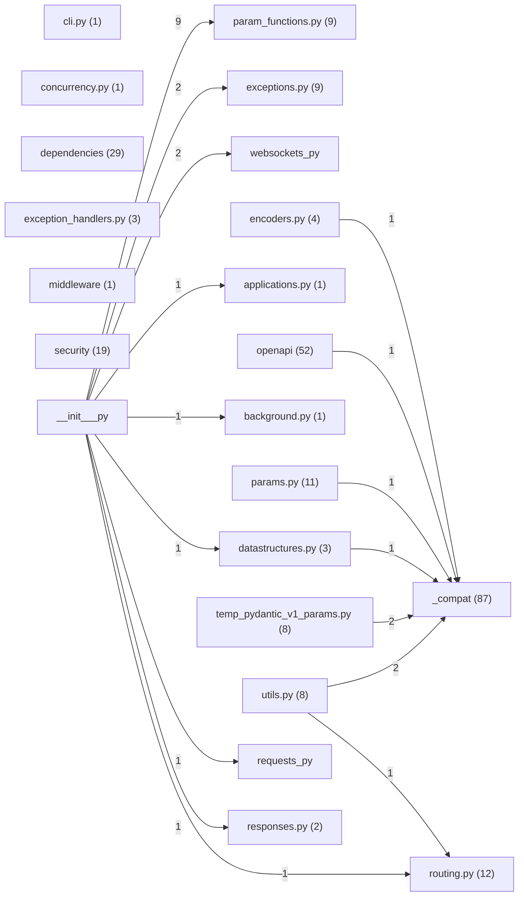

# Spectrometer Report — fastapi

- Generated: 2025-12-14T14:38:07
- Repo root: `/mnt/data/spectrometer_system_audit/validation/test_repos/fastapi`

## Summary
- Files analyzed: 52
- Components extracted: 261
- Recognized (non-Unknown): 23.8%
- Typed components: 62
- Unclassified components: 199

## Dependencies
- External packages (top): fastapi(117), pydantic(82), starlette(82), typing_extensions(25), annotated_doc(12), pydantic_core(5), anyio(3), multipart(2), ujson(1), orjson(1), fastapi_cli(1), python_multipart(1), email_validator(1)

## Outputs
- Full component list: `components.csv`
- Raw particles: `particles.csv` (no IDs/deps)
- Full JSON: `results.json`

## Architecture (Mermaid)

## Unclassified Samples
| component_id | kind | name | file | line | evidence |
|---|---|---|---|---|---|
| `c16fb8594ce0` | function | `get_cached_model_fields` | `_compat/main.py` | 53 | `def get_cached_model_fields(model: Type[BaseModel]) -> List[ModelField]:` |
| `0589a9530da4` | function | `_is_undefined` | `_compat/main.py` | 64 | `def _is_undefined(value: object) -> bool:` |
| `4c5079dc68ab` | function | `_get_model_config` | `_compat/main.py` | 74 | `def _get_model_config(model: BaseModel) -> Any:` |
| `79101bfbb5c5` | function | `_model_dump` | `_compat/main.py` | 85 | `def _model_dump(` |
| `cd3a52474476` | function | `_is_error_wrapper` | `_compat/main.py` | 98 | `def _is_error_wrapper(exc: Exception) -> bool:` |
| `dd1048b4b6bf` | function | `copy_field_info` | `_compat/main.py` | 108 | `def copy_field_info(*, field_info: FieldInfo, annotation: Any) -> FieldInfo:` |
| `862177377af4` | function | `get_annotation_from_field_info` | `_compat/main.py` | 134 | `def get_annotation_from_field_info(` |
| `8056ba04e004` | function | `is_bytes_field` | `_compat/main.py` | 152 | `def is_bytes_field(field: ModelField) -> bool:` |
| `3571baa0460f` | function | `is_bytes_sequence_field` | `_compat/main.py` | 164 | `def is_bytes_sequence_field(field: ModelField) -> bool:` |
| `6e33b26f34f4` | function | `is_scalar_field` | `_compat/main.py` | 176 | `def is_scalar_field(field: ModelField) -> bool:` |
| `b2f9de9686c7` | function | `is_scalar_sequence_field` | `_compat/main.py` | 188 | `def is_scalar_sequence_field(field: ModelField) -> bool:` |
| `339d6d51456e` | function | `is_sequence_field` | `_compat/main.py` | 200 | `def is_sequence_field(field: ModelField) -> bool:` |
| `84020bde0c00` | function | `serialize_sequence_value` | `_compat/main.py` | 212 | `def serialize_sequence_value(*, field: ModelField, value: Any) -> Sequence[Any]:` |
| `7862b458ef9e` | function | `_model_rebuild` | `_compat/main.py` | 224 | `def _model_rebuild(model: Type[BaseModel]) -> None:` |
| `0e072bbdffb4` | function | `get_compat_model_name_map` | `_compat/main.py` | 235 | `def get_compat_model_name_map(fields: List[ModelField]) -> ModelNameMap:` |
| `e5b2ad6053c8` | function | `get_definitions` | `_compat/main.py` | 267 | `def get_definitions(` |
| `6e0e354165a1` | function | `get_schema_from_model_field` | `_compat/main.py` | 314 | `def get_schema_from_model_field(` |
| `1faf48f84c36` | function | `_is_model_field` | `_compat/main.py` | 345 | `def _is_model_field(value: Any) -> bool:` |
| `6934c5a014c2` | function | `_is_model_class` | `_compat/main.py` | 355 | `def _is_model_class(value: Any) -> bool:` |
| `54f550d0df7a` | function | `_normalize_errors` | `_compat/may_v1.py` | 100 | `def _normalize_errors(errors: Sequence[Any]) -> List[Dict[str, Any]]:` |
| `c30f069bc1c8` | function | `_regenerate_error_with_loc` | `_compat/may_v1.py` | 115 | `def _regenerate_error_with_loc(` |
| `64021e25cac4` | function | `lenient_issubclass` | `_compat/shared.py` | 66 | `def lenient_issubclass(` |
| `8df42b2db4fc` | function | `_annotation_is_sequence` | `_compat/shared.py` | 77 | `def _annotation_is_sequence(annotation: Union[Type[Any], None]) -> bool:` |
| `cc765324fa96` | function | `field_annotation_is_sequence` | `_compat/shared.py` | 83 | `def field_annotation_is_sequence(annotation: Union[Type[Any], None]) -> bool:` |
| `f45444afeeca` | function | `value_is_sequence` | `_compat/shared.py` | 95 | `def value_is_sequence(value: Any) -> bool:` |
| `684a8c223895` | function | `_annotation_is_complex` | `_compat/shared.py` | 99 | `def _annotation_is_complex(annotation: Union[Type[Any], None]) -> bool:` |
| `d04bfaf54aac` | function | `field_annotation_is_complex` | `_compat/shared.py` | 109 | `def field_annotation_is_complex(annotation: Union[Type[Any], None]) -> bool:` |
| `c576fc363196` | function | `field_annotation_is_scalar` | `_compat/shared.py` | 125 | `def field_annotation_is_scalar(annotation: Any) -> bool:` |
| `e169745b6b64` | function | `field_annotation_is_scalar_sequence` | `_compat/shared.py` | 130 | `def field_annotation_is_scalar_sequence(annotation: Union[Type[Any], None]) -> bool:` |
| `77c252fcfbee` | function | `is_bytes_or_nonable_bytes_annotation` | `_compat/shared.py` | 147 | `def is_bytes_or_nonable_bytes_annotation(annotation: Any) -> bool:` |
| `c35dbebee707` | function | `is_uploadfile_or_nonable_uploadfile_annotation` | `_compat/shared.py` | 158 | `def is_uploadfile_or_nonable_uploadfile_annotation(annotation: Any) -> bool:` |
| `b80086eaa8c3` | function | `is_bytes_sequence_annotation` | `_compat/shared.py` | 169 | `def is_bytes_sequence_annotation(annotation: Any) -> bool:` |
| `21974fe7278f` | function | `is_uploadfile_sequence_annotation` | `_compat/shared.py` | 184 | `def is_uploadfile_sequence_annotation(annotation: Any) -> bool:` |
| `589e73f6a7f8` | function | `annotation_is_pydantic_v1` | `_compat/shared.py` | 199 | `def annotation_is_pydantic_v1(annotation: Any) -> bool:` |
| `071eaa609a8e` | function | `with_info_plain_validator_function` | `_compat/v1.py` | 160 | `def with_info_plain_validator_function(` |
| `cd0b2e1b16d1` | function | `get_model_definitions` | `_compat/v1.py` | 170 | `def get_model_definitions(` |
| `804529343c56` | function | `is_pv1_scalar_field` | `_compat/v1.py` | 189 | `def is_pv1_scalar_field(field: ModelField) -> bool:` |
| `2f4b9faf26f9` | function | `is_pv1_scalar_sequence_field` | `_compat/v1.py` | 208 | `def is_pv1_scalar_sequence_field(field: ModelField) -> bool:` |
| `4cb489d802a1` | function | `_model_rebuild` | `_compat/v1.py` | 222 | `def _model_rebuild(model: Type[BaseModel]) -> None:` |
| `8e2e9a5b8295` | function | `_model_dump` | `_compat/v1.py` | 226 | `def _model_dump(` |
| `63ef2bfbae30` | function | `_get_model_config` | `_compat/v1.py` | 232 | `def _get_model_config(model: BaseModel) -> Any:` |
| `c777a8305079` | function | `get_schema_from_model_field` | `_compat/v1.py` | 236 | `def get_schema_from_model_field(` |
| `e6d691eb7660` | function | `get_definitions` | `_compat/v1.py` | 255 | `def get_definitions(` |
| `f2348d67bbaf` | function | `is_scalar_field` | `_compat/v1.py` | 268 | `def is_scalar_field(field: ModelField) -> bool:` |
| `9a952e85925c` | function | `is_sequence_field` | `_compat/v1.py` | 272 | `def is_sequence_field(field: ModelField) -> bool:` |
| `441563dccb6a` | function | `is_scalar_sequence_field` | `_compat/v1.py` | 276 | `def is_scalar_sequence_field(field: ModelField) -> bool:` |
| `d390a91d2d24` | function | `is_bytes_field` | `_compat/v1.py` | 280 | `def is_bytes_field(field: ModelField) -> bool:` |
| `bc98ce87adf6` | function | `is_bytes_sequence_field` | `_compat/v1.py` | 284 | `def is_bytes_sequence_field(field: ModelField) -> bool:` |
| `f93d605e85fd` | function | `copy_field_info` | `_compat/v1.py` | 288 | `def copy_field_info(*, field_info: FieldInfo, annotation: Any) -> FieldInfo:` |
| `f5ad99dbebd2` | function | `serialize_sequence_value` | `_compat/v1.py` | 292 | `def serialize_sequence_value(*, field: ModelField, value: Any) -> Sequence[Any]:` |

(Showing 50/199 unclassified components; full list in `components.csv`.)
