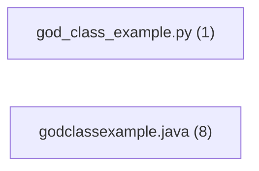

# Spectrometer Report — test_polyglot_god_classes

- Generated: 2025-12-14T14:40:42
- Repo root: `/mnt/data/spectrometer_system_audit/test_polyglot_god_classes`

## Summary
- Files analyzed: 2
- Components extracted: 9
- Recognized (non-Unknown): 11.1%
- Typed components: 1
- Unclassified components: 8

## Dependencies
- External packages (top): requests(1)

## Outputs
- Full component list: `components.csv`
- Raw particles: `particles.csv` (no IDs/deps)
- Full JSON: `results.json`

## Architecture (Mermaid)

## Unclassified Samples
| component_id | kind | name | file | line | evidence |
|---|---|---|---|---|---|
| `581ba0e42f6a` | class | `GodClassExample` | `GodClassExample.java` | 13 | `public class GodClassExample {` |
| `846803803ae9` | class | `Customer` | `GodClassExample.java` | 348 | `private class Customer {` |
| `812b17157be8` | class | `Order` | `GodClassExample.java` | 358 | `private class Order {` |
| `a212fa93dbd1` | class | `Item` | `GodClassExample.java` | 369 | `private class Item {` |
| `8ce998d9264f` | class | `NetworkClient` | `GodClassExample.java` | 375 | `private class NetworkClient {` |
| `f7726e9df834` | class | `FileLogger` | `GodClassExample.java` | 381 | `private class FileLogger {` |
| `e63c08238e1e` | class | `Validator` | `GodClassExample.java` | 390 | `private class Validator {` |
| `232018838310` | class | `GodClassPython` | `god_class_example.py` | 16 | `class GodClassPython:` |
