# Scattered Concerns Map (Drift Analysis)

This map visualizes the "Foreign Bodies" detected in the project root that violate the **Contextome (Brain)** vs **Codome (Body)** split.

## Legend
- 🟢 **Core**: Canonical System Component
- 🔴 **Scatter**: Misplaced / Orphaned / Legacy
- 🟡 **Debt**: Technical Debt / Drift

## Current Topology vs Ideal State

```mermaid
graph TD
    Root[PROJECT_elements]

    subgraph CORE ["Canonical Architecture"]
        Body[standard-model-of-code]
        Context[context-management]
    end

    subgraph SCATTER ["Foreign Bodies (To Consolidate)"]
        O1[experiments/]:::scatter --> Archive(Archive/Legacy)
        O2[dashboard/]:::scatter --> Archive
        O3[related/]:::scatter --> Archive
        O4[temporal_dashboard/]:::scatter --> Archive

        D1[architecture_report/]:::debt --> Reports(context-management/reports)
        D2[evolution_report/]:::debt --> Reports
        D3[roadmap_report/]:::debt --> Reports

        F1[unified_analysis.json 29MB]:::scatter --> Data(context-management/data)

        M1[PROJECT_MAP.md]:::debt --> Inventory(ARCHITECTURE_INVENTORY.md)
        M2[AGENTS.md]:::debt --> Docs(context-management/docs)
        M3[CLAUDE.md]:::debt --> Docs
        M4[GEMINI.md]:::debt --> Docs
    end

    Root --> Body
    Root --> Context
    Root --> O1
    Root --> O2
    Root --> O3
    Root --> O4
    Root --> D1
    Root --> D2
    Root --> D3
    Root --> F1
    Root --> M1

    classDef scatter fill:#ffcdd2,stroke:#c62828,color:black
    classDef debt fill:#fff9c4,stroke:#fbc02d,color:black
```

## Action Plan

| Artifact | Current Location | Target Location | Status |
|---|---|---|---|
| **Reports** | `*_report/` | `context-management/reports/` | [ ] Pending |
| **Modules** | `experiments/` | `standard-model-of-code/archive/` | [ ] Pending |
| **Docs** | `*.md` in Root | `context-management/docs/` | [ ] Pending |
| **Data** | `unified_analysis.json` | `context-management/data/` | [ ] Pending |
