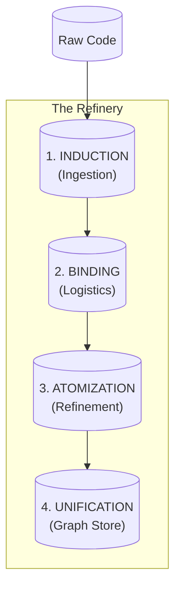

# REFINERY PIPELINE - Contextome Atomization Stages

**Pipeline:** Refinery (Contextome processing)
**Location:** `context-management/tools/ai/aci/refinery.py`
**Purpose:** Transform raw code into Refined Intelligence (Atoms) for the Graph Store.
**Stages:** 4 Canonical Rituals (Updated 2026-01-27)

---

## OVERVIEW

The Refinery Pipeline implements the **Waybill Architecture**, a linear transformation that turns raw files into graph-ready atoms. It bridges the gap between the immutable filesystem and the queryable Contextome.

---

## STAGE DEFINITIONS

### Stage 1: Induction (The Ingestion Ritual)
**Goal:** Manifest the file and assign it a persistent identity.
*   **User Intuition:** "Meet, Categorize, Tag"
*   **Technical Implementation:**
    *   **Class:** `corpus_inventory.py`
    *   **Action:** Scans filesystem, mints `Parcel ID` (`pcl_...`).
    *   **Output:** A "Parcel" with Language and Type metadata.

### Stage 2: Binding (The Logistics Handoff)
**Goal:** Attach provenance and contextual metadata.
*   **User Intuition:** "Describe the Situation"
*   **Technical Implementation:**
    *   **Class:** `pipeline.py`
    *   **Action:** Mints `Batch ID` (Copresence) and generates `Waybill`.
    *   **Data:** Captures who (User), when (Time), and why (Attention Signal).

### Stage 3: Atomization (The Refinery Gate)
**Goal:** Filter noise and break matter into atomic units (nodes).
*   **User Intuition:** "Do something (or not)"
*   **Technical Implementation:**
    *   **Class:** `refinery.py`
    *   **Gate:** `Attention Mechanism` filters flow (Laminar vs Turbulent).
    *   **Action:** `Chunker` splits content into `RefineryNodes`.
    *   **Enrichment:** Calculates Entropy, Complexity, and Semantic Embedding.

### Stage 4: Unification (The Gap Bridge)
**Goal:** Integrate atoms into the Total Reality.
*   **User Intuition:** "Data goes back to the User"
*   **Technical Implementation:**
    *   **Target:** **Neo4j Graph Store**
    *   **Action:** Nodes are ingested into the Graph.
    *   **Connectivity:** Nodes are linked to their `Batch`, `Parcel`, and `Structure` (Collider AST).

---

## COMPARISON: COLLIDER vs REFINERY

| Aspect | Collider Pipeline | Refinery Pipeline |
|--------|-------------------|-------------------|
| **Hemisphere** | Body (Structure) | Brain (Meaning) |
| **Input** | Code Syntax | Docs, Context, Intent |
| **Output** | Structural Graph | Semantic Graph |
| **Convergence** | **Neo4j** | **Neo4j** |

---

## CANONICAL LINKS

*   **Logic:** [refinery.py](file:///Users/lech/PROJECTS_all/PROJECT_elements/context-management/tools/ai/aci/refinery.py)
*   **Visualization:** [VISUALIZING_THE_WAYBILL.md](file:///Users/lech/.gemini/antigravity/brain/2870b6df-7ae4-4638-b8b5-9c31977358b8/VISUALIZING_THE_WAYBILL.md)
*   **Logistics Theory:** [THEORY_DATA_LOGISTICS.md](file:///Users/lech/PROJECTS_all/PROJECT_elements/context-management/docs/theory/THEORY_DATA_LOGISTICS.md)
