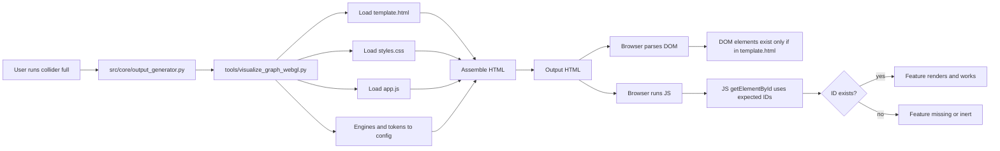

<!-- [MermaidChart: 1fc253e5-a686-4af3-a904-ce0c53d88c41] -->
<!-- [MermaidChart: 1fc253e5-a686-4af3-a904-ce0c53d88c41] -->
<!-- [MermaidChart: a47bb63c-d2f8-49cc-b8a1-601fc599e954] -->
<!-- [MermaidChart: 7b83b196-2f7f-4521-bb71-b2652aa088dc] -->

