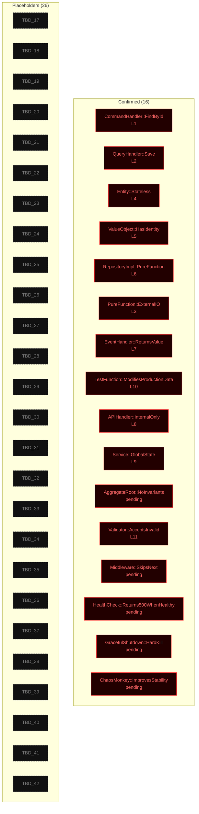
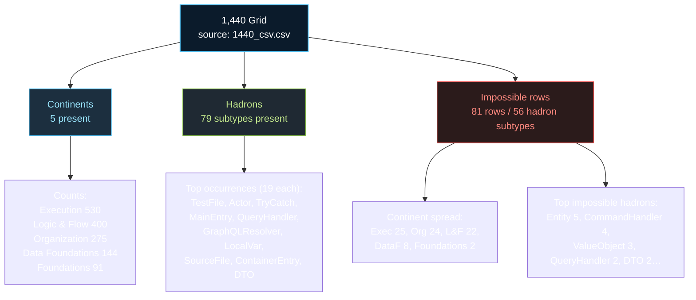

# Canonical Mermaids (v1 catalogs)

Mermaid diagrams for the key v1 canonical lists: constraints (11), forbidden archetypes (legacy 42 skeleton), and the RPBL purpose-map snapshot (1440 grid).

## 11 Fundamental Constraints (v1)

```mermaid
graph TD
    L1["L1 CQRS – Commands<br/>CommandHandler never returns data"]:::law
    L2["L2 CQRS – Queries<br/>QueryHandler never mutates state"]:::law
    L3["L3 Referential Purity<br/>PureFunction has no side effects"]:::law
    L4["L4 Entity Identity<br/>Entity always has ID"]:::law
    L5["L5 ValueObject Immutability<br/>VO has no identity"]:::law
    L6["L6 Repository Impurity<br/>RepositoryImpl is never pure"]:::law
    L7["L7 Fire-and-Forget Events<br/>EventHandler never returns value"]:::law
    L8["L8 External APIs<br/>APIHandler always crosses boundary"]:::law
    L9["L9 Stateless Services<br/>Service does not keep state"]:::law
    L10["L10 Test Isolation<br/>TestFunction never touches prod data"]:::law
    L11["L11 Validator Rejection<br/>Validator never accepts invalid"]:::law

    subgraph "11 Constraints (v1)"
      L1 --> L2 --> L3 --> L4 --> L5 --> L6 --> L7 --> L8 --> L9 --> L10 --> L11
    end

    classDef law fill:#111,color:#fff,stroke:#999,stroke-width:1.2px;
```

## Forbidden Archetypes (legacy “42 impossible”, skeleton)

## RPBL Purpose Map Snapshot (1440 grid)

