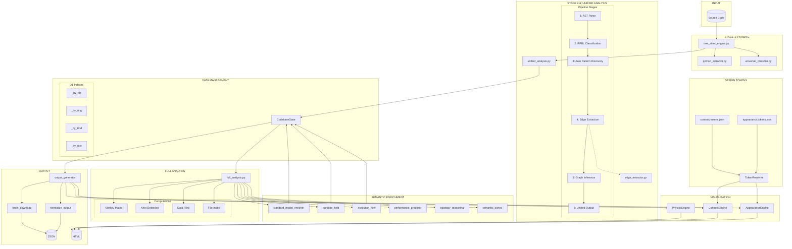
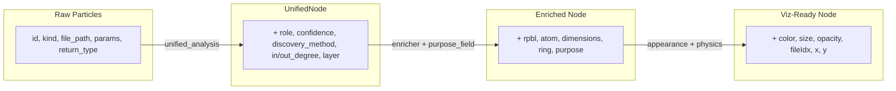
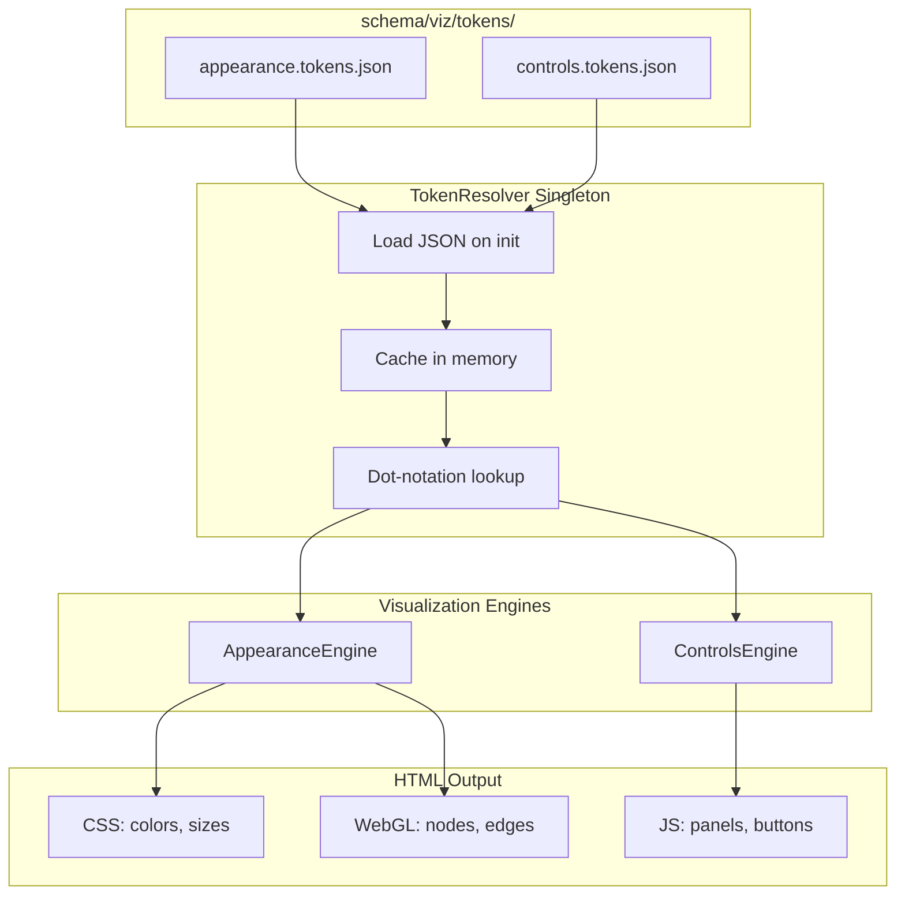
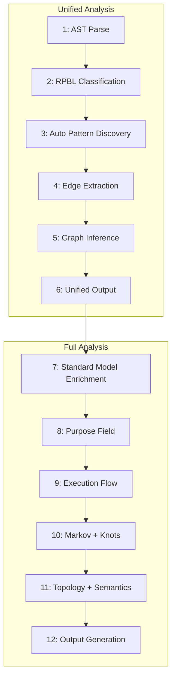
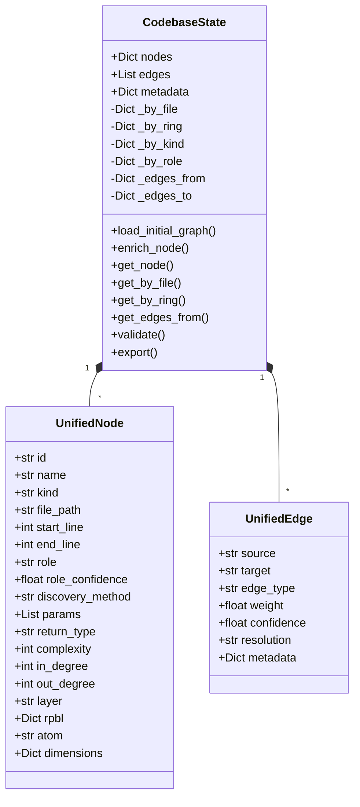
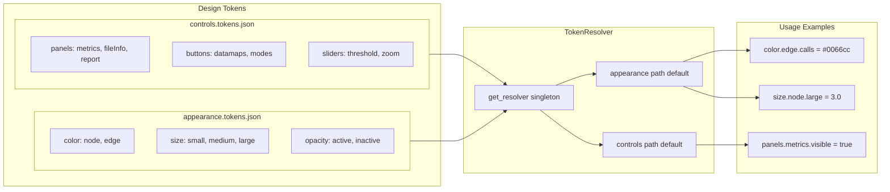

# Collider Modular Architecture

> Token Management & Data Flow Design Documentation

---

## System Overview



---

## Data Structures Flow



---

## Token Resolution Flow



---

## 12-Stage Full Analysis Pipeline



---

## CodebaseState Data Management



---

## Visualization Token System



---

## Module Dependency Matrix

| Module | Depends On | Produces |
|--------|-----------|----------|
| `tree_sitter_engine.py` | `parser/*`, `classification/*` | Raw particles |
| `unified_analysis.py` | `tree_sitter_engine`, `edge_extractor` | `UnifiedAnalysisOutput` |
| `edge_extractor.py` | particles | edges with resolution |
| `data_management.py` | - | `CodebaseState` (indexed) |
| `standard_model_enricher.py` | `schema/fixed/*` | RPBL, atoms, dimensions |
| `purpose_field.py` | nodes, edges | layer assignments |
| `execution_flow.py` | nodes, edges | entry points, orphans |
| `full_analysis.py` | all enrichment modules | `full_output` dict |
| `token_resolver.py` | `schema/viz/tokens/*` | resolved token values |
| `appearance_engine.py` | `token_resolver` | colored nodes/edges |
| `controls_engine.py` | `token_resolver` | UI panel config |
| `output_generator.py` | all above | JSON + HTML files |

---

## Key File Paths

| Component | Path |
|-----------|------|
| **Entry Point** | `cli.py` |
| **Full Analysis** | `src/core/full_analysis.py` |
| **Unified Analysis** | `src/core/unified_analysis.py` |
| **Data Management** | `src/core/data_management.py` |
| **Edge Extractor** | `src/core/edge_extractor.py` |
| **Standard Model Enricher** | `src/core/standard_model_enricher.py` |
| **Purpose Field** | `src/core/purpose_field.py` |
| **Execution Flow** | `src/core/execution_flow.py` |
| **Topology Reasoning** | `src/core/topology_reasoning.py` |
| **Semantic Cortex** | `src/core/semantic_cortex.py` |
| **Token Resolver** | `src/core/viz/token_resolver.py` |
| **Appearance Engine** | `src/core/viz/appearance_engine.py` |
| **Controls Engine** | `src/core/viz/controls_engine.py` |
| **Output Generator** | `src/core/output_generator.py` |
| **Brain Download** | `src/core/brain_download.py` |
| **Appearance Tokens** | `schema/viz/tokens/appearance.tokens.json` |
| **Controls Tokens** | `schema/viz/tokens/controls.tokens.json` |

---

## Canonical Data Conventions

| Convention | Format | Example |
|------------|--------|---------|
| **Node ID** | `file_path::qualified_name` | `src/core/service.py::MyService.run` |
| **Confidence** | 0.0 - 1.0 (never 0-100) | `0.92` |
| **Atom** | `RING.SUB.TIER` | `LOG.SRV.A` |
| **Rings** | LOG, DAT, ORG, EXE, EXT | `LOG` |
| **Tiers** | T0, T1, T2, M, A, C, U | `A` |
| **Edge Types** | calls, imports, contains, inherits | `calls` |
| **Resolution** | resolved_internal, external, unresolved | `resolved_internal` |

---

## Design Patterns Used

| Pattern | Where | Purpose |
|---------|-------|---------|
| **Facade** | `TreeSitterUniversalEngine` | Wraps parser + classifier |
| **Singleton** | `TokenResolver.get_resolver()` | Single token cache |
| **Strategy** | `AppearanceEngine` color modes | tier/ring/file coloring |
| **Pipeline** | `unified_analysis`, `full_analysis` | Sequential stages |
| **DTO** | `UnifiedNode`, `UnifiedEdge` | Fixed data contracts |
| **Index/Cache** | `CodebaseState._by_*` | O(1) lookups |

---

## Node Schema

```json
{
  "id": "src/core/file.py::ClassName.method_name",
  "name": "method_name",
  "kind": "method",
  "file_path": "/full/path/to/file.py",
  "start_line": 42,
  "end_line": 105,
  "role": "Service",
  "role_confidence": 0.92,
  "discovery_method": "pattern",
  "params": [{"name": "x", "type": "int"}],
  "return_type": "str",
  "complexity": 3,
  "in_degree": 5,
  "out_degree": 3,
  "layer": "application",
  "ring": "LOG",
  "atom": "LOG.SRV.A",
  "rpbl": {
    "responsibility": 7,
    "purity": 8,
    "boundary": 4,
    "lifecycle": 6
  },
  "dimensions": {
    "D1_WHAT": "LOG.SRV",
    "D1_ECOSYSTEM": "python",
    "D2_PURPOSE": "service"
  },
  "color": "#ff6b6b",
  "size": 2.4,
  "fileIdx": 3
}
```

---

## Edge Schema

```json
{
  "source": "src/core/file.py::Service.method",
  "target": "src/core/other.py::Repository.query",
  "edge_type": "calls",
  "weight": 1.0,
  "confidence": 0.95,
  "resolution": "resolved_internal",
  "file_path": "src/core/file.py",
  "line": 42,
  "markov_weight": 0.33
}
```

---

*Generated: 2026-01-18*
