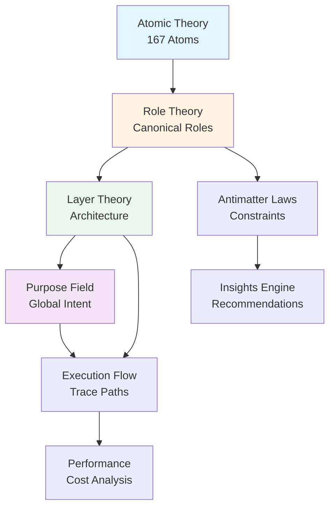
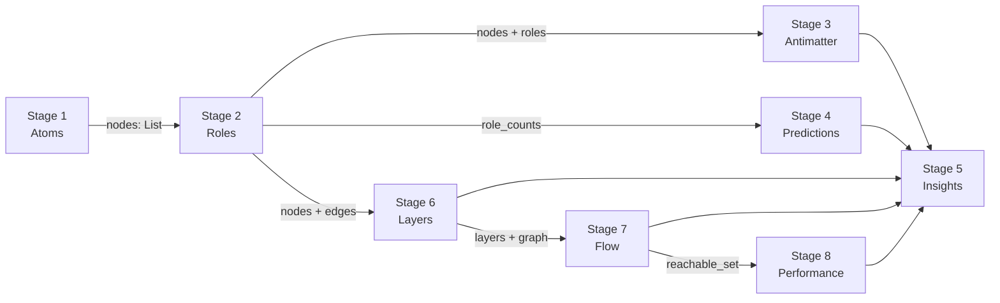

# The Standard Model Map: Theory & Pipeline

> **"How do we mount things on one another so that it makes sense?"**

This document proves the **dependency order** of the Standard Model theories and shows why reordering breaks the analysis.

---

## 📐 The Theoretical Hierarchy (Dependency DAG)



**The Mounting Law:**
> Each theory consumes the **output** of its dependencies as **input**. Reordering creates undefined behavior.

---

## 🏗️ The 4-Tier Stack (Microscopic → Macroscopic)

### Tier 1: Physics (The Foundation)
**"What is this made of?"**

| Theory | Atomic Theory |
|--------|---------------|
| **Axiom** | Every code element is composed of **167 known Atoms** (e.g., `LOG.FNC.M` = Function) |
| **Input** | Raw source code (text) |
| **Output** | `List[Node]` where each Node has `atom_id`, `name`, `file_path`, `lines` |
| **Pipeline** | `STAGE 1: Classification` |

**Example:**
```python
def save_user(user):  # <-- This is atom LOG.FNC.M (Function)
    db.insert(user)   # <-- This is atom LOG.STM.A (Statement)
```

**Why First?**
Without atoms, we have no **objects** to reason about. Trying to assign "Roles" without atoms is undefined.

---

### Tier 2: Chemistry (The Behavior)
**"What does it do?"**

| Theory | Role Theory + RPBL |
|--------|---------------------|
| **Axiom** | Constellations of Atoms form **Roles** (e.g., "Function with DB calls" → `Repository`) |
| **Input** | `List[Node]` (atoms) + `List[Edge]` (relationships) |
| **Output** | Each Node now has `role`, `role_confidence`, `rpbl_scores` |
| **Pipeline** | `STAGE 2: Role Distribution` |

**Example:**
```python
class UserRepository:        # Has methods: find(), save()
    def find(id): ...        # → Role: Repository (pattern match)
    def save(user): ...      # Confidence: 95% (explicit pattern)
```

**Why Second?**
We need structure (atoms) before we can infer function (roles). A "Repository" is meaningless without knowing what atoms compose it.

**Dependency Proof:**
If we run Stage 2 before Stage 1, we get: `AttributeError: 'str' object has no attribute 'atom_id'`

---

### Tier 3: Biology (The Context)
**"Where does it live & how does it flow?"**

| Theory | Layer Theory + Flow Theory |
|--------|----------------------------|
| **Axiom** | Roles belong to **Layers**. Code **flows** from entry points. |
| **Input** | `List[Node]` (with roles) + graph structure |
| **Output** | Each Node has `layer` (Domain/Infra/App/UI). Graph has `reachable_set`, `orphans` |
| **Pipeline** | `STAGE 6: Purpose Field` + `STAGE 7: Execution Flow` |

**Example:**
```python
# Layer Detection:
UserRepository → Infrastructure (because it does I/O)
User (Entity)  → Domain (because it has business rules)

# Flow Detection:
main() → create_user() → UserRepository.save()  # Reachable
orphan_function()  # Never called → Dead code
```

**Why Third?**
- **Layer** depends on **Role**: Only after knowing it's a "Repository" can we place it in "Infrastructure".
- **Flow** depends on **Structure**: We need the call graph (edges) to trace execution.

**Dependency Proof:**
If we run Stage 6 before Stage 2, we get: `KeyError: 'role' not in node` (Layer detection uses role heuristics)

---

### Tier 4: Cosmology (The Emergence)
**"Why does it exist? What's broken?"**

| Theory | Antimatter + Purpose Field + Insights |
|--------|---------------------------------------|
| **Axiom** | The system has **intent** (Purpose). Violations are **impossible states**. |
| **Input** | Fully enriched graph (atoms, roles, layers, flow) |
| **Output** | `violations`, `predictions`, `insights` (actionable recommendations) |
| **Pipeline** | `STAGE 3: Antimatter` + `STAGE 4: Predictions` + `STAGE 5: Insights` + `STAGE 8: Performance` |

**Example:**
```python
# Antimatter Violation:
User (Domain Entity) imports PostgresAdapter (Infrastructure)
→ VIOLATION: "Domain must not depend on Infrastructure"

# Prediction:
Found Entity: Order, Product, Payment
Found Repository: OrderRepository
→ PREDICT: "Missing ProductRepository, PaymentRepository"

# Insight:
20 Entities, 2 Repositories
→ HIGH Priority: "Apply Repository Pattern"
```

**Why Last?**
- **Antimatter** needs **Layer + Role**: Can't detect "Domain → Infrastructure" violation without knowing both.
- **Predictions** needs **Role counts**: "Missing Repository" requires Entity count.
- **Performance** needs **Flow**: Can't identify hotspots without execution trace.

**Dependency Proof:**
If we run Stage 3 (Antimatter) before Stage 6 (Layers), we get: `None` violations (because `node.layer` is undefined)

---

## 🔗 The Data Flow (What Flows Between Stages?)



**The Protocol:**
1. **Stage 1** produces the **matter** (atoms).
2. **Stage 2** adds **identity** (roles).
3. **Stage 3-8** add **context** (layers, flow, laws).
4. **Stage 5** synthesizes **meaning** (insights).

---

## 🧪 What Breaks If We Reorder?

| Reorder | What Breaks | Why |
|---------|-------------|-----|
| Run Stage 2 before Stage 1 | `AttributeError` | Roles need atoms to pattern-match |
| Run Stage 6 before Stage 2 | `KeyError: 'role'` | Layer detection uses role names |
| Run Stage 3 before Stage 6 | Zero violations | Antimatter needs layers to detect cross-layer imports |
| Run Stage 8 before Stage 7 | No hotspots | Performance needs flow trace to identify critical paths |
| Run Stage 5 before Stage 3,4,6,7,8 | Empty insights | Insights aggregate findings from all prior stages |

**The Law of Mounting:**
> A theory can only consume data **produced** by its dependencies. Violating this creates **runtime errors** or **silent failures** (zero results).

---

## 🎯 The CodebaseState (Unified Data Layer)

The **CodebaseState** enforces this order by design:

```python
state = CodebaseState(path)
state.load_initial_graph(nodes, edges)  # Stage 1 output

# Sequential enrichment (enforces dependency order):
state.enrich_node(id, "role", role="Repository")       # Stage 2
state.enrich_node(id, "layer", layer="Infrastructure") # Stage 6
state.enrich_node(id, "flow", is_orphan=True)          # Stage 7

# Export (after all stages complete):
output = state.export()  # Unified schema
```

**This is the glue** that prevents out-of-order execution.

---

## � Theory Dependencies (Summary Table)

| Stage | Theory | Depends On | Produces | Why This Order? |
|-------|--------|------------|----------|-----------------|
| 1 | Atomic | None | `atoms` | Foundation (no dependencies) |
| 2 | Role | Atoms | `roles` | Needs structure to infer function |
| 3 | Antimatter | Roles, Layers | `violations` | Needs role + layer to detect cross-layer violations |
| 4 | Predictions | Roles | `missing_components` | Needs role counts for symmetry |
| 6 | Layer | Roles, Graph | `layers` | Uses role + I/O heuristics |
| 7 | Flow | Graph, Entry Points | `reachable_set`, `orphans` | Needs edges to trace execution |
| 8 | Performance | Flow | `hotspots`, `cost` | Needs flow trace to identify critical paths |
| 5 | Insights | All above | `recommendations` | Synthesizes findings from all prior stages |

---

**The First Principle:**
> **Atoms** → **Roles** → **Layers** → **Laws** → **Purpose**

This is not arbitrary. It is the **only valid order** that avoids undefined dependencies.

---

## 📦 The 16 Fundamental Families

> *Updated from code - actual count is 16, not 12*

Atoms group into 16 families across 4 phases:

| Family | Phase | Purpose |
|--------|-------|---------|
| Bits | Data | Binary flags/masks |
| Bytes | Data | Raw byte arrays |
| Primitives | Data | Basic values (int, string, bool) |
| Variables | Data | Named storage |
| Expressions | Logic | Value-producing combinations |
| Statements | Logic | Actions (return, assert) |
| Control | Logic | Flow (if, while, for) |
| Functions | Logic | Callable units |
| Aggregates | Organization | Composite structures (class, DTO) |
| Modules | Organization | Organizational units |
| Files | Organization | File-level entities |
| Handlers | Execution | Request/event handlers |
| Initializers | Execution | Startup/bootstrap code |
| Probes | Execution | Logging/monitoring |
| Services | Execution | Background services |
| Workers | Execution | Async/background workers |

**Total Atoms:** 167 across 16 families in 4 phases

---

## 🏢 The 10 Universal Subsystems

Most repositories cluster into ~10 meta-components (subsystems):

| # | Subsystem | What It Contains | Purpose |
|---|-----------|------------------|---------|
| 1 | **Ingress** | Routers, controllers, middleware | Receive requests |
| 2 | **Egress** | External clients, webhooks | Call external systems |
| 3 | **Domain Core** | Entities, rules, use-cases | Business logic |
| 4 | **Persistence** | ORM, repositories, migrations | Store data |
| 5 | **Async Processing** | Queues, workers, schedulers | Background work |
| 6 | **Presentation** | UI components, view models | Display data |
| 7 | **Security** | AuthN/AuthZ, policies | Protect system |
| 8 | **Observability** | Logging, metrics, tracing | Monitor health |
| 9 | **Configuration** | Config loading, env vars | Configure behavior |
| 10 | **Delivery** | CI/CD pipelines, IaC | Ship code |
