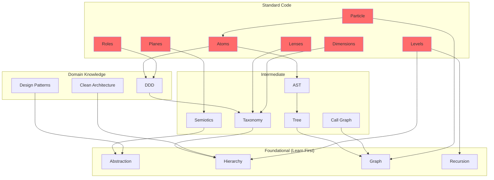

# CONCEPT ATLAS
## The Library of Prerequisites for Understanding Standard Code

> *"We are a collection of abstractions about abstractions. The most useful wins."*

---

## Epistemic Premise

To understand **Standard Code**, you must first understand the **concepts it borrows**.
This document maps every prerequisite concept and their spatial relationships.

**Relationships Types:**
- **∥ PARALLEL**: Concepts exist side-by-side (independent, can combine)
- **⊂ CONTAINS**: One concept nests inside another
- **↑ ABOVE/BELOW**: Concepts at different abstraction scales
- **→ DEPENDS ON**: Prerequisites for understanding

---

# PART I: THE CONCEPT INVENTORY

## Count: 47 Core Concepts

| # | Concept | Domain | Type | Prerequisites |
|---|---------|--------|------|---------------|
| **FOUNDATIONAL (Borrowed)** |||||
| 1 | Abstraction | Philosophy | Universal | None |
| 2 | Map vs Territory | Epistemology | Foundational | Abstraction |
| 3 | Hierarchy | Systems | Universal | None |
| 4 | Recursion | Math | Universal | Hierarchy |
| 5 | Fractal | Math | Pattern | Recursion |
| 6 | Graph | Math | Structure | None |
| 7 | Node | Graph Theory | Entity | Graph |
| 8 | Edge | Graph Theory | Relationship | Graph, Node |
| 9 | Tree | Data Structures | Structure | Graph, Hierarchy |
| 10 | Taxonomy | Biology | Classification | Hierarchy |
| **PHILOSOPHICAL (Borrowed)** |||||
| 11 | Ontology | Philosophy | Framework | Abstraction |
| 12 | Epistemology | Philosophy | Framework | Ontology |
| 13 | Semiotics | Linguistics | Theory | Abstraction |
| 14 | Syntactics | Semiotics | Layer | Semiotics |
| 15 | Semantics | Semiotics | Layer | Semiotics |
| 16 | Pragmatics | Semiotics | Layer | Semiotics |
| **SCIENTIFIC (Borrowed)** |||||
| 17 | Entropy | Physics | Measure | None |
| 18 | Information | Shannon | Measure | Entropy |
| 19 | State | Physics | Property | None |
| 20 | Transformation | Math | Process | State |
| 21 | Feedback Loop | Cybernetics | Pattern | Transformation |
| 22 | Self-Organization | Complexity | Phenomenon | Feedback Loop |
| 23 | Emergence | Complexity | Phenomenon | Self-Organization |
| **SOFTWARE ENGINEERING (Borrowed)** |||||
| 24 | AST | Compilers | Structure | Tree |
| 25 | Call Graph | Program Analysis | Structure | Graph |
| 26 | Dependency | Software | Relationship | Graph |
| 27 | Module | Software | Container | Abstraction |
| 28 | Function | Software | Unit | Transformation |
| 29 | Class | OOP | Container | Module, Function |
| 30 | Interface | OOP | Contract | Abstraction |
| 31 | Layer (Arch) | Architecture | Pattern | Hierarchy |
| 32 | Pattern (Design) | GoF | Template | Abstraction |
| **DDD/ARCHITECTURE (Borrowed)** |||||
| 33 | Entity | DDD | Object | State |
| 34 | Value Object | DDD | Object | State |
| 35 | Aggregate | DDD | Container | Entity, Boundary |
| 36 | Repository | DDD | Pattern | Aggregate |
| 37 | Service | DDD | Component | Function |
| 38 | Boundary | Architecture | Concept | Module |
| 39 | Port | Hexagonal | Interface | Boundary |
| 40 | Adapter | Hexagonal | Implementation | Port |
| **STANDARD CODE (Novel)** |||||
| 41 | Plane | SC Theory | Existence Mode | Semiotics |
| 42 | Level | SC Theory | Scale | Hierarchy |
| 43 | Lens | SC Theory | Perspective | Ontology |
| 44 | Dimension | SC Theory | Axis | Taxonomy |
| 45 | Atom | SC Theory | Type | AST, Taxonomy |
| 46 | Role | SC Theory | Purpose | DDD Patterns |
| 47 | Particle | SC Theory | Instance | Node, Atom, Confidence |

---

## Concept Prerequisites Graph

```
To understand PARTICLE, you need:
  PARTICLE
    ├── Node ← Graph ← (foundational)
    ├── Atom ← AST ← Tree ← Graph
    │          └── Taxonomy ← Hierarchy ← (foundational)
    └── Confidence ← Epistemology ← (foundational)
```

---

# PART II: SPATIAL RELATIONSHIPS

## The 3 Relationship Types

### 1. PARALLEL (∥) - Side by Side

Concepts that exist simultaneously, independent axes:

```
┌─────────────────────────────────────────────────────────────────┐
│                     PARALLEL CONCEPTS                           │
├─────────────────────────────────────────────────────────────────┤
│                                                                 │
│   ╔════════════╗    ╔════════════╗    ╔════════════╗           │
│   ║  PHYSICAL  ║ ∥  ║  VIRTUAL   ║ ∥  ║  SEMANTIC  ║           │
│   ║   PLANE    ║    ║   PLANE    ║    ║   PLANE    ║           │
│   ╚════════════╝    ╚════════════╝    ╚════════════╝           │
│                                                                 │
│   ╔════════╗ ╔════════╗ ╔════════╗ ╔════════╗ ╔════════╗       │
│   ║ D1:WHAT║∥║D2:LAYER║∥║D3:ROLE ║∥║D4:BOUND║∥║ ...D8  ║       │
│   ╚════════╝ ╚════════╝ ╚════════╝ ╚════════╝ ╚════════╝       │
│                                                                 │
│   ╔════════╗ ╔════════╗ ╔════════╗ ╔════════╗ ╔════════╗       │
│   ║  R1:ID ║∥║R2:ONTO ║∥║R3:CLASS║∥║R4:COMP ║∥║ ...R8  ║       │
│   ╚════════╝ ╚════════╝ ╚════════╝ ╚════════╝ ╚════════╝       │
│                                                                 │
└─────────────────────────────────────────────────────────────────┘

PARALLEL SETS:
- 3 Planes (P1, P2, P3) - all exist simultaneously
- 8 Dimensions (D1-D8) - independent axes
- 8 Lenses (R1-R8) - simultaneous perspectives
```

### 2. CONTAINS (⊂) - Nested Inside

Concepts that nest within each other:

```
┌─────────────────────────────────────────────────────────────────┐
│                     CONTAINMENT HIERARCHY                       │
├─────────────────────────────────────────────────────────────────┤
│                                                                 │
│   L12 UNIVERSE ─────────────────────────────────────────────┐   │
│   │                                                         │   │
│   └── L7 SYSTEM ─────────────────────────────────────────┐  │   │
│       │                                                  │  │   │
│       └── L6 PACKAGE ─────────────────────────────────┐  │  │   │
│           │                                           │  │  │   │
│           └── L5 FILE ─────────────────────────────┐  │  │  │   │
│               │                                    │  │  │  │   │
│               └── L4 CONTAINER ─────────────────┐  │  │  │  │   │
│                   │                             │  │  │  │  │   │
│                   └── L3 NODE (ATOM) ────────┐  │  │  │  │  │   │
│                       │                      │  │  │  │  │  │   │
│                       └── L2 BLOCK ───────┐  │  │  │  │  │  │   │
│                           │               │  │  │  │  │  │  │   │
│                           └── L1 STMT ─┐  │  │  │  │  │  │  │   │
│                               │        │  │  │  │  │  │  │  │   │
│                               └── L0   │  │  │  │  │  │  │  │   │
│                                 TOKEN  │  │  │  │  │  │  │  │   │
│                                        │  │  │  │  │  │  │  │   │
└────────────────────────────────────────┴──┴──┴──┴──┴──┴──┴──┴───┘

CONTAINMENT RULES:
- Higher level CONTAINS lower levels
- Every level exists INSIDE a higher level
- L3 (Node/Atom) is the fundamental semantic unit
```

### 3. ABOVE/BELOW (↑↓) - Scale Layers

Concepts at different abstraction scales:

```
┌─────────────────────────────────────────────────────────────────┐
│                     ABSTRACTION SCALES                          │
├─────────────────────────────────────────────────────────────────┤
│                                                                 │
│   ╔═══════════════════════════════════════════════════════════╗ │
│   ║           META-LEVEL (About the theory)                   ║ │
│   ║   ┌───────────┐ ┌───────────┐ ┌───────────┐              ║ │
│   ║   │ Epistemics│ │ Lineage   │ │ Validation│              ║ │
│   ║   └───────────┘ └───────────┘ └───────────┘              ║ │
│   ╚═══════════════════════════════════════════════════════════╝ │
│                           ↑ about ↓                             │
│   ╔═══════════════════════════════════════════════════════════╗ │
│   ║           THEORY-LEVEL (Standard Code)                    ║ │
│   ║   ┌───────┐ ┌───────┐ ┌───────┐ ┌───────┐ ┌───────┐      ║ │
│   ║   │Planes │ │Levels │ │Lenses │ │Dims   │ │Atoms  │      ║ │
│   ║   └───────┘ └───────┘ └───────┘ └───────┘ └───────┘      ║ │
│   ╚═══════════════════════════════════════════════════════════╝ │
│                           ↑ about ↓                             │
│   ╔═══════════════════════════════════════════════════════════╗ │
│   ║           DOMAIN-LEVEL (Borrowed Concepts)                ║ │
│   ║   ┌───────┐ ┌───────┐ ┌───────┐ ┌───────┐ ┌───────┐      ║ │
│   ║   │DDD    │ │GoF    │ │Clean  │ │Graphs │ │Sem    │      ║ │
│   ║   └───────┘ └───────┘ └───────┘ └───────┘ └───────┘      ║ │
│   ╚═══════════════════════════════════════════════════════════╝ │
│                           ↑ about ↓                             │
│   ╔═══════════════════════════════════════════════════════════╗ │
│   ║           FOUNDATIONAL-LEVEL (Prerequisites)              ║ │
│   ║   ┌───────┐ ┌───────┐ ┌───────┐ ┌───────┐ ┌───────┐      ║ │
│   ║   │Abstract│ │Hierarch│ │Graph  │ │Recurs │ │Entropy│      ║ │
│   ║   └───────┘ └───────┘ └───────┘ └───────┘ └───────┘      ║ │
│   ╚═══════════════════════════════════════════════════════════╝ │
│                                                                 │
└─────────────────────────────────────────────────────────────────┘
```

---

# PART III: THE COMPLETE CONCEPT MAP

## Zoomable Atlas Structure

```
ZOOM LEVEL 1 (Macro): The 4 Quadrants
┌────────────────────────────────────────────────────────────────┐
│                    STANDARD CODE ATLAS                         │
├──────────────────────┬─────────────────────────────────────────┤
│                      │                                         │
│   ONTOLOGY           │   EPISTEMOLOGY                          │
│   (What exists)      │   (What we know)                        │
│   ├── Planes         │   ├── Confidence                        │
│   ├── Levels         │   ├── Evidence                          │
│   ├── Dimensions     │   ├── Validation                        │
│   └── Atoms/Roles    │   └── Lineage                           │
│                      │                                         │
├──────────────────────┼─────────────────────────────────────────┤
│                      │                                         │
│   RELATIONSHIPS      │   DYNAMICS                              │
│   (How connected)    │   (How changes)                         │
│   ├── Edges          │   ├── Lifecycle                         │
│   ├── Containment    │   ├── Transformation                    │
│   ├── Dependencies   │   └── Evolution                         │
│   └── Inheritance    │                                         │
│                      │                                         │
└──────────────────────┴─────────────────────────────────────────┘
```

```
ZOOM LEVEL 2 (Ontology Detail):
┌────────────────────────────────────────────────────────────────┐
│                    ONTOLOGY QUADRANT                           │
├────────────────────────────────────────────────────────────────┤
│                                                                │
│   EXISTENCE           SCALE              CLASSIFICATION        │
│   ┌─────────┐         ┌─────────┐        ┌─────────┐          │
│   │ PLANES  │         │ LEVELS  │        │DIMENSIONS│          │
│   │ ∥∥∥     │         │ ⊂⊂⊂⊂⊂   │        │ ∥∥∥∥∥∥∥∥ │          │
│   │ P1 P2 P3│         │ L0...L12│        │ D1...D8  │          │
│   └─────────┘         └─────────┘        └─────────┘          │
│   (parallel)          (nested)           (orthogonal)          │
│                                                                │
│   MATERIAL            PURPOSE                                  │
│   ┌─────────┐         ┌─────────┐                             │
│   │  ATOMS  │         │  ROLES  │                             │
│   │ 4×4×N   │         │  33+?   │                             │
│   │ =167    │         │         │                             │
│   └─────────┘         └─────────┘                             │
│   (categorized)       (semantic)                              │
│                                                                │
└────────────────────────────────────────────────────────────────┘
```

```
ZOOM LEVEL 3 (Single Concept - e.g., LEVELS):
┌────────────────────────────────────────────────────────────────┐
│                       THE 16 LEVELS                            │
├────────────────────────────────────────────────────────────────┤
│                                                                │
│   COSMOLOGICAL (L8-L12)                                        │
│   ┌─────────────────────────────────────────────────────────┐  │
│   │ L12:Universe → L11:Domain → L10:Org → L9:Platform → L8  │  │
│   └─────────────────────────────────────────────────────────┘  │
│                          │                                     │
│   SYSTEMIC (L4-L7)       ▼                                     │
│   ┌─────────────────────────────────────────────────────────┐  │
│   │ L7:System → L6:Package → L5:File → L4:Container         │  │
│   └─────────────────────────────────────────────────────────┘  │
│                          │                                     │
│   SEMANTIC (L1-L3)       ▼            ★ FUNDAMENTAL UNIT       │
│   ┌─────────────────────────────────────────────────────────┐  │
│   │ L3:Node ★ → L2:Block → L1:Statement                     │  │
│   └─────────────────────────────────────────────────────────┘  │
│                          │                                     │
│   EVENT HORIZON (L0)     ▼                                     │
│   ┌─────────────────────────────────────────────────────────┐  │
│   │ L0:Token (Where text becomes logic)                     │  │
│   └─────────────────────────────────────────────────────────┘  │
│                          │                                     │
│   PHYSICAL (L-1 to L-3)  ▼                                     │
│   ┌─────────────────────────────────────────────────────────┐  │
│   │ L-1:Character → L-2:Byte → L-3:Bit                      │  │
│   └─────────────────────────────────────────────────────────┘  │
│                                                                │
│   LINEAGE: Dijkstra (1968) + Koestler (1967) + Floridi (2008) │
│                                                                │
└────────────────────────────────────────────────────────────────┘
```

---

# PART IV: CONCEPT DEPENDENCY GRAPH

## What You Need to Know (Prerequisites)



---

# PART V: CONCEPT GLOSSARY

## The Essential 47 (Alphabetical)

| Concept | One-Line Definition | Category |
|---------|---------------------|----------|
| **Abstraction** | Hiding complexity behind a simpler interface | Foundational |
| **Adapter** | Implementation that converts between interfaces | Domain |
| **Aggregate** | Consistency boundary around related entities | DDD |
| **AST** | Tree representation of source code syntax | Software |
| **Atom** | One of 167 structural classification types | SC Theory |
| **Boundary** | Where a system meets the outside | Architecture |
| **Call Graph** | Graph of which functions invoke which | Software |
| **Class** | Container for related state and behavior | OOP |
| **Dependency** | When one module needs another | Software |
| **Dimension** | One of 8 orthogonal classification axes | SC Theory |
| **Edge** | Connection between nodes in a graph | Graph Theory |
| **Emergence** | Complex behavior from simple rules | Complexity |
| **Entity** | Object with identity that persists over time | DDD |
| **Entropy** | Measure of disorder/information | Physics |
| **Epistemology** | Study of knowledge and belief | Philosophy |
| **Feedback Loop** | Output affecting input | Cybernetics |
| **Fractal** | Pattern that repeats at every scale | Math |
| **Function** | Unit of transformation | Software |
| **Graph** | Nodes connected by edges | Math |
| **Hierarchy** | Levels of containment or abstraction | Universal |
| **Information** | Reduction of uncertainty | Shannon |
| **Interface** | Contract for interaction | OOP |
| **Layer (Arch)** | Horizontal slice of architecture | Architecture |
| **Lens** | One of 8 perspectives for viewing code | SC Theory |
| **Level** | One of 16 scales in the hierarchy | SC Theory |
| **Map vs Territory** | Representation ≠ reality | Epistemology |
| **Module** | Self-contained unit of code | Software |
| **Node** | Point in a graph | Graph Theory |
| **Ontology** | Study of what exists | Philosophy |
| **Particle** | Node + Atom + Confidence | SC Theory |
| **Pattern (Design)** | Reusable solution template | GoF |
| **Plane** | One of 3 modes of existence | SC Theory |
| **Port** | Interface for external communication | Hexagonal |
| **Pragmatics** | Meaning in context | Semiotics |
| **Recursion** | Self-reference, part contains whole | Math |
| **Repository** | Pattern for data persistence | DDD |
| **Role** | One of 33 semantic purposes | SC Theory |
| **Self-Organization** | Structure emerging without central control | Complexity |
| **Semantics** | Meaning of symbols | Semiotics |
| **Semiotics** | Study of signs and symbols | Linguistics |
| **Service** | Stateless business logic | DDD |
| **State** | Current configuration of a system | Physics |
| **Syntactics** | Structure of symbols | Semiotics |
| **Taxonomy** | Classification hierarchy | Biology |
| **Transformation** | Change from one state to another | Math |
| **Tree** | Hierarchical graph structure | Data Structures |
| **Value Object** | Object defined by its values, not identity | DDD |

---

# PART VI: READING ORDER

## The Learning Path

```
PHASE 1: FOUNDATIONS (No prerequisites)
  ├── Abstraction
  ├── Hierarchy  
  ├── Graph
  └── Recursion

PHASE 2: STRUCTURES (After Phase 1)
  ├── Tree ← Graph
  ├── Taxonomy ← Hierarchy
  ├── AST ← Tree
  └── Fractal ← Recursion

PHASE 3: PHILOSOPHY (Any time)
  ├── Semiotics
  ├── Ontology
  ├── Epistemology
  └── Map vs Territory

PHASE 4: SOFTWARE DOMAIN (After Phases 1-2)
  ├── DDD (Entity, Aggregate, Repository, Service)
  ├── Clean Architecture (Layers, Boundaries)
  ├── GoF Patterns
  └── Call Graph, Dependencies

PHASE 5: STANDARD CODE (After all above)
  ├── Planes ← Semiotics
  ├── Levels ← Hierarchy + Recursion
  ├── Lenses ← Ontology + Taxonomy
  ├── Dimensions ← Taxonomy
  ├── Atoms ← AST + DDD
  ├── Roles ← DDD
  └── Particle ← Node + Atom + Confidence
```

---

> *"The theory is a collection of useful concepts. Each concept has ancestors. Together they form the atlas of software engineering."*

---

## Statistics

| Category | Count |
|----------|-------|
| **Foundational Concepts** | 10 |
| **Philosophical Concepts** | 6 |
| **Scientific Concepts** | 7 |
| **Software Engineering Concepts** | 9 |
| **DDD/Architecture Concepts** | 8 |
| **Standard Code Concepts** | 7 |
| **TOTAL CONCEPTS** | **47** |

---

```
┌─────────────────────────────────────────────────────────────────────────────┐
│                                                                             │
│   "To understand the duality of particles and waves,                        │
│    you must first understand what a particle is, and what a wave is.        │
│    Then you can understand the synthesis."                                  │
│                                                                             │
│   Standard Code is a synthesis.                                             │
│   This atlas maps what you need to understand it.                           │
│                                                                             │
└─────────────────────────────────────────────────────────────────────────────┘
```
