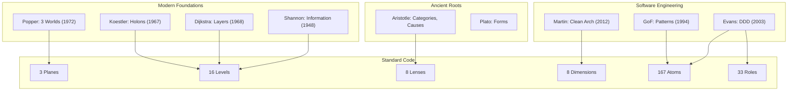

# CONCEPT LINEAGE
## Intellectual Inheritance Chains of Standard Code

> *"Just like code has inheritance chains, we must track where each concept comes from."*

---

## Epistemic Contract

This document traces the **intellectual provenance** of every concept in Standard Code.

**Purpose:**
- Academic honesty: Credit to original thinkers
- Epistemology: Know what we inherit vs. what we synthesize
- Evolution: Track how ideas transform through combination

**Format:**
```
CONCEPT ← PARENT_CONCEPT (Author, Year)
         └── GRANDPARENT_CONCEPT (Author, Year)
```

---

# PART I: FOUNDATIONAL CONCEPTS

---

## 1. THE 3 PLANES (Physical, Virtual, Semantic)

```
PLANES ← Semiotics: Syntactics/Semantics/Pragmatics (Morris, 1938)
       ← Ontological Levels (Nicolai Hartmann, 1940s)
       ← Three Worlds Theory (Karl Popper, 1972)
           └── World 1: Physical
           └── World 2: Mental
           └── World 3: Abstract Objects
       ← Software Levels (Floridi, "The Levels of Abstraction", 2008)
```

**Synthesis:** We renamed Popper's "Worlds" to "Planes" and aligned them with software-specific substrates (bytes → syntax → meaning).

---

## 2. THE LEVEL HIERARCHY (L-3 to L12)

```
LEVELS ← Abstraction Layers (Dijkstra, "Structure of THE", 1968)
       ← Levels of Abstraction (Floridi, 2008)
       ← Semantic Levels (Simon, "Sciences of the Artificial", 1969)
       ← Holarchy (Koestler, "The Ghost in the Machine", 1967)
           └── Holons: Simultaneously whole and part
       ← Scalar Hierarchy (Allen & Starr, "Hierarchy", 1982)
           └── Ecological scaling: Organism → Population → Ecosystem
       ← Category Theory: Objects at different levels of abstraction
```

**Synthesis:** Combined Dijkstra's layers, Koestler's holons, and ecological scalar theory. The "16 levels" count is our empirical observation.

---

## 3. THE FRACTAL PATTERN (M→I→P→O)

```
FRACTAL ← Self-Similarity (Mandelbrot, 1975)
        ← Input-Process-Output (Shannon, "Mathematical Theory of Communication", 1948)
        ← Finite State Machines (Mealy/Moore, 1950s)
        ← Cybernetic Loop (Wiener, "Cybernetics", 1948)
            └── Feedback cycles
        ← OODA Loop (John Boyd, 1970s)
            └── Observe → Orient → Decide → Act
        ← Conway's Game of Life (1970)
            └── Emergent complexity from simple rules
```

**Synthesis:** We observed that IPO repeats at every level. Added "Memory" (state) as the fourth component, creating M→I→P→O with feedback.

---

## 4. THE 8 LENSES

```
LENSES ← Aristotle's Four Causes (350 BC)
         └── Material, Formal, Efficient, Final
       ← Zachman Framework (1987)
           └── What, How, Where, Who, When, Why
       ← 4+1 Architectural Views (Kruchten, 1995)
           └── Logical, Process, Development, Physical, Scenarios
       ← C4 Model (Simon Brown, 2011)
           └── Context, Container, Component, Code
       ← Epistemological Categories (Kant, 1781)
           └── Categories of Understanding
```

**Synthesis:** We distilled "8 orthogonal questions" from these frameworks. The Epistemology lens (R8) is our addition—confidence tracking is novel.

| Lens | Primary Ancestor |
|------|------------------|
| R1 Identity | Naming (Universal) |
| R2 Ontology | Aristotle's Categories |
| R3 Classification | Taxonomy (Linnaeus) |
| R4 Composition | Part-Whole (Mereology) |
| R5 Relationships | Graph Theory (Euler) |
| R6 Transformation | Shannon's IPO |
| R7 Semantics | Semiotics (Peirce, Morris) |
| R8 Epistemology | **Novel synthesis** |

---

## 5. THE 8 DIMENSIONS

```
DIMENSIONS ← Multidimensional Scaling (Kruskal, 1964)
           ← Faceted Classification (Ranganathan, 1933)
               └── PMEST: Personality, Matter, Energy, Space, Time
           ← DDD Concepts (Eric Evans, 2003)
               └── Aggregates, Entities, Value Objects
           ← Clean Architecture Layers (Robert Martin, 2012)
           ← Functional/Non-Functional Split (IEEE, 1998)
```

**Synthesis:** We orthogonalized questions that architects ask. Each dimension is independent—this is our claim to validate.

| Dimension | Primary Ancestor |
|-----------|------------------|
| D1 WHAT | AST Node Types (Compiler Theory) |
| D2 LAYER | Clean Architecture (Martin) |
| D3 ROLE | DDD Patterns (Evans) |
| D4 BOUNDARY | Ports & Adapters (Cockburn) |
| D5 STATE | State Machines (Mealy/Moore) |
| D6 EFFECT | Pure Functions (Lambda Calculus) |
| D7 ACTIVATION | Event-Driven Architecture |
| D8 LIFETIME | Garbage Collection (McCarthy) |

---

## 6. THE 167 ATOMS

```
ATOMS ← AST Node Kinds (Compiler Theory)
      ← Periodic Table Metaphor (Mendeleev, 1869)
      ← Design Patterns (GoF, 1994)
          └── 23 patterns → generalized
      ← DDD Building Blocks (Evans, 2003)
          └── Entity, ValueObject, Aggregate, Repository, etc.
      ← Microservices Patterns (Richardson, 2018)
      ← Tree-sitter Node Types (Max Brunsfeld, 2018)
```

**Synthesis:** We enumerated all AST node types we've observed and organized them into 4 Phases × 4 Families. The "167" is an empirical count, not a theoretical derivation.

| Phase | Primary Ancestor |
|-------|------------------|
| DATA | Type Systems (Pierce) |
| LOGIC | Control Flow (Böhm-Jacopini) |
| ORGANIZATION | DDD (Evans) |
| EXECUTION | Microservices Patterns |

---

## 7. THE 33 ROLES

```
ROLES ← DDD Tactical Patterns (Evans, 2003)
         └── Repository, Factory, Service, Entity, ValueObject
      ← CQRS (Greg Young, 2010)
          └── Command, Query
      ← Hexagonal Architecture (Cockburn, 2005)
          └── Ports, Adapters
      ← Clean Architecture (Martin, 2012)
          └── Use Cases, Controllers, Presenters
      ← Gang of Four Patterns (1994)
          └── Builder, Factory, Strategy, etc.
```

**Synthesis:** We consolidated roles from DDD, CQRS, Clean Architecture. The "33" count is empirical—we've found these in real codebases.

---

## 8. THE 6 EDGE FAMILIES

```
EDGES ← Graph Theory (Euler, 1736)
      ← Dependency Graphs (Compiler Theory)
      ← Call Graphs (Program Analysis)
      ← UML Relationships (OMG, 1997)
          └── Association, Aggregation, Composition, Inheritance
      ← ER Diagrams (Chen, 1976)
          └── Entity-Relationship
      ← Semantic Web (Berners-Lee, 2001)
          └── RDF Triples: Subject → Predicate → Object
```

**Synthesis:** We categorized edges by semantic family (Structural, Dependency, Inheritance, Semantic, Temporal, Data Flow).

---

# PART II: THEORETICAL FRAMEWORKS

---

## 9. THE COSMOLOGY (Manifold, Holon, Wormholes)

```
COSMOLOGY ← Topology (Poincaré, 1895)
          ← Manifold Theory (Riemann, 1854)
          ← Holarchy (Koestler, 1967)
          ← Panpsychism (Chalmers, 1996)
              └── Information as fundamental
          ← Computational Universe (Wolfram, 2002)
          ← Purpose Fields (Novel metaphor)
```

**Synthesis:** We treat code space as an 8D manifold where systems are holons floating in a "purpose field." The metaphor is novel, the math is standard topology.

---

## 10. THE CONSTRUCTAL LAW

```
CONSTRUCTAL ← Adrian Bejan (1996)
             └── "Flow systems evolve to provide easier access to currents"
           ← Thermodynamics (2nd Law)
           ← Self-Organization (Prigogine, 1977)
           ← Complexity Theory (Santa Fe Institute)
```

**Synthesis:** We apply Bejan's law to code: information flow through call graphs follows least-resistance paths, evolving toward hierarchy.

---

## 11. THE PANCOMPUTATIONALISM

```
PANCOMPUTATION ← Computation as Universe (Zuse, 1967)
               ← Digital Physics (Fredkin, 1992)
               ← Cellular Automata (Wolfram, 2002)
               ← It from Bit (Wheeler, 1990)
               ← Constructor Theory (Deutsch & Marletto, 2013)
```

**Synthesis:** We accept the hypothesis that reality is computational, making software engineering a study of "natural law."

---

## 12. THE EPISTEMIC STANCE

```
EPISTEMIC ← Critical Rationalism (Popper, 1934)
              └── Falsifiability
          ← Bayesian Epistemology (Jaynes, 2003)
              └── Confidence as probability
          ← Map vs Territory (Korzybski, 1931)
          ← Open World Assumption (Description Logics)
          ← Semantic Web: Non-Monotonic Reasoning
```

**Synthesis:** "We know that we don't know" is Socratic humility + Popperian fallibilism + open-world semantics.

---

# PART III: NOVEL CONTRIBUTIONS

These concepts are synthesized by Standard Code, not inherited:

| Concept | Novel Contribution |
|---------|-------------------|
| **8D Classification Space** | Combining 8 orthogonal dimensions into a semantic manifold |
| **Particle = Node + Atom + Confidence** | The triple with uncertainty |
| **L3 as Semantic Event Horizon** | The function as fundamental unit |
| **Confidence as R8 Lens** | Making uncertainty explicit |
| **Frontier Register** | Tracking unknown as first-class |
| **Postulates with Validation Obligations** | Every claim has "How It Could Be Wrong" |

---

# PART IV: BIBLIOGRAPHY (Abbreviated)

| Author | Work | Year | Concepts Used |
|--------|------|------|---------------|
| Aristotle | Categories | -350 | Ontology, Classification |
| Dijkstra | Structure of THE | 1968 | Layers, Abstraction |
| Shannon | Mathematical Theory of Communication | 1948 | IPO, Information |
| Koestler | Ghost in the Machine | 1967 | Holarchy, Holons |
| Popper | Objective Knowledge | 1972 | Three Worlds, Falsifiability |
| Bejan | Constructal Theory | 1996 | Flow evolution |
| Evans | Domain-Driven Design | 2003 | Aggregates, Entities, Repos |
| Martin | Clean Architecture | 2012 | Layers, Use Cases |
| Floridi | Levels of Abstraction | 2008 | Information Philosophy |
| Wolfram | A New Kind of Science | 2002 | Computational Universe |

---

# PART V: LINEAGE VISUALIZATION



---

> *"We stand on the shoulders of giants. This document is our acknowledgment and our map of what we've inherited."*
