---
# STANDARD CODE - VERIFICATION SCHEMA
# This frontmatter enables automated verification of document consistency.

schema_version: "2.0.0"
document_name: "Standard Code"
last_verified: "2025-12-26"

# CANONICAL COUNTS - The verifier checks these against occurrences in the document
canonical_counts:
  planes: 3
  levels: 16           # 13 Semantic (L0-L12) + 3 Physical (L-1 to L-3)
  lenses: 8
  dimensions: 8
  atoms: 167
  roles: 33
  edge_families: 6

# REQUIRED SECTIONS - The verifier checks all these headers exist
required_sections:
  - "PART I: THE ONTOLOGY"
  - "PART II: THE RELATIONSHIPS"
  - "PART III: THE TAXONOMY"
  - "PART IV: THE COMPLETE STRUCTURE"
  - "PART V: THE COSMOLOGY"
  - "PART VI: THE NATURAL LAW"
  - "PART VII: THE FUTURE"
  - "PART VIII: THE ATLAS"
  - "PART IX: THE LINEAGE"
  - "PART X: THE CONCEPT ATLAS"

# POSTULATES - The verifier checks these are stated (not proven truths, but working hypotheses)
postulates:
  - "Plane Simultaneity"
  - "Level Exclusivity"
  - "Dimension Orthogonality"
  - "Atom Coverage"
  - "Fractal Self-Similarity"
---

# STANDARD CODE
## A Living Map of Software Engineering

> *"The territory exists. This document is a living legend. Canon is a tool, not a claim of totality."*

---

## EPISTEMIC STANCE (First Principle)

> **We know that we don't know.**

This work is a **map** of software engineering, **not the territory**. Its purpose is to create a usable legend that improves navigation, prediction, and reasoning.

| Principle | Meaning |
|-----------|----------|
| **Open World** | All inventories are canonical *working sets*—versioned, testable, and revisable. They are not claims of totality. |
| **Unknown is First-Class** | Any construct that does not fit cleanly becomes evidence that the map must evolve. |
| **Provisional Certainty** | We crystallize knowledge because usefulness requires it, but we never claim exhaustiveness. |
| **Humble Science** | Every "postulate" is a hypothesis with validation obligations, not a proven theorem. |

**What this is NOT:**
- NOT a "theory of everything" for code
- NOT a closed model
- NOT proof that these categories are all that exist

**What this IS:**
- A comprehensive map of software engineering territory
- A versioned canonical reference (v2.0.0)
- An open framework designed to evolve with evidence

**Version:** 2.0.0  
**Last Verified:** 2025-12-26  
**Status:** CANONICAL REFERENCE (Open, Versioned)

---

<!-- ASSERT: planes.count = 3 -->
<!-- ASSERT: levels.count = 16 -->
<!-- ASSERT: lenses.count = 8 -->
<!-- ASSERT: dimensions.count = 8 -->
<!-- ASSERT: atoms.count = 167 -->
<!-- ASSERT: roles.count = 33 -->

# VOLUME I: THE SPECIFICATION

---

# STANDARD CODE
## Complete Theory Reference - All Knowledge Connected

---

# PART I: THE ONTOLOGY (What Exists)

---

## 1. ENTITIES (Nodes of Knowledge)

### 1.1 THE 3 PLANES (Modes of Existence)

Every entity exists in **all 3 planes simultaneously**. These are not levels—they are parallel dimensions.

| # | PLANE | SUBSTANCE | QUESTION | ANSWER TYPE |
|---|-------|-----------|----------|-------------|
| P1 | **PHYSICAL** | Matter, Energy | Where is it stored? | Bytes, disk sector, RAM address |
| P2 | **VIRTUAL** | Symbols, Structure | What is its form? | AST node, file path, syntax |
| P3 | **SEMANTIC** | Meaning, Intent | What does it mean? | Purpose, role, responsibility |

**PLANE FLOW:**
```
P1 PHYSICAL  ──encoding──▶  P2 VIRTUAL  ──interpretation──▶  P3 SEMANTIC
   (bytes)                    (symbols)                        (meaning)
```

**OUR POSITION:** We READ from P2 (Virtual) and PRODUCE P3 (Semantic).

---

### 1.2 THE 16 LEVELS (The Zero-Point Scale)

The scale is centered on **L0 (Token)**—the point where text becomes logic.
It consists of **13 Semantic Levels** (L0-L12) and **3 Physical Levels** (L-1 to L-3).

*   **Positive Levels (L1 to L12):** The Realm of **Meaning** (Software).
*   **Zero Point (L0):** The Event Horizon (The Atom of Syntax).
*   **Negative Levels (L-1 to L-3):** The Realm of **Data** (Physics).

```
╔═══════════════════════════════════════════════════════════════════════════════════════╗
║  #   LEVEL           SYMBOL   DEFINITION                    CONTAINS                  ║
╠═══════════════════════════════════════════════════════════════════════════════════════╣
║      ════════════════════════ COSMOLOGICAL SCALES ════════════════════════            ║
║ L12  UNIVERSE         🌐      All code everywhere           → Domains                 ║
║ L11  DOMAIN           🏛️       Industry vertical             → Organizations          ║
║ L10  ORGANIZATION     🏢      Company codebase              → Platforms               ║
║ L9   PLATFORM         ☁️       Infrastructure                → Ecosystems              ║
║ L8   ECOSYSTEM        🔗      Connected systems             → Systems                 ║
╠═══════════════════════════════════════════════════════════════════════════════════════╣
║      ════════════════════════ SYSTEMIC SCALES ════════════════════════                ║
║ L7   SYSTEM (Holon)   ◇       Deployable codebase           → Packages                ║
║ L6   PACKAGE          📁      Module/folder                 → Files                   ║
║ L5   FILE             📄      Source file                   → Containers              ║
║ L4   CONTAINER        □       Class/struct                  → Nodes                   ║
╠═══════════════════════════════════════════════════════════════════════════════════════╣
║      ════════════════════════ SEMANTIC SCALES ════════════════════════                ║
║ L3   NODE (Atom)      ●       Function/method               → Blocks                  ║
║ L2   BLOCK            ▬       Control structure             → Statements              ║
║ L1   STATEMENT        ─       Instruction                   → Tokens                  ║
╠═══════════════════════════════════════════════════════════════════════════════════════╣
║      ════════════════════════ THE EVENT HORIZON ════════════════════════              ║
║ L0   TOKEN            ·       Lexical Unit (Word)           → Characters              ║
╠═══════════════════════════════════════════════════════════════════════════════════════╣
║      ════════════════════════ PHYSICAL SCALES ════════════════════════                ║
║ L-1  CHARACTER        a       Alphanumeric symbol           → Bytes                   ║
║ L-2  BYTE             01      8-bit unit                    → Bits                    ║
║ L-3  BIT              ⚡       Binary state (0/1)            → Energy                  ║
╚═══════════════════════════════════════════════════════════════════════════════════════╝
```

**Correction:** The "Atom" (L3) remains the fundamental unit of *Semantic Analysis*, but the "Bit" (L-3) is the fundamental unit of *Existence*.

> **TERMINOLOGY NOTE:** The word "Atom" has two related meanings in Standard Code:
> 1. **L3 Node (Semantic Atom):** The function/method—the smallest unit with meaning and behavior.
> 2. **167 Atom Types (Classification Atoms):** The categories in D1 (WHAT dimension)—used to classify what kind of structure something IS.
> 
> Think of it like chemistry: a "hydrogen atom" is both (1) an indivisible unit and (2) a type classification (element #1). Here, a function is both a Node (the unit) and has an Atom Type (e.g., "Function", "Method", "Lambda").

---

### 1.3 THE 8 LENSES (Perspectives for Understanding)

Every entity can be viewed through **all 8 lenses simultaneously**.

| # | LENS | QUESTION | REVEALS | EXAMPLE |
|---|------|----------|---------|---------|
| R1 | **IDENTITY** | What is it called? | Name, path, signature | `getUserById` at `core/user.py:42` |
| R2 | **ONTOLOGY** | What exists? | Entity type, properties | "A function with 3 params" |
| R3 | **CLASSIFICATION** | What kind is it? | Role, category, atom | "This is a Query" |
| R4 | **COMPOSITION** | How is it structured? | Parts, container, nesting | "6 methods inside 1 class" |
| R5 | **RELATIONSHIPS** | How is it connected? | Calls, imports, inherits | "Called by 5, calls 2" |
| R6 | **TRANSFORMATION** | What does it do? | Input → Process → Output | "Takes ID, returns User" |
| R7 | **SEMANTICS** | What does it mean? | Purpose, intent, responsibility | "Retrieves user from DB" |
| R8 | **EPISTEMOLOGY** | How certain are we? | Confidence, evidence, source | "92% from name pattern" |

**COMPLETENESS HYPOTHESIS:** Every question about code *should be* answerable by one lens. This is a design goal, not a proven theorem. Classifications require empirical validation (see R8: Epistemology).

---

### 1.4 THE 8 DIMENSIONS (Orthogonal Classification Axes)

Every **Particle** (classified Node) has a position on **8 independent axes**.

| # | DIM | QUESTION | VALUES | DETECTION |
|---|-----|----------|--------|-----------|
| D1 | **WHAT** | What is this made of? | 167 atom types | AST node mapping |
| D2 | **LAYER** | Where in architecture? | Interface, Application, Core, Infrastructure, Test | Path + imports |
| D3 | **ROLE** | What's its purpose? | 33 canonical roles | Name patterns |
| D4 | **BOUNDARY** | Does it cross boundaries? | Internal, Input, I/O, Output | Call targets |
| D5 | **STATE** | Does it maintain state? | Stateful, Stateless | Field analysis |
| D6 | **EFFECT** | Side effects? | Pure, Read, Write, ReadModify | Call graph |
| D7 | **ACTIVATION** | How is it triggered? | Direct, Event, Time | Decorators |
| D8 | **LIFETIME** | How long does it exist? | Transient, Session, Global | Scope analysis |

**8D COORDINATE EXAMPLE:**
```python
Particle(
    what="Function",        # D1: Atom type
    layer="Core",           # D2: Architectural layer
    role="Repository",      # D3: Functional purpose
    boundary="I/O",         # D4: External connection
    state="Stateless",      # D5: No internal state
    effect="ReadModify",    # D6: Side effects
    activation="Direct",    # D7: Direct invocation
    lifetime="Transient"    # D8: Per-request
)
```

---

### 1.5 THE 167 ATOMS (Material Composition)

Atoms are organized in **4 PHASES × 4 FAMILIES = 16 FAMILIES**.

| PHASE | FAMILIES | ATOMS | DESCRIPTION |
|-------|----------|-------|-------------|
| **DATA** | Bits, Bytes, Primitives, Variables | 26 | The matter of software |
| **LOGIC** | Expressions, Statements, Control, Functions | 61 | The forces of software |
| **ORGANIZATION** | Aggregates, Services, Modules, Files | 45 | The structure of software |
| **EXECUTION** | Handlers, Workers, Initializers, Probes | 35 | The dynamics of software |
| **TOTAL** | **16 families** | **167** | Complete AST coverage |

**PHASE → FAMILY → ATOM hierarchy:**
```
PHASE (4)
  └── FAMILY (4 per phase = 16)
        └── ATOM (10-15 per family = 167)
```

---

### 1.6 THE 33 ROLES (Semantic Purposes)

Roles are the **semantic classification** assigned to Nodes.

| CATEGORY | ROLES |
|----------|-------|
| **Query** (Read) | Query, Finder, Loader, Getter |
| **Command** (Write) | Command, Creator, Mutator, Destroyer |
| **Factory** (Create) | Factory, Builder |
| **Storage** (Persist) | Repository, Store, Cache |
| **Orchestration** (Coordinate) | Service, Controller, Manager, Orchestrator |
| **Validation** (Check) | Validator, Guard, Asserter |
| **Transform** (Convert) | Transformer, Mapper, Serializer, Parser |
| **Event** (React) | Handler, Listener, Subscriber, Emitter |
| **Utility** (Help) | Utility, Formatter, Helper |
| **Internal** (Implement) | Internal, Lifecycle |
| **Unknown** | Unknown (unclassified) |

---

## 2. THE FRACTAL PATTERN (Universal Structure)

The **M→I→P→O** pattern repeats at every scale.

```
┌────────────────────────────────────────────────────────────────────────────────┐
│                                                                                │
│   ╔════════╗     ╔═════════╗     ╔════════════╗     ╔════════╗                 │
│   ║ MEMORY ║ ──▶ ║  INPUT  ║ ──▶ ║ PROCESSING ║ ──▶ ║ OUTPUT ║                 │
│   ╚════════╝     ╚═════════╝     ╚════════════╝     ╚════════╝                 │
│        ▲                                                  │                    │
│        └──────────────────────────────────────────────────┘                    │
│                         (cycles back to memory)                                │
└────────────────────────────────────────────────────────────────────────────────┘

SCALE           MEMORY           INPUT            PROCESSING       OUTPUT
───────────────────────────────────────────────────────────────────────────────
L12 UNIVERSE    Prior State      Request          Transform        Response
L7  SYSTEM      Database         API Call         Controller       Result
L4  CONTAINER   State Store      Parameters       Methods          Return
L3  NODE        Closure          Arguments        Body             Value
L2  BLOCK       Condition        Operands         Operators        Result
L0  TOKEN       Position         Characters       Lexer            Symbol

"The same M→I→P→O pattern repeats at every level of granularity."
```

---

# PART II: THE RELATIONSHIPS (Edges of Knowledge)

---

## 3. EDGE TYPES (How Things Connect)

### 3.1 STRUCTURAL EDGES (Containment)

| EDGE | NOTATION | MEANING | LEVEL CONSTRAINT |
|------|----------|---------|------------------|
| **contains** | A ◇─▶ B | A holds B inside | Higher → Lower only |
| **is_part_of** | B ──▶ A | B belongs to A | Lower → Higher only |

**PROPERTIES:**
- `cardinality`: 1:N (one container, many contents)
- `transitivity`: YES (L7 contains L5 contains L3)
- `mandatory`: NO (empty containers exist)

---

### 3.2 DEPENDENCY EDGES (References)

| EDGE | NOTATION | MEANING | DIRECTION |
|------|----------|---------|-----------|
| **calls** | A ──▶ B | A invokes B | Caller → Callee |
| **imports** | A ═══▶ B | A depends on B's module | Importer → Imported |
| **uses** | A ···▶ B | A references B | User → Used |

**PROPERTIES:**
- `weight`: call frequency (1-N)
- `static`: compile-time vs runtime
- `direct`: immediate vs transitive

---

### 3.3 INHERITANCE EDGES (Type Hierarchy)

| EDGE | NOTATION | MEANING | MECHANISM |
|------|----------|---------|-----------|
| **inherits** | A ◁── B | A extends B | Class inheritance |
| **implements** | A ◁·· B | A realizes B | Interface implementation |
| **mixes_in** | A ◁─· B | A includes B | Trait/mixin |

**PROPERTIES:**
- `depth`: inheritance chain length (1-N)
- `virtual`: abstract or concrete
- `multiple`: single vs diamond

---

### 3.4 SEMANTIC EDGES (Meaning Relationships)

| EDGE | NOTATION | MEANING | EXAMPLE |
|------|----------|---------|---------|
| **is_a** | A ──◇ B | A is a type of B | `UserRepo` is_a `Repository` |
| **has_role** | A ──◆ B | A plays role B | `getUserById` has_role `Query` |
| **serves** | A ──▷ B | A provides for B | `UserService` serves `UserController` |
| **delegates_to** | A ──▸ B | A passes work to B | `Controller` delegates_to `Service` |

**PROPERTIES:**
- `confidence`: 0-100% certainty
- `evidence`: pattern, decorator, inference
- `overridable`: can be reclassified

---

### 3.5 TEMPORAL EDGES (Lifecycle)

| EDGE | NOTATION | MEANING | PHASE |
|------|----------|---------|-------|
| **initializes** | A ═══▷ B | A creates B | Startup |
| **triggers** | A ───▷ B | A causes B to run | Runtime |
| **disposes** | A ═══▶ B | A destroys B | Shutdown |
| **precedes** | A ─ ─▶ B | A must complete before B | Ordering |

**PROPERTIES:**
- `async`: synchronous or asynchronous
- `blocking`: waits or fire-and-forget
- `retry`: retry policy

---

## 4. EDGE PROPERTY CATALOG

Every edge has these measurable properties:

| PROPERTY | TYPE | VALUES | APPLIES TO |
|----------|------|--------|------------|
| **direction** | Enum | Outgoing, Incoming, Bidirectional | All edges |
| **cardinality** | Tuple | 1:1, 1:N, N:M | All edges |
| **strength** | Float | 0.0-1.0 (weak to strong) | Dependencies |
| **transitivity** | Bool | Yes/No (does it chain?) | Structural |
| **optionality** | Enum | Required, Optional, Conditional | All edges |
| **lifecycle** | Enum | Static, Runtime, Transient | All edges |
| **confidence** | Float | 0-100% | Semantic edges |
| **evidence** | List | Pattern, Decorator, Inference, Manual | Semantic edges |

---

# PART III: THE TAXONOMY (Classification System)

---

## 5. CLASSIFICATION SOURCES

How we determine what something IS:

| SOURCE | CONFIDENCE | MECHANISM | EXAMPLE |
|--------|------------|-----------|---------|
| **Ground Truth** | 100% | Manual verification | Human-labeled |
| **Decorator** | 85-95% | AST decorator analysis | `@app.route` → Controller |
| **Inheritance** | 80-95% | Type hierarchy | `extends Repository` → Repository |
| **Name Pattern** | 60-90% | Regex matching | `get*` → Query |
| **Graph Inference** | 50-70% | Call graph analysis | Called by Controller → likely Service |
| **LLM Fallback** | 40-60% | AI classification | Embedding similarity |
| **Unknown** | 0-30% | No evidence | Needs review |

---

## 6. CONFIDENCE LEVELS

| RANGE | LEVEL | MEANING | ACTION |
|-------|-------|---------|--------|
| 95-100% | **CERTAIN** | Ground truth / overwhelming evidence | Trust |
| 80-94% | **HIGH** | Strong pattern match | Accept |
| 60-79% | **MEDIUM** | Pattern with ambiguity | Review if critical |
| 40-59% | **LOW** | Weak evidence | Verify |
| 0-39% | **UNCERTAIN** | Insufficient evidence | Human review required |

---

## 7. PATTERN TYPES

### 7.1 PREFIX PATTERNS (Name Starts With)

| PREFIX | ROLE | CONFIDENCE | EXAMPLE |
|--------|------|------------|---------|
| `get`, `fetch`, `find` | Query | 85% | `getUserById` |
| `create`, `make`, `build` | Creator | 85% | `createUser` |
| `update`, `set`, `modify` | Mutator | 80% | `updateEmail` |
| `delete`, `remove`, `destroy` | Destroyer | 85% | `deleteUser` |
| `is`, `has`, `can`, `should` | Predicate | 90% | `isValid` |
| `validate`, `check`, `verify` | Validator | 85% | `validateEmail` |
| `to`, `from`, `parse`, `format` | Transformer | 80% | `toJSON` |
| `on`, `handle` | Handler | 80% | `onUserCreated` |
| `_`, `__` (not dunder) | Internal | 90% | `_buildQuery` |
| `test_`, `spec_` | Test | 95% | `test_user_creation` |

### 7.2 SUFFIX PATTERNS (Name Ends With)

| SUFFIX | ROLE | CONFIDENCE | EXAMPLE |
|--------|------|------------|---------|
| `Repository`, `Repo` | Repository | 95% | `UserRepository` |
| `Service` | Service | 90% | `UserService` |
| `Controller` | Controller | 95% | `UserController` |
| `Factory` | Factory | 95% | `UserFactory` |
| `Handler` | Handler | 85% | `EventHandler` |
| `Manager` | Manager | 85% | `CacheManager` |
| `Validator` | Validator | 90% | `EmailValidator` |
| `Builder` | Builder | 90% | `QueryBuilder` |
| `Mapper` | Mapper | 85% | `UserMapper` |
| `Adapter` | Adapter | 85% | `DatabaseAdapter` |

### 7.3 PATH PATTERNS (File Location)

| PATH CONTAINS | LAYER | CONFIDENCE | EXAMPLE |
|---------------|-------|------------|---------|
| `test/`, `tests/`, `spec/` | Test | 95% | `tests/user_test.py` |
| `api/`, `controllers/`, `routes/` | Interface | 85% | `api/users.py` |
| `services/`, `application/` | Application | 80% | `services/user_service.py` |
| `domain/`, `models/`, `entities/` | Core | 80% | `domain/user.py` |
| `infrastructure/`, `adapters/` | Infrastructure | 85% | `infrastructure/db.py` |

---

# PART IV: THE COMPLETE STRUCTURE

---

## 8. ENTITY-RELATIONSHIP DIAGRAM

```
┏━━━━━━━━━━━━━━━━━━━━━━━━━━━━━━━━━━━━━━━━━━━━━━━━━━━━━━━━━━━━━━━━━━━━━━━━━━━━━━━━━━━━━━━━┓
┃                              STANDARD MODEL OF CODE                                     ┃
┣━━━━━━━━━━━━━━━━━━━━━━━━━━━━━━━━━━━━━━━━━━━━━━━━━━━━━━━━━━━━━━━━━━━━━━━━━━━━━━━━━━━━━━━━┫
┃                                                                                         ┃
┃   ┌─────────────────────────────────────────────────────────────────────────────────┐   ┃
┃   │                          3 PLANES (Parallel Existence)                          │   ┃
┃   │   ╔═══════════╗        ╔═══════════╗        ╔═══════════╗                       │   ┃
┃   │   ║ PHYSICAL  ║◀─────▶ ║  VIRTUAL  ║◀─────▶ ║ SEMANTIC  ║                       │   ┃
┃   │   ║  (Matter) ║encodes ║(Structure)║interprets║ (Meaning)║                       │   ┃
┃   │   ╚═════╦═════╝        ╚═════╦═════╝        ╚═════╦═════╝                       │   ┃
┃   │         │     exists_in      │     exists_in      │                             │   ┃
┃   │         └────────────────────┼────────────────────┘                             │   ┃
┃   └─────────────────────────────┬┴─────────────────────────────────────────────────┘   ┃
┃                                 │                                                       ┃
┃                           every_entity                                                  ┃
┃                                 ▼                                                       ┃
┃   ┌─────────────────────────────────────────────────────────────────────────────────┐   ┃
┃   │                          16 LEVELS (Nested Hierarchy)                           │   ┃
┃   │                                                                                 │   ┃
┃   │   L12 ──contains──▶ L11 ──contains──▶ L10 ──▶ L9 ──▶ L8                        │   ┃
┃   │                                                    │                            │   ┃
┃   │                                            ════════╪════════ MACRO              │   ┃
┃   │                                                    │                            │   ┃
┃   │   L7 ──contains──▶ L6 ──contains──▶ L5 ──▶ L4 ──▶ L3 ★                         │   ┃
┃   │                                                    │                            │   ┃
┃   │                                            ════════╪════════ SEMANTIC           │   ┃
┃   │                                                    │                            │   ┃
┃   │   L3 ──contains──▶ L2 ──contains──▶ L1 ──contains──▶ L0                        │   ┃
┃   │                                                                                 │   ┃
┃   └─────────────────────────────┬───────────────────────────────────────────────────┘   ┃
┃                                 │                                                       ┃
┃                           has_level                                                     ┃
┃                                 ▼                                                       ┃
┃   ┌─────────────────────────────────────────────────────────────────────────────────┐   ┃
┃   │                             ENTITY (Any Code Unit)                              │   ┃
┃   │                                                                                 │   ┃
┃   │   ┌─────────────────┐    ┌─────────────────┐    ┌─────────────────┐            │   ┃
┃   │   │     SYSTEM      │───▶│     PACKAGE     │───▶│      FILE       │            │   ┃
┃   │   │      (L7)       │    │      (L6)       │    │      (L5)       │            │   ┃
┃   │   └─────────────────┘    └─────────────────┘    └────────┬────────┘            │   ┃
┃   │                                                          │                      │   ┃
┃   │                          ┌───────────────────────────────┼──────────────┐       │   ┃
┃   │                          │                               │              │       │   ┃
┃   │                          ▼                               ▼              ▼       │   ┃
┃   │   ┌─────────────────┐    ┌─────────────────┐    ┌─────────────────┐            │   ┃
┃   │   │   CONTAINER     │───▶│      NODE ★     │◀───│   PROPERTY      │            │   ┃
┃   │   │     (L4)        │    │      (L3)       │    │                 │            │   ┃
┃   │   └─────────────────┘    └────────┬────────┘    └─────────────────┘            │   ┃
┃   │                                   │                                             │   ┃
┃   └───────────────────────────────────┼─────────────────────────────────────────────┘   ┃
┃                                       │                                                 ┃
┃            ┌──────────────────────────┼──────────────────────────┐                      ┃
┃            │                          │                          │                      ┃
┃      is_classified_as            has_position              has_edges                   ┃
┃            ▼                          ▼                          ▼                      ┃
┃   ┌─────────────────┐    ┌─────────────────────────┐    ┌───────────────────────┐      ┃
┃   │    PARTICLE     │    │    8 DIMENSIONS         │    │    RELATIONSHIPS      │      ┃
┃   │ (Node + Atom +  │    │  (8D Classification)    │    │                       │      ┃
┃   │   Confidence)   │    │                         │    │  calls ───────▶       │      ┃
┃   │                 │    │  D1: WHAT (167 atoms)   │    │  imports ═════▶       │      ┃
┃   │   ┌─────────┐   │    │  D2: LAYER              │    │  inherits ◁───        │      ┃
┃   │   │  ATOM   │   │    │  D3: ROLE (33 roles)    │    │  implements ◁··       │      ┃
┃   │   │(1 of 167)│   │    │  D4: BOUNDARY           │    │  uses ·····▶          │      ┃
┃   │   └─────────┘   │    │  D5: STATE              │    │  contains ◇──▶        │      ┃
┃   │        │        │    │  D6: EFFECT             │    │  is_a ────◇           │      ┃
┃   │   has_role      │    │  D7: ACTIVATION         │    │  has_role ──◆         │      ┃
┃   │        ▼        │    │  D8: LIFETIME           │    │  triggers ──▷         │      ┃
┃   │   ┌─────────┐   │    │                         │    │                       │      ┃
┃   │   │  ROLE   │   │    └─────────────────────────┘    └───────────────────────┘      ┃
┃   │   │(1 of 33)│   │                                                                   ┃
┃   │   └─────────┘   │                                                                   ┃
┃   └─────────────────┘                                                                   ┃
┃            │                                                                            ┃
┃      viewed_through                                                                     ┃
┃            ▼                                                                            ┃
┃   ┌─────────────────────────────────────────────────────────────────────────────────┐   ┃
┃   │                          8 LENSES (Parallel Views)                              │   ┃
┃   │                                                                                 │   ┃
┃   │   ╔══════════╗ ╔══════════╗ ╔══════════╗ ╔══════════╗                          │   ┃
┃   │   ║ IDENTITY ║ ║ ONTOLOGY ║ ║ CLASSIF. ║ ║ COMPOSIT.║                          │   ┃
┃   │   ║   (R1)   ║ ║   (R2)   ║ ║   (R3)   ║ ║   (R4)   ║                          │   ┃
┃   │   ╚══════════╝ ╚══════════╝ ╚══════════╝ ╚══════════╝                          │   ┃
┃   │   ╔══════════╗ ╔══════════╗ ╔══════════╗ ╔══════════╗                          │   ┃
┃   │   ║ RELATION ║ ║ TRANSFOR ║ ║ SEMANTIC ║ ║ EPISTEMO ║                          │   ┃
┃   │   ║   (R5)   ║ ║   (R6)   ║ ║   (R7)   ║ ║   (R8)   ║                          │   ┃
┃   │   ╚══════════╝ ╚══════════╝ ╚══════════╝ ╚══════════╝                          │   ┃
┃   │                                                                                 │   ┃
┃   └─────────────────────────────────────────────────────────────────────────────────┘   ┃
┃                                                                                         ┃
┗━━━━━━━━━━━━━━━━━━━━━━━━━━━━━━━━━━━━━━━━━━━━━━━━━━━━━━━━━━━━━━━━━━━━━━━━━━━━━━━━━━━━━━━━┛
```

---

## 9. RELATIONSHIP MATRIX

How each major concept relates to every other:

|  | PLANE | LEVEL | LENS | DIMENSION | ATOM | ROLE | EDGE |
|--|-------|-------|------|-----------|------|------|------|
| **PLANE** | — | crosses all | applies to | orthogonal | exists in all | exists in all | exists in all |
| **LEVEL** | exists in all | **contains/contained_by** | applies to | measured at | categorized in | assigned at L3-L7 | connects across |
| **LENS** | reveals each | applies to all | **parallel views** | orthogonal | reveals what | reveals purpose | analyzes |
| **DIMENSION** | orthogonal | measured at | orthogonal | **8D space** | WHAT=which atom | ROLE=which role | properties of |
| **ATOM** | material basis | L3 nodes have | what it IS | D1 position | **167 types** | determines | typed by |
| **ROLE** | semantic purpose | L3-L7 scope | why it EXISTS | D3 position | semantic of | **33 types** | labeled by |
| **EDGE** | crosses planes | crosses levels | analyzed by | has properties | connects atoms | connects roles | **6 types** |

---

## 10. CANONICAL (v2.0) vs FRONTIER

> **Note:** "Canonical" means "current working set"—not "all there is." Extension is expected and governed.

| CATEGORY | COUNT | STATUS | LOCATION | SCOPE |
|----------|-------|--------|----------|-------|
| **Planes** | 3 | Canonical | Theory | Universal |
| **Levels** | 16 | Canonical | Theory | Universal |
| **Lenses** | 8 | Canonical | Theory | Universal |
| **Dimensions** | 8 | Canonical | `schema/fixed/dimensions.json` | Universal |
| **Phases** | 4 | Canonical | Theory | Universal |
| **Families** | 16 | Canonical | Theory | Universal |
| **Atoms** | 167 | Canonical | `schema/fixed/atoms.json` | Python, TypeScript, Java |
| **Roles** | 33 | Canonical | `schema/fixed/roles.json` | Universal |
| **Edges** | 6 | Canonical | Theory | Universal |
| **Patterns** | 100+ | Frontier | `schema/learned/patterns.json` | Evolving |
| **Confidence Weights** | N | Frontier | Runtime | Learnable |
| **Unknown Atoms** | ? | Frontier | Tracked | Languages not yet mapped |
| **Ambiguous Roles** | ? | Frontier | Tracked | Cases requiring human review |

---

## 11. COMPLETE INVENTORY

```
╔═══════════════════════════════════════════════════════════════════════════════╗
║                         STANDARD MODEL INVENTORY                              ║
╠═══════════════════════════════════════════════════════════════════════════════╣
║                                                                               ║
║   ONTOLOGY (What Exists)                                                      ║
║   ├── 3 Planes (Physical, Virtual, Semantic)               ── PARALLEL       ║
║   ├── 16 Levels (L-3 to L12)                               ── NESTED         ║
║   ├── 8 Lenses (R1-R8)                                     ── PARALLEL       ║
║   ├── 8 Dimensions (D1-D8)                                 ── ORTHOGONAL     ║
║   ├── 4 Phases × 4 Families = 16 Families                  ── HIERARCHICAL   ║
║   ├── 167 Atoms                                            ── CATEGORICAL    ║
║   └── 33 Roles                                             ── CATEGORICAL    ║
║                                                                               ║
║   RELATIONSHIPS (How Things Connect)                                          ║
║   ├── Structural: contains, is_part_of                                        ║
║   ├── Dependency: calls, imports, uses                                        ║
║   ├── Inheritance: inherits, implements, mixes_in                             ║
║   ├── Semantic: is_a, has_role, serves, delegates_to                          ║
║   └── Temporal: initializes, triggers, disposes, precedes                     ║
║                                                                               ║
║   BOUNDARIES                                                                  ║
║   ├── MACRO: L8-L12 (beyond scope)                                            ║
║   ├── OPERATIONAL: L3-L7 (we classify)                                        ║
║   └── SYNTACTIC: L0-L2 (inside node)                                          ║
║                                                                               ║
║   FUNDAMENTAL UNIT                                                            ║
║   └── ★ L3 NODE (Function/Method)                                             ║
║                                                                               ║
║   FRACTAL PATTERN (at every scale)                                            ║
║   └── MEMORY → INPUT → PROCESSING → OUTPUT → (cycles back)                   ║
║                                                                               ║
╚═══════════════════════════════════════════════════════════════════════════════╝
```

---

## 12. KEY POSTULATES (Current Hypotheses)

> **These are working assumptions, not proven truths.** Each has validation obligations.

| # | Postulate | Current Claim | How It Could Be Wrong | Validation Method |
|---|-----------|---------------|----------------------|-------------------|
| 1 | **Plane Simultaneity** | Every entity exists in all 3 planes at once | New planes discovered (e.g., temporal) | Theoretical analysis |
| 2 | **Level Exclusivity** | Every entity IS exactly one level | Entities spanning levels found | Empirical classification |
| 3 | **Level Transitivity** | `contains` is transitive | Non-transitive containment found | Graph analysis |
| 4 | **Lens Adequacy** | 8 lenses cover observed question-space | Recurring questions not expressible | Question-lens mapping study |
| 5 | **Dimension Orthogonality** | 8 dimensions are independent axes | Dimensions found to correlate | Mutual information analysis |
| 6 | **Atom Coverage** | 167 atoms cover AST types (scoped languages) | Unmapped AST nodes in new languages | Coverage crosswalk per language |
| 7 | **Node Fundamentality** | L3 NODE is the atom of semantic analysis | Finer granularity needed | Use-case validation |
| 8 | **Fractal Self-Similarity** | M→I→P→O repeats at every scale | Counter-examples at some scale | Multi-scale pattern analysis |
| 9 | **Classification Confidence** | Every classification has measurable certainty | Confidence scores miscalibrated | Calibration study (ECE) |
| 10 | **Edge Symmetry** | Every relationship has an inverse | Asymmetric edges found | Edge taxonomy review |

---

> **This is the current canonical reference set (v2.0). The model is OPEN: extension is expected and governed.**

# PART V: THE COSMOLOGY (Global Topology)

---

## 13. THE TOPOLOGY OF THE THEORY

The Standard Model of Code is not a flat map. It is a high-dimensional structure.
Topologically, it is an **8-Dimensional Fibrated Hypergraph**.

### 13.1 THE MANIFOLD ($\mathcal{M}$)
The total space of code analysis is an **8-Dimensional Manifold**.
Every point in this manifold is defined by the coordinate vector $C = (D_1, D_2, \dots, D_8)$.

$$ \mathcal{M} \cong \text{Atom} \times \text{Layer} \times \text{Role} \times \text{Boundary} \times \text{State} \times \text{Effect} \times \text{Activation} \times \text{Lifetime} $$

*   **Metric Space:** Distance in this manifold defines "Semantic Similarity." (e.g., A `UserDTO` is close to a `UserEntity` in $D_{Layer}$ but far in $D_{State}$).
*   **Curvature:** The manifold is "curved" by complexity. High-gravity wells (God Classes) warp the space around them, pulling in dependencies.

### 13.2 THE HOLON (The Whole System)
A "Whole Topology of a System" is called a **HOLON**.

*   **Definition:** A Holon is a self-contained, autonomous structure that is simultaneously a *Whole* (containing lower levels) and a *Part* (contained by higher levels).
*   **Properties:**
    *   **Autonomy:** It has its own Purpose Field.
    *   **Coherence:** It holds its internal structure against entropy.
    *   **Openness:** It interacts with other Holons via defined Interfaces.

### 13.3 THE INTER-COSMIC VOID (Positioning)
How do distinct Holons (Systems) position relative to each other?

They float in the **Purpose Field** ($\Psi$).
*   **Positioning:** They do not touch physically (unless they share a repo). They touch **Semantically**.
*   ** Wormholes (Interfaces):** Two Holons connect via "Wormholes"—defined points where the internal topology of one folds out to touch the other.
    *   *Example:* An API Contract is a Wormhole. It is a point where the `Billing Holon` touches the `Shipping Holon`. The vast 8D internal structures of both are hidden; only the Interface Surface touches.

## 14. THE GRAND UNIFICATION FORMULA

$$ \text{Software} = \sum_{Levels} \left( \text{Structure}_{Fractal} \times \text{Meaning}_{8D} \right)^{\text{Purpose}} $$

*   **Structure:** The Recursive IPO Fractal (Physics).
*   **Meaning:** The 8-Dimensional Manifold (Semantics).
*   **Purpose:** The Panpsychic Vector Field (Intent).

# PART VI: THE NATURAL LAW (Pancomputationalism)

---

## 15. THE PRIMACY OF FUNCTION
The **L3 Node (Function)** is not just a software construct. It is a fundamental unit of **Natural Law**.

### 15.1 UNIVERSAL PANCOMPUTATIONALISM
The theory posits that the Universe itself is a computer (*Zuse, Fredkin, Wolfram*).
*   **Matter** is Data (State).
*   **Physics** is Software (Functions).
*   **Time** is the Execution Cycle (Recursion).

Therefore, when we write a **Function**, we are not "inventing" a tool. We are harnessing the fundamental mechanism of reality: **The Transformation of State**.

### 15.2 THE CONSTRUCTAL LAW (The Flow of Code)
Why does code evolve into trees and hierarchies?
It follows **Adrian Bejan's Constructal Law** (1996):
> *"For a finite-size flow system to persist in time (to live), it must evolve in such a way that it provides easier access to the imposed currents that flow through it."*
> — Bejan, A. (1997). *Constructal-theory network of conducting paths*. Int. J. Heat Mass Transfer.

*   **The Current:** Data (Information Flow).
*   **The Channel:** The Function Call Graph.
*   **The Evolution:** Spaghetti code (High Resistance) naturally evolves into Modular Hierarchies (Low Resistance) to maximize the flow of meaning.

### 15.3 THE BIOLOGICAL ISOMORPHISM
*   **DNA:** The Source Code (L5).
*   **Ribosome:** The Compiler.
*   **Protein:** The Executable Function (L3).
*   **Metabolism:** The Runtime Environment.

**Conclusion:** The Standard Model of Code is not a metaphor. It is a description of the **Computational Nature of Reality**.

# PART VII: THE FUTURE (Code as Intent)

---

## 16. THE IMPULSE PARADIGM
Code is currently treated as an **Asset** (Inventory). This is a limit of our tools.
The Standard Model enables code to be treated as a **State of Intent** (Energy).

### 16.1 THE IMPULSE CYCLE
In the future, we do not "write" code. We express **Impulses**.
1.  **Impulse:** "I want to track spending."
2.  **Mapping:** System applies User Context (Privacy, SQL, Dark Mode).
3.  **Generation:** AI synthesizes **Standard Model Atoms** to fulfill the Impulse.
4.  **Execution:** The Atoms execute.
5.  **Dissolution:** The code dissolves. Only the Data remains.

### 16.2 THE STANDARD MODEL AS PROTOCOL
Why do we need the Standard Model if AI does it all?
Because **Natural Language is Vague**.
The Standard Model acts as the **Universal Protocol** that constrains AI generation into **Precise, Safe, Executable Structures**. It is the roadmap for the "Code-as-Intent" engine.

---

# PART VIII: THE ATLAS OF THE COSMOS (Visualization)

---

## 17. THE GRAND UNIFIED MAP

The following topology represents the "Total State" of the Standard Model Universe.

### 17.1 THE HOLON (The System Universe)
A System is a self-contained Universe ($L_7$) floating in the Purpose Field ($\Psi$).

```mermaid
graph TD
    classDef universe fill:#000,stroke:#333,stroke-width:4px;
    classDef holon fill:#1a1a2e,stroke:#4a4e69,stroke-width:3px,color:#fff;
    classDef atom fill:#e94560,stroke:#fff,color:#fff;
    classDef wormhole fill:#fcd307,stroke:#fff,stroke-width:4px,color:#000;

    subgraph UNIVERSE ["THE PURPOSE FIELD (L12)"]
        direction TB
        PSI(("Ψ<br/>Global Purpose"))
        style PSI fill:#533483,stroke:#fff,color:#fff

        subgraph HOLON_A ["HOLON A: The System"]
            direction TB
            
            subgraph MANIFOLD ["8D Manifold Space"]
                SVC1([Service: Core]):::atom
                ENT1(Entity: User):::atom
                SVC1 -- orchestrates --> ENT1
            end
        end

        WORMHOLE(("INTERFACE<br/>WORMHOLE")):::wormhole
        SVC1 == "Contract" ==> WORMHOLE
        
        PSI -.-> HOLON_A
    end
```



> **"Code is the crystallization of Purpose into Structure."**


---

# VOLUME II: THE UNIFIED THEORY
(Source: `docs/THE_UNIFIED_THEORY.md`)

---

# THE UNIFIED THEORY OF CODE
**(Standard Model Library: Volume II)**

> *"A comparative, metaphysical, and scientific analysis of the nature of software."*

**Status:** Canonical Reference
**Scope:** Universal Theory of Software Nature

---

## TABLE OF CONTENTS

### SECTION A: THE SCIENTIFIC BASIS
*The material substrate: Physics, Biology, Math.*
1. **[Part I: The Physics of Code](#part-i-the-physics-of-code)** (Halstead, Entropy, Mass)
2. **[Part V: The Biology of Code](#part-v-the-biology-of-code)** (Taxonomy, Evolution)
3. **[Part VII: The Mathematics of Code](#part-vii-the-mathematics-of-code)** (Category Theory, Graph Theory)
4. **[Part XI: The Scientific Analogies](#part-xi-the-scientific-analogies)** (Atom tables, Astronomy tables)
5. **[Part VIII: The Particle Physics of Identity](#part-viii-the-particle-physics-of-identity)** (Fermions vs. Bosons)

### SECTION B: THE HUMAN CONTEXT
*The means of expression: Language, Law, Design.*
6. **[Part II: The Linguistics of Code](#part-ii-the-linguistics-of-code)** (Semiotics, Chomsky)
7. **[Part IX: The Jurisprudence of Code](#part-ix-the-jurisprudence-of-code)** (Legal Systems, Rights)
8. **[Part IV: The Architecture of Code](#part-iv-the-architecture-of-code)** (Alexander, Vitruvius)
9. **[Part VI: The Geography of Code](#part-vi-the-geography-of-code)** (Maps vs. Territory)

### SECTION C: THE METAPHYSICS
*The deeper reality: Cosmology, Realms, Fractals.*
10. **[Part X: The Metaphysics of Code](#part-x-the-metaphysics-of-code)** (The 10 Realms)
11. **[Part XVI: The Three Realms Deep Dive](#part-xvi-the-three-realms-deep-dive)** (Physical, Virtual, Semantic)
12. **[Part XII: The Universal Fractal](#part-xii-the-universal-fractal)** (M-I-P-O Cycle)
13. **[Part XIII: The Hermetic Code](#part-xiii-the-hermetic-code)** (As Above, So Below)
14. **[Part XV: The Theory of Dependencies](#part-xv-the-theory-of-dependencies)** (The Pipeline Law)

### SECTION D: THE PRACTICE
*The application of theory.*
15. **[Part III: The Comparative Analysis](#part-iii-the-comparative-analysis)** (JetBrains MPS, OMG Essence)
16. **[Part XIV: The Analyst's Playbook](#part-xiv-the-analysts-playbook)** (Mental Models)

---
The Standard Model of Code V2 (SMC) represents a proposed "Grand Unification" of software engineering theory. Historically, software has been analyzed through disjointed lenses: either as physical text (Halstead), linguistic expression (Halliday), mathematical structures (Category Theory), or architectural forms (Alexander). The SMC proposes that these are not competing theories, but orthogonal dimensions of a single underlying reality. By defining a rigorous ontology of **167 Atoms** (Structure) and **33 Roles** (Purpose) across **8 Dimensions**, the SMC provides the "Rosetta Stone" that connects these disparate fields. This document provides an exhaustive comparative analysis of the SMC against the major theoretical frameworks of the last 50 years.

---

---

# SECTION A: THE SCIENTIFIC BASIS
*The material substrate: Physics, Biology, Math.*

# Part I: The Physics of Code

*The study of the material substrate: Mass, Energy, and Entropy.*

## 1. Halstead's Software Physics (1977)
**Core Concept:** Code is physical matter composed of fundamental particles.

### The Theory
Maurice Halstead attempted to establish an "empirical science of software" by treating code as physical matter. He posited that any software program, regardless of language or complexity, is fundamentally composed of only two things:
1.  **Operators:** Actions or functions (e.g., `+`, `if`, `print`).
2.  **Operands:** Data or variables (e.g., `x`, `10`, `"string"`).

From this, he derived formulas for "Program Volume" ($V$), "Potential Volume" ($V^*$), and "Effort" ($E$).
$$ E = \frac{n_1 N_2 (N_1 + N_2) \log_2(n_1 + n_2)}{2 n_2} $$
Where $n$ counts unique tokens and $N$ counts total occurrences.

### The SMC Correlation
The Standard Model accepts Halstead's premise but significantly refines the "Atomic Table."
*   **Refinement of "Operands":** Halstead treats `int x` and `Repository repo` identically as "Operands." The SMC distinguishes them as `DAT.VAR.A` (Variable Atom) vs `ORG.CLS.M` (Class Atom).
*   **Refinement of "Operators":** Halstead treats `+` and `UserService` identically as "Operators." The SMC distinguishes `LOG.OPR.A` (Operator Atom) from `LOG.FNC.M` (Method Atom).

### Mathematical Mapping
| Halstead Concept | Symbol | SMC Equivalent | SMC Metric |
|------------------|:------:|----------------|------------|
| Unique Operators | $n_1$ | `Count(Unique Atom Types)` | **Semblance** |
| Unique Operands | $n_2$ | `Count(Unique Data Types)` | **Variability** |
| Total Operators | $N_1$ | `Count(Logic Atoms)` | **Mass (Logic)** |
| Total Operands | $N_2$ | `Count(Data Atoms)` | **Mass (Data)** |
| Volume | $V$ | `Total Atoms * log2(Types)` | **Information Density** |

### Critical Divergence
Halstead's Physics has no concept of "Meaning." A program that calculates pi and a program that deletes the database can have identical Halstead Metrics ($E$, $V$). Standard Model V2 introduces specific Atoms with semantic implications (e.g., `SEC.KEY.A` for keys, `NET.REQ.A` for requests), allowing it to distinguish "Dangerous Matter" from "Safe Matter."

## 2. Shannon's Information Theory (1948)
**Core Concept:** Code is a signal, and its complexity is related to Entropy.

### The Theory
Claude Shannon defined information entropy ($H$) as a measure of unpredictability.
$$ H(X) = -\sum P(x_i) \log_2 P(x_i) $$
In software, high entropy often correlates with "spaghetti code" or poor maintainability, as the "next symbol" is hard to predict.

### The SMC Correlation
The SMC uses the **13 Semantic Levels of Scale** to measure entropy at specific resolutions.
*   **L3 Entropy:** The unpredictability of Atoms within a Node (Method cyclomatic complexity).
*   **L5 Entropy:** The unpredictability of Nodes within a File (Cohesion).
*   **L9 Entropy:** The unpredictability of Services within a System (Coupling).

Because the SMC identifies *types* of atoms (167 variants), it can calculate a much more distinct "Spectral Entropy" than simple text-based compression could.

---

# Part V: The Mathematics of Code

*The study of structure, relations, and abstraction.*

## 10. Category Theory (Eilenberg & Mac Lane)
**Core Concept:** Mathematical study of objects and morphisms (structure-preserving maps).

### The Theory
A Category consists of:
*   **Objects:** Abstract entities.
*   **Morphisms:** Arrows between objects ($f: A \rightarrow B$).
*   **Composition:** Associative combining of arrows ($g \circ f$).

### The SMC Correlation
The Standard Model describes a **Category of Code** where:
*   **Objects:** State Sets (valid variations of `DAT.VAR.A`).
*   **Morphisms:** `LOG.FNC.M` (pure functions transforming state).
*   **Functors:** Transformations between Layers (e.g., mapping a `Domain Entity` to a `DTO`).

**The "Pure" Dimension:**
**Dimension 6: EFFECT** is a direct measure of Categorical Purity.
*   `Pure`: A true Morphism (Function).
*   `Read`/`Write`: Side effects that break the Categorical ideal (monadic operations).

The SMC treats Functional Programming (FP) not as a "style" but as a subset of the graph where all edges preserve Categorical laws (Referential Transparency).

## 11. Graph Theory (Euler)
**Core Concept:** Modeling pairwise relations between objects.

### The Theory
Graphs ($G = (V, E)$) model connectivity. Key concepts:
*   **Centrality:** How important is a node?
*   **Clusters:** Tightly knit groups.
*   **Paths:** Routes of flow.

### The SMC Correlation
The SMC is fundamentally Graph-Native. `unified_analysis.json` *is* a graph.
*   **Nodes ($V$):** The 167 Atoms.
*   **Edges ($E$):** `Calls`, `Imports`, `Inherits`.

**Spectral Analysis of the Graph:**
The "Spectrometer" tool in the SMC effectively performs spectral graph theory—analyzing the eigenvalues of the adjacency matrix to find "eigen-behaviors" (fundamental patterns of flow) in the codebase. This allows detection of:
*   **Hubs:** High-degree nodes (Utilities).
*   **Bridges:** Nodes connecting disconnected clusters (Adapters/Facades).

---

# Part VII: The Geography of Code

*The study of maps, territories, and archives.*

## 14. Software Heritage & World of Code (The Maps)
**Core Concept:** Archiving the entire observable universe of code (L11/L12).

### The Theory
These massive projects aim to index every line of public code ever written. They are the "Cartographers" of the digital age.

### The SMC Correlation
*   **The Map:** Software Heritage / World of Code.
*   **The Legend:** The Standard Model of Code.

Without a Standard Model, these archives are just "piles of text." You can search them, but you cannot *understand* them at scale. You cannot ask: "Show me all `Repositories` written in Python that handle `User` entities with `High Complexity`."

The SMC provides the ontology that could turn these **Archives** into **Knowledge Bases**.

---

# Part XI: The Scientific Analogies

*Extracted from the Visual Cosmology*

The Standard Model posits direct isomorphisms between Code and Natural Science.

## 1. Physics $\leftrightarrow$ Code

| PHYSICS | CODE | THE CONNECTION |
|---------|------|----------------|
| **Atom** | Function/Method | Smallest unit with identity and behavior. |
| **Particle** | AST Node | Raw matter from which atoms are built. |
| **Molecule** | Class/Module | Atoms bonded together by "Forces". |
| **Force** | Dependency | What binds things together (Gravity/Electromagnetism). |
| **Mass** | Complexity | Resistance to change (Inertia). |
| **Energy** | Execution | What makes things happen. |
| **Field** | Scope | Area of influence. |
| **Quantum State** | Runtime Value | Exists only when observed/executed. |
| **Antimatter** | Anti-Pattern | Destructive when touching good code. |
| **Higgs Boson** | Purpose Field | Gives meaning to otherwise meaningless particles. |

## 2. Astronomy $\leftrightarrow$ Code

| ASTRONOMY | CODE | THE CONNECTION |
|-----------|------|----------------|
| **Star** | Function | Independent unit that "burns" (executes). |
| **Constellation** | Module/Class | Group of stars forming a recognized pattern. |
| **Galaxy** | System/Package | Large gravitationally (dependency) bound grouping. |
| **Universe** | Codebase | Everything that exists in the known scope. |
| **Orbit** | Dependency Chain | How things revolve around each other. |
| **Black Hole** | God Class | Pulls everything in; nothing escapes (high coupling). |
| **Supernova** | Refactoring | Explosive transformation/dispersal of elements. |
| **Dark Matter** | Undocumented Code | Invisible but gravitational (affects everything). |
| **Light Year** | Stack Depth | Distance between caller and callee. |

# Part VIII: Synthesis & Grand Unification


## 15. The Unification Table
How the Standard Model of Code V2 unites 50 years of theory.

| Concept | Physics (Halstead) | Linguistics (Halliday) | Biology (Linnaeus) | Architecture (Alexander) | Math (Category) | **Standard Model V2** |
|:---|:---|:---|:---|:---|:---|:---|
| **Structure** | Operators/Operands | Ideational Func | Genus/Species | Centers | Objects | **D1: WHAT** |
| **Purpose** | Information | Interpersonal Func | Niche | Function | Morphisms | **D3: ROLE** |
| **Context** | N/A | Textual Func | Ecosystem | Field | Category | **D2: LAYER** |
| **Relation** | N/A | Grammar | Phylogeny | Boundary | Functor | **D4: BOUNDARY** |
| **Identity** | Matter | Subject | Individual | Wholeness | Element | **D5: STATE** |

## Conclusion
The Standard Model of Code V2 is not a replacement for these theories, but a **Synthesis**.

*   It validates **Halstead**: Code is physical matter (Atoms).
*   It validates **Halliday**: Code is social communication (Roles).
*   It validates **Alexander**: Code is living structure (Centers).
*   It validates **Category Theory**: Code is mathematical relation (Morphisms).

By organizing these truths into **8 Orthogonal Dimensions**, the Standard Model provides the first truly universal framework for the analysis, understanding, and improvement of software systems.


---

# Appendix A: Comparative Analysis Case Studies

This appendix demonstrates the application of the Standard Model compared to other theories on real-world code snippets.

## Case Study 1: The "God Class"
*An overly complex User Manager.*

```python
class UserManager:
    def __init__(self, db):
        self.db = db
    
    def create_user(self, name, email):
        if not "@" in email:
            raise ValueError("Invalid email")
        user_id = self.db.insert("users", {"name": name, "email": email})
        self.send_welcome_email(email)
        return user_id

    def send_welcome_email(self, email):
        # ... SMTP logic ...
        pass
```

### Analysis 1: Halstead Physics
*   **Operators:** `class`, `def`, `if`, `raise`, `=`, `.`, `(`, `)`
*   **Operands:** `UserManager`, `create_user`, `self`, `db`, `"@"`, `"Invalid email"`
*   **Metric:** High Volume ($V$), Low Level ($L$).
*   **Insight:** "This code contains many tokens." It says *nothing* about the bad design.

### Analysis 2: Systemic Functional Linguistics (SFL)
*   **Ideational:** It represents a Process of Creation and Communication.
*   **Interpersonal:** The `UserManager` is acting as both a `Repository` (insert) and a `Service` (send email). It confuses the social role.
*   **Insight:** "The actor is performing conflicting social roles."

### Analysis 3: The Standard Model V2
*   **D1 (Structure):** `ORG.CLS.M` (Manager), `LOG.FNC.M` (Create)
*   **D3 (Role):**
    *   `create_user`: **Hybrid Role** (Antimatter). It mixes `Mutator` (DB insert) with `Gateway` (Email).
*   **D6 (Effect):** `ReadModify` (DB) + `SideEffect` (Network).
*   **D2 (Layer):** Ambiguous. Is it Domain? Infra?
*   **Diagnosis:** **Cohesion Violation**. The Center `UserManager` is weak because its internal centers (`db`, `email`) belong to different layers.

## Case Study 2: The Pure Function
*A simple calculation.*

```typescript
function calculateTax(amount: number, rate: number): number {
    return amount * rate;
}
```

### Analysis 1: Halstead Physics
*   **Metrics:** Low Volume, High Level. Very efficient.
*   **Insight:** "Easy to read."

### Analysis 2: Category Theory
*   **Map:** $f: (Number \times Number) \rightarrow Number$
*   **Property:** Referential Transparency. $f(x)$ always implies $y$.
*   **Insight:** "This is a valid Morphism in the Category of Numbers."

### Analysis 3: The Standard Model V2
*   **D1 (Atom):** `LOG.FNC.M` (Function).
*   **D3 (Role):** `Transformer` or `Utility`.
*   **D5 (State):** `Stateless`.
*   **D6 (Effect):** `Pure`.
*   **D8 (Lifetime):** `Transient`.
*   **Diagnosis:** **Ideal Boson**. Highly reusable, thread-safe, scalable.

## Case Study 3: The DTO
*A data container.*

```java
public class UserDTO {
    public String name;
    public String email;
}
```

### Analysis 1: Linnaean Taxonomy
*   **Kingdom:** Java data structures.
*   **Species:** `UserDTO`.
*   **Insight:** "It belongs to the Data family."

### Analysis 2: Standard Model V2
*   **D1 (Atom):** `DAT.STR.A` (Data Structure) / `ORG.CLS.M`.
*   **D3 (Role):** `DTO` (Data Transfer Object).
*   **D6 (Effect):** `None` (Passive).
*   **D4 (Boundary):** `IO` (Likely used at boundaries).
*   **Diagnosis:** **Inert Matter**. Safe to copy, safe to serialize.

---

# Appendix B: The Mathematical Formalism of SMC

## 1. The Dimensional Vector space $\mathcal{S}$
Every code particle $p$ is a vector in 8-dimensional space $\mathcal{S} \cong D_1 \times D_2 \times \dots \times D_8$.

$$ p = \begin{bmatrix}
D_1: \text{Atom Type} \\
D_2: \text{Layer} \\
D_3: \text{Role} \\
D_4: \text{Boundary} \\
D_5: \text{State} \\
D_6: \text{Effect} \\
D_7: \text{Activation} \\
D_8: \text{Lifetime}
\end{bmatrix} $$

## 2. The Distance Metric (Similarity)
The semantic distance between two particles $p_a$ and $p_b$ can be defined (e.g., Hamming distance for categorical dimensions).
$$ \Delta(p_a, p_b) = \sum_{i=1}^{8} w_i \cdot \delta(p_a[i], p_b[i]) $$
This allows us to cluster code semantically, not just syntactically.

## 3. The Complexity Energy ($\mathcal{E}$)
Similar to Halstead's Effort, but weighted by Semantic Gravity (Layer importance) and State Risk ($D_5$).
$$ \mathcal{E}(p) = \text{Complexity}(p) \times \text{Weight}(D_2) \times \text{Risk}(D_5) $$

---

# Appendix C: Glossary of Terms

*   **Atom:** The fundamental unit of structure (L3 Node). SMC equivalent of Halstead's "Operator/Operand".
*   **Boson:** A stateless, interchangeable particle. SMC D5=`Stateless`.
*   **Category:** A collection of objects and morphisms. SMC D6=`Pure` aligns with this.
*   **Center:** A focal point of structure (Alexander). SMC L3 Node.
*   **Dimension:** An orthogonal axis of analysis (e.g., Role, Layer). SMC has 8.
*   **Entropy:** The measure of disorder. High entropy in D2 (Layer) = Layer Violation.
*   **Fermion:** A stateful, unique particle. SMC D5=`Stateful`.
*   **Metafunction:** A simultaneous layer of meaning (Halliday). SMC Dimensions are Metafunctions.
*   **Morphism:** A structure-preserving map. SMC D6=`Pure` transformation.
*   **Role:** The semantic purpose of a particle. SMC D3.
*   **Wholeness:** The coherence of a system. The goal of the SMC analysis.

---

# SECTION B: THE HUMAN CONTEXT
*The means of expression: Language, Law, Design.*

# Part II: The Linguistics of Code

*The study of semantic intent: Grammar, Meaning, and Pragmatics.*

## 3. Systemic Functional Linguistics (M.A.K. Halliday)
**Core Concept:** Language is a "system of choices" serving multiple simultaneous functions.

### The Theory
Halliday argued that you cannot analyze a sentence just by its grammar (Subject-Verb-Object). You must analyze its **Metafunctions**:
1.  **Ideational:** What experience is being represented? (The "Field")
2.  **Interpersonal:** What represents the relationship between speaker and listener? (The "Tenor")
3.  **Textual:** How is the message organized? (The "Mode")

### The SMC Correlation
This is the **Direct Theoretical Ancestor** of the SMC's Multi-Dimensional Analysis. The SMC asserts that code particles are "Utterances" in a formal machine language, and they carry 8 simultaneous dimensions of meaning.

#### The Rosetta Stone of Metafunctions

| Halliday's Metafunction | Definition | SMC Dimension | Definition |
|-------------------------|------------|---------------|------------|
| **Ideational** | "What is happening?" | **D1: WHAT** | The Structural Atom (`Function`, `Class`, `Variable`) |
| | | **D5: STATE** | The Memory context regarding the action |
| | | **D6: EFFECT** | The physical consequence (`Read`, `Write`) |
| **Interpersonal** | "Who is acting?" | **D3: ROLE** | The Social Role (`Service`, `Controller`, `Repository`) |
| | | **D4: BOUNDARY** | The Relationship to the "Other" (Input/Output) |
| **Textual** | "How is it organized?" | **D2: LAYER** | The Architectural Position (`Domain`, `Infra`) |
| | | **D8: LIFETIME** | The Temporal existence (`Singleton`, `Transient`) |

### Case Study: "The Controller"
Consider a standard REST Controller method.
*   **Ideational:** It is a Function (Structure). It takes arguments and returns data.
*   **Interpersonal:** It is a `Controller` (Role). It mediates between the "User" (Client) and the "System" (Service). It represents the boundary of authority.
*   **Textual:** It sits in the `Presentation` Layer. It organizes the flow of the request.

Without SFL theory, we might just say "It's a function." With SFL/SMC, we see the full social and structural reality of the code.

## 4. Generative Grammar (Noam Chomsky)
**Core Concept:** Language is generated by recursive syntactic rules.

### The Theory
Chomsky proposed that infinite sentences can be generated from finite rules (Universal Grammar). He defined the hierarchy of grammars (Regular, Context-Free, Context-Sensitive, Recursively Enumerable).

### The SMC Correlation
The SMC **Levels of Scale (L0-L4)** correspond to the Chomsky Hierarchy.
*   **L0 (Token):** Regular Grammar (RegEx).
*   **L1 (Expression):** Context-Free Grammar (ASTs).
*   **L3 (Node):** Context-Sensitive relationships (Scope, Type safety).

The Standard Model posits that while **Syntax** (Chomsky) is strictly hierarchical and recursive, **Semantics** (Halliday) is multi-dimensional and contextual. Most static analysis tools (Linters) are stuck in Chomskyan analysis (Syntax checking). The SMC moves to Hallidayan analysis (Semantic intent).

## 5. Structural Semiotics (Ferdinand de Saussure & Charles Peirce)
**Core Concept:** The Signifier is not the Signified.

### The Theory
*   **Signifier:** The sound pattern or written word (e.g., the word "Dog").
*   **Signified:** The concept or mental image (e.g., the idea of a dog).
*   **Peirce's Triad:** Icon (resemblance), Index (causal link), Symbol (arbitrary convention).

### The SMC Correlation
In software, this distinction is critical and formalized in the SMC as **Structure (Atom)** vs **Purpose (Role)**.
*   **The Signifier:** The Class `UserEntity`. Structurally, it is just a `class` block (Atom: `ORG.CLS.M`).
*   **The Signified:** The Concept of a `User`. It is a Persistence Entity (Role: `Entity`).

**The "Symbolic Crisis":**
A major source of "Technical Debt" is **Semiotic Misalignment**—when the Signifier (Code Name/Structure) no longer aligns with the Signified (Actual Behavior).
*   *Example:* A class named `UserManager` (Signifier implies management) that actually just formats dates (Signified behavior is `Utility`).
*   **SMC Solution:** By analyzing **Dimension 1 (Atom)** separately from **Dimension 3 (Role)**, the SMC detects these semiotic rifts.

---

# Part IX: The Jurisprudence of Code (Legal Parallel)

*Comparison with Legal Systems and Computational Law*

## 1. The Core Mapping (Code $\leftrightarrow$ Law)
Like a Legal System, a Software System is a complex set of rules designed to govern behavior (of data) and resolve conflicts (exceptions).

| SOFTWARE CONCEPT | LEGAL PARALLEL | RATIONALE |
|------------------|----------------|-----------|
| **Core Architecture / Kernel** | **The Constitution** | The immutable foundation that defines the system's rights and limits. |
| **Function / Algorithm** | **Statute / Regulation** | Specific rules that mandate behavior ("If X happens, do Y"). |
| **Interface / API** | **Contract** | A binding agreement between two parties (components) defining obligations. |
| **Namespace / Domain** | **Jurisdiction** | The scope where specific rules apply. |
| **Library / Dependency** | **Precedent (Stare Decisis)** | Reusing established solutions/rulings for new problems. |
| **Exception Handling** | **Litigation / Court** | The process for resolving violations or unexpected states. |
| **Compiler / CI** | **Judiciary / Review** | The body that validates if the "Law" is constitutional and syntactically valid. |
| **Runtime / OS** | **Executive Branch** | The force that executes and enforces the laws in real-time. |

## 2. "Code Is Law" (Lessig's Convergence)
*   **The Theory:** Lawrence Lessig argued that in cyberspace, code *is* the regulator.
*   **SMC Relevance:** In the Standard Model, the **Role (D3)** is the "Legal Status" of an atom. A `Validator` atom is literally a "Police Officer" enforcing a Statute.

## 3. Smart Contracts & Computational Law
The future of law is "Computational Law"—where statutes are written in executable logic.
*   **The Convergence:** The Standard Model is the "Legal Code" for AI. It transforms "Natural Intent" (Spirit of the Law) into "Atomic Structure" (Letter of the Law).

> **Conclusion:** A codebase is a Legal System. It has legislated rules, contractual interfaces, and a constitution of design patterns.

### 2.1 Drill-Down: Classes vs. Functions
*   **THE CLASS (The Legal Entity / Charter)**
    *   **Legal Parallel:** A **Corporation** or **Legal Person**.
    *   **Why?** A Class defines an *Identity* (State/Properties) and a set of *Powers* (Methods). Like a Corporate Charter, it says: "This entity exists, owns these assets, and is allowed to perform these actions."
    *   *Example:* `UserClass` $\leftrightarrow$ "The Legal Definition of a Citizen."

*   **THE FUNCTION (The Statute / Provision)**
    *   **Legal Parallel:** A **Statute** or **Regulatory Provision**.
    *   **Why?** A Function is pure *Action* or *Logic*. It is a rule that says "If Input A, then Result B." It has no identity of its own; it is just the law being executed.
    *   *Example:* `calculateTax()` $\leftrightarrow$ "IRS Code Section 401(k) - Calculation of Deductions."

# Part IV: The Architecture of Code

*The study of structure, wholeness, and habitability.*

## 8. Christopher Alexander's "The Nature of Order"
**Core Concept:** Living structures are composed of "Centers" that intensify one another to create "Wholeness."

### The Theory
Alexander, an architect, proposed that "Life" in a structure (a building, a painting, a city) is an objective quality, not subjective. He defined **15 Fundamental Properties** of living structures, including:
1.  **Centers:** Focal points of structure.
2.  **Strong Centers:** Centers reinforced by other centers.
3.  **Boundaries:** That which separates and connects.
4.  **Levels of Scale:** Smooth transitions between sizes.

### The SMC Correlation
The Standard Model validates Alexander's theory in the digital realm.
*   **Atoms as Centers:** Every L3 Node (Class, Function) is a "Center."
*   **Recursive Wholeness:** A Class is a Center. It is composed of Methods (Centers). Methods are composed of Statements (Centers).
*   **Intensity:** The "importance" of a node (measured by PageRank/Eigenvector Centrality in `unified_analysis.json`) corresponds to Alexander's "intensity" of a center.

**The "God Class" Explanation:**
Why does a 5000-line "God Class" feel "wrong"? Alexander would say it violates **Differentiation** and **Good Shape**. It is a Center that has swallowed its neighbors, destroying the wholeness of the local field (the architectural layer). The SMC identifies this as "Antimatter"—dense, unstructured mass that warps the graph.

## 9. The Vitruvian Triad (Vitruvius)
**Core Concept:** Good architecture must possess *Firmitas*, *Utilitas*, and *Venustas*.

### The Theory
Roman architect Vitruvius Pollio declared that all buildings must have:
1.  **Firmitas (Strength):** Robustness, structural integrity.
2.  **Utilitas (Utility):** Functionality, serving its purpose.
3.  **Venustas (Beauty):** Delight, aesthetic harmony.

### The SMC Correlation
The SMC maps these ancient principles to modern code quality metrics across its Dimensions.

| Vitruvian Principle | Definition | SMC Dimension | Metric |
|---------------------|------------|---------------|--------|
| **Firmitas** | Strength/Stability | **D5: STATE** | Cyclomatic Complexity, Test Coverage |
| | | **D8: LIFETIME** | Memory/Resource Stability |
| **Utilitas** | Function/Usefulness | **D3: ROLE** | Purpose Clarity (Semiotics) |
| | | **D6: EFFECT** | Side-Effect correctness |
| **Venustas** | Beauty/Harmony | **D1: WHAT** | Readability, Indentation (L0) |
| | | **D2: LAYER** | Architectural Symmetry |

The Standard Model suggests that "Clean Code" is simply code where *Firmitas* (it runs), *Utilitas* (it works), and *Venustas* (it is readable) are in balance.

---

# Part VI: The Particle Physics of Identity

*The study of fundamental forces and quantum states.*

## 12. The Standard Model of Particle Physics
**Core Concept:** The Standard Model of Particle Physics distinguishes 12 Matter particles (Fermions) from Force-mediating particles (Bosons: photon, W/Z, gluons, Higgs).

### The Theory
*   **Fermions:** Electrons, Quarks. They have mass and occupy space. They obey Pauli Exclusion (no two in same state).
*   **Bosons:** Photons, Gluons. They carry force. They can superimpose (many in same state).

### The SMC Correlation
This is the namesake of our project. We posit that Software has an identical duality.

### The "Software Pauli Exclusion Principle"
**Stateful Atoms (The Fermions of Code)**
*   **Examples:** `Entity`, `Aggregate`, `Session`, `Database Row`.
*   **Behavior:** They have **Identity**.
    *   `User(ID=1)` is distinct from `User(ID=2)`.
    *   You cannot replace one with the other without changing the system's "Physical Reality."
    *   They "take up space" (Memory, Database Storage).
    *   **Architecture Rule:** You must manage their lifecycle carefully (Repository Pattern).

**Stateless Atoms (The Bosons of Code)**
*   **Examples:** `Service`, `Utility`, `Strategy`, `Pure Function`.
*   **Behavior:** They have **Superposition**.
    *   `UserService` instance A is functionally identical to `UserService` instance B.
    *   You can spin up 1000 containers of them (Cloud Scaling) and they occupy the "same state" (handling requests indiscriminately).
    *   They mediate "Forces" (DataFlow) between the Matter (Entities).

**The Architectural Insight:**
Why do Microservices scale? Because they maximize Bosonic (Stateless) surface area.
Why are Monoliths hard to scale? Because they often entangle Fermionic (Stateful) data deep in memory.
**SMC Dimension 5 (STATE)** is the detector of this particle type.

## 13. Quantum Superposition & Polymorphism
**Core Concept:** A particle exists in multiple potential states until observed.

### The SMC Correlation
**Polymorphism** is the quantum superposition of software.
*   **The Particle:** An interface `IPaymentProcessor`.
*   **The Superposition:** It is simultaneously `StripeProcessor` and `PayPalProcessor`.
*   **The Observation:** Runtime binding "collapses the wave function" into a concrete implementation.

The SMC handles this via **Abstract Atoms**. An Interface is a "probability cloud" of potential behaviors. The `UniversalClassifier` attempts to map the "Probability Amplitude" of what concrete types typically fulfill this role.

---

---

# SECTION C: THE METAPHYSICS
*The deeper reality: Cosmology, Realms, Fractals.*

# Part X: The Metaphysics of Code (The Ten Realms)

*Extracted from the Universe of Code Cosmology*

Code exists simultaneously in multiple conceptual realms.

## The Ten Realms of Existence

| Realm | Domain | Focus |
|-------|--------|-------|
| **1. SIGNS (Semiotics)** | Names, Symbols | The relationship between the Signifier (Symbol) and the Signified (Concept). |
| **2. ENTROPY (Info Theory)** | Signal vs. Noise | The reduction of Chaos into Order via Classification. |
| **3. BEING (Ontology)** | Existence | How text "instantiates" into a living entity (Object). |
| **4. IDEALS (Forms)** | Abstraction | The Platonic Form (Class/Interface) vs. The Particular (Instance). |
| **5. CLASSIFICATION (Taxonomy)** | Order | The hierarchical grouping of entities by nature. |
| **6. COMPOSITION (Chemistry)** | Structure | How atomic units bond to form molecular wholes. |
| **7. CONNECTIONS (Graph Theory)** | Relations | The topology of links (calls, imports, inheritance). |
| **8. REPRESENTATION (Map)** | Abstraction | The distinction between the Map (Model) and the Territory (Code). |
| **9. TRANSFORMATION (Systems)** | Process | The Input $\rightarrow$ Process $\rightarrow$ Output cycle. |
| **10. MEANING (Hermeneutics)** | Context | The interpretation of intent based on surrounding context. |

# Part XVI: The Three Realms Deep Dive

*The Philosophical Triad*

Code exists simultaneously in three parallel realms.

## 1. The Physical Realm (Matter)
*   **Substrate:** Silicon, Electrons, Magnetic States.
*   **Question:** "Where is it stored?"
*   **Blind Spot:** Can show you the bytes, but cannot tell you the *meaning*.

## 2. The Virtual Realm (Structure)
*   **Substrate:** Syntax Trees, Files, Memory Addresses.
*   **Question:** "What is the syntax?"
*   **Blind Spot:** Can show you the structure, but cannot tell you the *purpose*.

## 3. The Semantic Realm (Meaning)
*   **Substrate:** Concepts, Intents, Responsibilities.
*   **Question:** "Why does this exist?"
*   **Unique Power:** This is the only realm where *correctness* and *semantics* live.

> "The Standard Model operates in the **Semantic Realm**, reading from the Virtual, grounded in the Physical."

# Part XII: The Universal Fractal (M-I-P-O)

*The Repeating Pattern of Reality*

At every scale, from the Universe to the Token, code follows the **M-I-P-O** cycle:
**M (Memory) $\rightarrow$ I (Input) $\rightarrow$ P (Process) $\rightarrow$ O (Output)**

| SCALE | MEMORY (Prior State) | INPUT (Trigger) | PROCESS (Transform) | OUTPUT (Result) |
|-------|----------------------|-----------------|---------------------|-----------------|
| **UNIVERSE** | Database | User Request | Application Logic | Response |
| **SYSTEM** | Config/Env | CLI Args | Controller | Result/Exit Code |
| **COMPONENT** | State Store | Parameters | Logic Body | Return Value |
| **TOKEN** | Context Position | Character Stream | Parsing Logic | Lexical Symbol |

> "As above, so below. The M-I-P-O pattern is the heartbeat of the Code Universe."

# Part XIII: The Hermetic Code

*Extracted from the Unified Theory*

The ancient Hermetic principle ("As Above, So Below") is literal in code.

## 1. The Recursion of Design
A function mirrors the system it belongs to.

| At System Level | At Function Level |
|-----------------|-------------------|
| **API Gateway** | Function Parameters |
| **Service Logic** | Code Block |
| **Database** | Local Variables/State |
| **Response** | Return Value |
| **Error Handling** | Try/Catch |

```python
# A function IS a micro-system
def process_order(order):     # ← API Endpoint
    validate(order)           # ← Guard / Gateway
    items = parse(order)      # ← Transformer Service
    total = calculate(items)  # ← Business Logic
    save(order, total)        # ← Persistence Layer
    return receipt(order)     # ← Network Response
```

## 2. The Mandelbrot of Code
Code exhibits true fractal behavior: zoom in anywhere, and you find the same structural complexity.

**Zoom Level 1: System** (The Whole)
**Zoom Level 2: Module** (The Component)
**Zoom Level 3: Function** (The Unit)

At every level, the shape is maintained: Boundaries, Internal Logic, State, and I/O.

# Part XV: The Theory of Dependencies (The Pipeline)

*Extracted from the Theory Map*

The Standard Model requires a strict dependency order to function. This is the **Law of Mounting**:

> Each theory consumes the **output** of its dependencies as **input**. Reordering creates undefined behavior.

## The 4-Tier Stack

| Tier | Theory | Input | Output | Why This Order? |
|------|--------|-------|--------|-----------------|
| **1. PHYSICS** | **Atomic Theory** | Raw Text | Atoms | You need matter before you can have form. |
| **2. CHEMISTRY** | **Role Theory** | Atoms | Roles | You need structure before you can infer function. |
| **3. BIOLOGY** | **Layers & Flow** | Roles | Layers | You need identity before you can map relationships. |
| **4. COSMOLOGY** | **Natural Law** | Full Graph | Violations | You need context before you can judge correctness. |

**The First Principle:**
**Atoms** $\rightarrow$ **Roles** $\rightarrow$ **Layers** $\rightarrow$ **Laws** $\rightarrow$ **Purpose**

---

# SECTION D: THE PRACTICE
*The application of theory.*

# Part III: The Biology of Code

*The study of evolution, taxonomy, and life.*

## 6. Linnaean Taxonomy (Carl Linnaeus)
**Core Concept:** Hierarchical classification of natural diversity.

### The Theory
Kingdom > Phylum > Class > Order > Family > Genus > Species.
This system allowed biologists to organize millions of distinct organisms into a navigable tree.

### The SMC Correlation
The **16 Levels of Scale** are the Linnaean Taxonomy of Code.

| Linnaean Rank | SMC Level | Example |
|---------------|-----------|---------|
| **Domain** (Eukarya) | **L12 Omniverse** | All Software |
| **Kingdom** (Animalia) | **L10 Domain** | "Finance", "Healthcare" |
| **Phylum** (Chordata) | **L9 System** | "Payment Backend" |
| **Class** (Mammalia) | **L8 Service** | "Transaction Service" |
| **Order** (Primates) | **L7 Package** | `com.stripe.api` |
| **Family** (Hominidae) | **L6 Module** | `auth_module` |
| **Genus** (Homo) | **L5 File** | `User.ts` |
| **Species** (Sapiens) | **L3 Atom** | `class User` |

### Critical Divergence
Biology is strictly nested (a Species entails a Genus). Code is often graph-like (a File can be imported by multiple Packages?). However, regarding *containment*, the SMC enforces strict nesting: A Function (L3) cannot contain a File (L5).

## 7. Evolutionary Biology (Phylogenetics)
**Core Concept:** Structures evolve over time through mutation and selection.

### The Theory
Organisms share common ancestors. "Conserved" genes (like those for ribosome creation) change very slowly because they are critical. "Surface" genes (like fur color) change rapidly.

### The SMC Correlation
The SMC **Dimension 8: LIFETIME** and **Dimension 2: LAYER** capture this evolutionary velocity.
*   **Conserved Code:** **Domain Layer** (Entities). These should be stable, changing slowly. Mutations here are high-risk.
*   **Surface Code:** **Presentation Layer** (UI/Controllers). These evolve rapidly to meet environmental (user) demands.

**Code Smells as Mutations:**
*   **Beneficial Mutation:** Refactoring to a Pattern.
*   **Deleterious Mutation:** Introduction of "Antimatter" (Spaghetti code).
*   **Cancer:** Determining "God Classes" (Uncontrolled growth of a single center consuming resources).

---

# Part XIV: The Analyst's Playbook

*Mental Models for Applied Analysis*

How to apply the 10 Realms to analyze code.

| RELAM | QUESTION | ACTION |
|-------|----------|--------|
| **SEMIOTICS** | "What does this sign mean?" | Decode the intent behind the name. |
| **INFO THEORY** | "How much entropy is here?" | Classify unknown patterns to reduce noise. |
| **ONTOLOGY** | "What exists here?" | Map the entities before analyzing their relationships. |
| **PLATONIC FORMS** | "Which Form does this embody?" | Match the concrete instance to its Ideal Role. |
| **TAXONOMY** | "Which species is this?" | Place the entity in the Cosmological Catalog. |
| **CHEMISTRY** | "How is this composed?" | Deconstruct the "molecule" (Class) into "atoms" (Methods). |
| **GRAPH THEORY** | "How is it connected?" | Follow the edges (Calls, Imports) to understand influence. |
| **CARTOGRAPHY** | "Is the map accurate?" | Remember the visualization is an abstraction, not the code. |
| **SYSTEMS** | "Where is the I $\rightarrow$ P $\rightarrow$ O?" | Identify the Input-Process-Output cycle. |
| **HERMENEUTICS** | "What is the context?" | Interpret ambiguous names based on their file path/module. |


---

# VOLUME III: THE VISION
(Source: `docs/VISION_STATE_OF_INTENT.md`)

---

# VISION: CODE AS A STATE OF INTENT
*The Transition from Static Assets to Dynamic Impulses*

## 1. The Paradigm Shift
Historically, code has been a **Static Asset**. We write it, store it, debug it, and maintain it. It is "Inventory."
Our vision proposes that code is actually a **State of Intent**. It is "Energy."

> **"Code is a low-level processing state that bridges Human Desire and Machine Action. It should not need to be stored."**

## 2. The Mechanics of the Intent OS
In this future, the Software Development Life Cycle (SDLC) is replaced by the **Impulse Cycle**:

1.  **The Impulse (Input):** The user expresses a simple natural language desire, goal, or impulse.
    *   *Example:* "I want to track my spending."
2.  **The Context (Personal Mapping):** The System retrieves the user's pre-mapped preferences, style, and constraints.
    *   *Mapping:* "User prefers Dark Mode, SQL databases, and Privacy-First architecture."
3.  **The Generation (The Standard Model):** The AI synthesizes the Impulse + Context into a **Standard Model Config**.
    *   It selects the Atoms (`LOG.CTL.A`).
    *   It assigns the Roles (`ORG.SVC.M`).
    *   It defines the Borders (`Manifesto`).
4.  **The Execution (Runtime):** The system "collapses" the Standard Model definition into running logic in real-time.
5.  **The Dissolution:** Once the goal is met, the "Code" dissolves. Only the **Data** (The Result) and the **Refined Preferences** remain.

## 3. The Role of the Standard Model
Why do we need the Standard Model of Code if AI generates everything?

**Because Language is Vague, but Structure must be Precise.**

The Standard Model is the **Universal Protocol** (The Rosetta Stone) that allows the AI to translate a "Vague Impulse" into "Precise Action."
*   It serves as the constrained **Target Language** for the AI.
*   It guarantees that the generated "State of Intent" is valid, safe, and aligned with the user's "Personal Map."

## 4. The Seamless Path
The Standard Model enables the **Seamless Move Back and Forth**:
*   **Forward:** NLP $\rightarrow$ Standard Model $\rightarrow$ Execution.
*   **Backward:** Execution $\rightarrow$ Standard Model $\rightarrow$ Natural Language Summary.

We are not building a better way to *write* code.
We are building the **Physics Engine** that allows code to be *generated, executed, and discarded* at the speed of thought.

## Conclusion
Code is not the destination. **Intent is the destination.**
Code is just the fluid medium we travel through. The Standard Model is the map of that medium.


---

# APPENDIX A: VISUAL ATLAS
(Source: `docs/GRAND_ARCHITECTURAL_MAP.md`)

---

# THE GRAND ARCHITECTURAL MAP
*The Unified Topology of the Standard Model of Code*

## THE ONE VIEW
This diagram integrates the **Holon** (System), the **Manifold** (8D Space), and the **Void** (Inter-Cosmic Space) into a single topological view.

```mermaid
graph TD
    %% GLOBAL STYLES
    classDef universe fill:#000,stroke:#333,stroke-width:4px;
    classDef holon fill:#1a1a2e,stroke:#4a4e69,stroke-width:3px,color:#fff;
    classDef manifold fill:#16213e,stroke:#0f3460,stroke-dasharray: 5 5;
    classDef atom fill:#e94560,stroke:#fff,color:#fff;
    classDef purpose fill:#533483,stroke:none,color:#fff;
    classDef wormhole fill:#fcd307,stroke:#fff,stroke-width:4px,color:#000;

    subgraph UNIVERSE ["THE PURPOSE FIELD (L12 CANOPY)"]
        direction TB
        
        %% THE PURPOSE FIELD
        PSI(("Ψ<br/>Global Purpose<br/>Integral"))
        style PSI fill:#533483,stroke:#fff,color:#fff

        %% HOLON A
        subgraph HOLON_A ["HOLON A: The Core System"]
            direction TB
            
            subgraph MANIFOLD_A ["8D Manifold Space"]
                direction LR
                
                %% The Fractal Hierarchy
                subgraph L9_APP ["L9 Application"]
                    SVC1([Service: Users]):::atom
                    SVC2([Service: Auth]):::atom
                end
                
                subgraph L11_DOM ["L11 Domain"]
                    ENT1(Entity: User):::atom
                    ENT2(Entity: Token):::atom
                end
                
                %% Fractal Connections
                SVC1 -- orchestrates --> ENT1
                SVC2 -- authenticates --> ENT1
                SVC2 -- issues --> ENT2
                
                %% 8 Dimensions (Annotated)
                D_AXIS["8D Coordinates<br/>[Role, State, Layer...]"]:::manifold
                D_AXIS -.-> SVC1
            end
            
            %% Holon Purpose
            P_A{{"Local Purpose:<br/>Manage Identity"}}:::purpose
            P_A -.-> SVC1
        end

        %% HOLON B
        subgraph HOLON_B ["HOLON B: The External System"]
             direction TB
             SVC_EXT([Service: Payment]):::atom
        end
        
        %% THE WORMHOLE CONNECTION
        WORMHOLE_1(("INTERFACE<br/>WORMHOLE"))
        style WORMHOLE_1 fill:#fcd307,color:#000
        
        SVC2 == "API Contract" ==> WORMHOLE_1
        WORMHOLE_1 == "HTTPS" ==> SVC_EXT
        
        %% Field Integration
        PSI -.-> P_A
        PSI -.-> HOLON_B

    end

    class UNIVERSE universe;
    class HOLON_A,HOLON_B holon;
    class MANIFOLD_A manifold;
```




---


# PART IX: THE LINEAGE (Intellectual Inheritance)

---

> *"Just like code has inheritance chains, we must track where each concept comes from."*

## The Epistemic Contract

We rely on understanding concepts that we did not develop. We borrow knowledge from those who came before. This section traces the **intellectual provenance** of every Standard Code concept.

---

## 1. FOUNDATIONAL LINEAGES

### 1.1 THE 3 PLANES

```
PLANES ← Semiotics: Syntactics/Semantics/Pragmatics (Morris, 1938)
       ← Three Worlds Theory (Karl Popper, 1972)
           └── World 1: Physical → P1 PHYSICAL
           └── World 2: Mental 
           └── World 3: Abstract Objects → P3 SEMANTIC
       ← Levels of Abstraction (Floridi, 2008)
```

**Synthesis:** We renamed Popper's "Worlds" to "Planes" and aligned with software substrates.

### 1.2 THE 16 LEVELS

```
LEVELS ← Abstraction Layers (Dijkstra, "THE", 1968)
       ← Holarchy (Koestler, "Ghost in the Machine", 1967)
           └── Holons: Simultaneously whole and part
       ← Scalar Hierarchy (Allen & Starr, 1982)
       ← Levels of Abstraction (Floridi, 2008)
```

**Synthesis:** Combined Dijkstra's layers, Koestler's holons, ecological scaling.

### 1.3 THE FRACTAL PATTERN (M→I→P→O)

```
FRACTAL ← Self-Similarity (Mandelbrot, 1975)
        ← Input-Process-Output (Shannon, 1948)
        ← Cybernetic Loop (Wiener, 1948)
        ← OODA Loop (John Boyd, 1970s)
```

**Synthesis:** IPO + Memory (state) + feedback = M→I→P→O at every scale.

### 1.4 THE 8 LENSES

```
LENSES ← Aristotle's Four Causes (350 BC)
       ← Zachman Framework (1987): What, How, Where, Who, When, Why
       ← 4+1 Architectural Views (Kruchten, 1995)
```

| Lens | Primary Ancestor |
|------|------------------|
| R1 Identity | Universal naming |
| R2 Ontology | Aristotle |
| R3 Classification | Linnaeus taxonomy |
| R4 Composition | Mereology |
| R5 Relationships | Euler (Graph Theory) |
| R6 Transformation | Shannon |
| R7 Semantics | Morris (Semiotics) |
| R8 Epistemology | **Novel** |

### 1.5 THE 8 DIMENSIONS

```
DIMENSIONS ← Faceted Classification (Ranganathan, 1933)
           ← DDD Concepts (Evans, 2003)
           ← Clean Architecture (Martin, 2012)
```

| Dimension | Primary Ancestor |
|-----------|------------------|
| D1 WHAT | Compiler Theory (AST) |
| D2 LAYER | Clean Architecture |
| D3 ROLE | DDD Patterns |
| D4 BOUNDARY | Hexagonal (Cockburn) |
| D5 STATE | Mealy/Moore |
| D6 EFFECT | Lambda Calculus |
| D7 ACTIVATION | Event-Driven Arch |
| D8 LIFETIME | Garbage Collection |

### 1.6 THE 167 ATOMS

```
ATOMS ← AST Node Kinds (Compiler Theory)
      ← Periodic Table Metaphor (Mendeleev, 1869)
      ← Design Patterns (GoF, 1994)
      ← DDD Building Blocks (Evans, 2003)
```

### 1.7 THE 33 ROLES

```
ROLES ← DDD Tactical Patterns (Evans, 2003)
      ← CQRS (Greg Young, 2010)
      ← Hexagonal Architecture (Cockburn, 2005)
      ← Clean Architecture (Martin, 2012)
```

---

## 2. THEORETICAL FRAMEWORKS

### 2.1 THE COSMOLOGY

```
COSMOLOGY ← Manifold Theory (Riemann, 1854)
          ← Holarchy (Koestler, 1967)
          ← Computational Universe (Wolfram, 2002)
```

### 2.2 THE CONSTRUCTAL LAW

```
CONSTRUCTAL ← Adrian Bejan (1996)
             └── "Flow systems evolve to provide easier access"
           ← Thermodynamics (2nd Law)
```

### 2.3 THE EPISTEMIC STANCE

```
EPISTEMIC ← Critical Rationalism (Popper, 1934)
          ← Map vs Territory (Korzybski, 1931)
          ← Open World Assumption (Description Logics)
```

---

## 3. NOVEL CONTRIBUTIONS

| Concept | Novel Contribution |
|---------|-------------------|
| **8D Classification Manifold** | 8 orthogonal dimensions as semantic space |
| **Particle = Node + Atom + Confidence** | The triple with uncertainty |
| **L3 as Semantic Event Horizon** | Function as fundamental unit |
| **R8 Epistemology Lens** | Confidence tracking as first-class |
| **Frontier Register** | Unknown as first-class |
| **Postulates with Validation Obligations** | Every claim falsifiable |

---

## 4. BIBLIOGRAPHY (Key Sources)

| Author | Work | Year | Concepts |
|--------|------|------|----------|
| Aristotle | Categories | -350 | Ontology |
| Dijkstra | Structure of THE | 1968 | Layers |
| Shannon | Information Theory | 1948 | IPO |
| Koestler | Ghost in the Machine | 1967 | Holons |
| Popper | Objective Knowledge | 1972 | 3 Worlds |
| Bejan | Constructal Theory | 1996 | Flow |
| Evans | Domain-Driven Design | 2003 | DDD |
| Martin | Clean Architecture | 2012 | Layers |

---

# PART X: THE CONCEPT ATLAS (Prerequisites)

---

> *"To understand the duality, you must first understand what a particle is and what a wave is."*

## The Library of Prerequisites

Standard Code is a synthesis. This section maps the **47 concepts** needed to understand it.

---

## 1. CONCEPT INVENTORY

### Count: 47 Core Concepts

| Category | Count | Examples |
|----------|-------|----------|
| **Foundational** | 10 | Abstraction, Hierarchy, Graph, Recursion, Fractal |
| **Philosophical** | 6 | Ontology, Epistemology, Semiotics |
| **Scientific** | 7 | Entropy, Information, State, Transformation |
| **Software Engineering** | 9 | AST, Call Graph, Function, Class, Module |
| **DDD/Architecture** | 8 | Entity, Aggregate, Repository, Boundary |
| **Standard Code** | 7 | Plane, Level, Lens, Dimension, Atom, Role, Particle |

---

## 2. SPATIAL RELATIONSHIPS

### 2.1 PARALLEL (∥) - Side by Side

```
┌─────────────────────────────────────────────────────────┐
│   ╔════════════╗  ╔════════════╗  ╔════════════╗       │
│   ║  PHYSICAL  ║∥ ║  VIRTUAL   ║∥ ║  SEMANTIC  ║       │
│   ╚════════════╝  ╚════════════╝  ╚════════════╝       │
│                                                         │
│   ╔════╗ ╔════╗ ╔════╗ ╔════╗ ╔════╗ ╔════╗ ╔════╗ ╔════╗│
│   ║ D1 ║∥║ D2 ║∥║ D3 ║∥║ D4 ║∥║ D5 ║∥║ D6 ║∥║ D7 ║∥║ D8 ║│
│   ╚════╝ ╚════╝ ╚════╝ ╚════╝ ╚════╝ ╚════╝ ╚════╝ ╚════╝│
└─────────────────────────────────────────────────────────┘
```

### 2.2 CONTAINS (⊂) - Nested

```
L12 UNIVERSE
 └── L7 SYSTEM
      └── L6 PACKAGE
           └── L5 FILE
                └── L4 CONTAINER
                     └── L3 NODE ★
                          └── L2 BLOCK
                               └── L1 STMT
                                    └── L0 TOKEN
```

### 2.3 ABOVE/BELOW (↑↓) - Abstraction Scales

```
META-LEVEL      ← Epistemics, Lineage, Validation
     ↑
THEORY-LEVEL    ← Planes, Levels, Lenses, Dimensions
     ↑  
DOMAIN-LEVEL    ← DDD, GoF, Clean Architecture
     ↑
FOUNDATIONAL    ← Abstraction, Hierarchy, Graph
```

---

## 3. LEARNING PATH

```
PHASE 1: FOUNDATIONS (No prerequisites)
  └── Abstraction, Hierarchy, Graph, Recursion

PHASE 2: STRUCTURES (After Phase 1)
  └── Tree, Taxonomy, AST, Fractal

PHASE 3: PHILOSOPHY (Any time)
  └── Semiotics, Ontology, Epistemology

PHASE 4: SOFTWARE DOMAIN (After 1-2)
  └── DDD, Clean Architecture, GoF

PHASE 5: STANDARD CODE (After all above)
  └── Planes, Levels, Lenses, Dimensions, Atoms, Roles, Particle
```

---

## 4. ESSENTIAL GLOSSARY (47 Concepts)

| Concept | One-Line Definition |
|---------|---------------------|
| Abstraction | Hiding complexity behind simpler interface |
| Aggregate | Consistency boundary around related entities |
| AST | Tree representation of source code syntax |
| Atom | One of 167 structural classification types |
| Boundary | Where a system meets the outside |
| Call Graph | Graph of which functions invoke which |
| Dimension | One of 8 orthogonal classification axes |
| Edge | Connection between nodes in a graph |
| Entity | Object with identity that persists over time |
| Epistemology | Study of knowledge and belief |
| Fractal | Pattern that repeats at every scale |
| Graph | Nodes connected by edges |
| Hierarchy | Levels of containment or abstraction |
| Lens | One of 8 perspectives for viewing code |
| Level | One of 16 scales in the hierarchy |
| Map vs Territory | Representation ≠ reality |
| Node | Point in a graph |
| Ontology | Study of what exists |
| Particle | Node + Atom + Confidence |
| Plane | One of 3 modes of existence |
| Recursion | Self-reference, part contains whole |
| Repository | Pattern for data persistence |
| Role | One of 33 semantic purposes |
| Semiotics | Study of signs and symbols |
| State | Current configuration of a system |
| Taxonomy | Classification hierarchy |
| Transformation | Change from one state to another |

---

> *"We stand on the shoulders of giants. This is our acknowledgment and our map of what we've inherited."*
