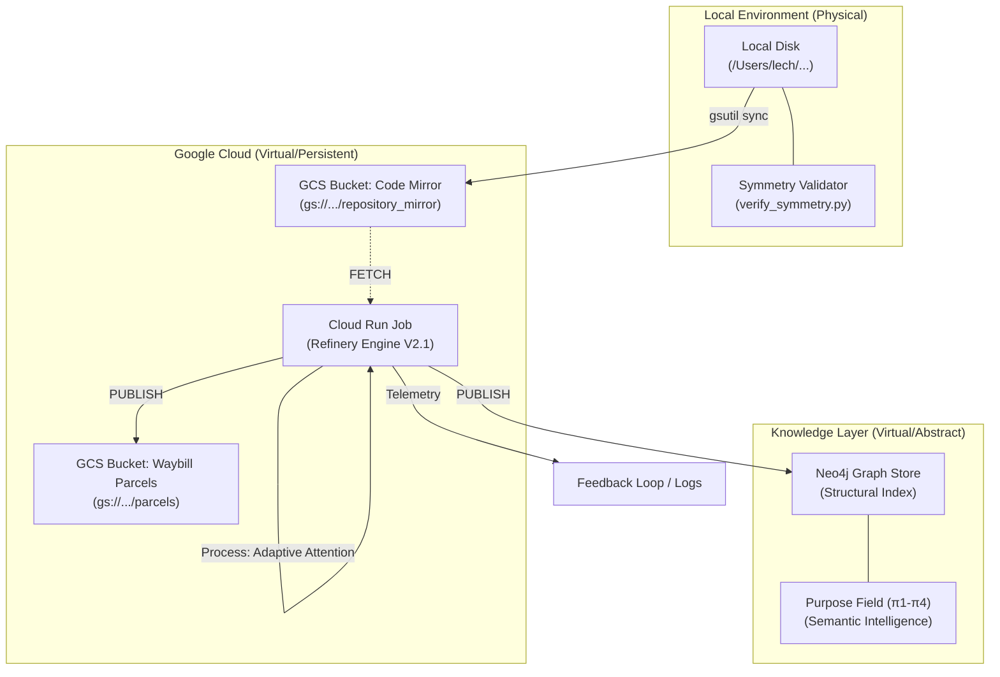

# Data Topology: The Project Elements Ecosystem (Canonical)

This document defines the definitive flow of code, metadata, and intelligence within the `PROJECT_elements` system.

## 1. The Ecosystem Diagram

## 2. Technical Nuances

### 2.1 Adaptive Flow Control (π₂)
The Refinery uses an **Attention Mechanism** to filter data based on query intent:
- **Laminar Flow**: High-fidelity, targeted precision for specific architectural queries.
- **Turbulent Flow**: High-breadth exploration for discovery and mapping.

### 2.2 Holographic Persistence (Waybills)
All data processed is wrapped in a **Waybill** for provenance. These live as JSON Parcels in GCS, providing a holographic backup of the graph state that can be re-indexed at any time.

### 2.3 Symmetry Verification
The `verify_symmetry.py` tool acts as a local governor, ensuring that the **Codome** (Implementation) and **Contextome** (Documentation) do not drift apart. It verifies the high-order registries (ROR, LOL, SOS) against the physical file system.

### 2.4 Purpose Extraction (π₁-π₄)
The ultimate goal of the data flow is to refine raw characters into **Purpose**.
- **π₁**: Syntax/Structure
- **π₂**: Semantics/Connectivity
- **π₃**: Functional Intent
- **π₄**: Teleological alignment (Why this code exists)

## 3. Storage & Runtime
| Tier | Storage Type | Persistence | Purpose |
|------|--------------|-------------|---------|
| **Physical Source** | Local SSD | Permanent | Master Authority |
| **Mirror** | GCS Object | Permanent | Cloud Availability |
| **Intelligence** | Neo4j / GCS JSON | Permanent | Knowledge Querying |
| **Compute** | Cloud Run RAM/SSD | Ephemeral | Transformation Engine |

> [!IMPORTANT]
> **Ephemeral Runtime**: The Cloud Run environment is strictly transient. All local changes within the container are lost after execution. Only data committed to GCS or Neo4j persists.
