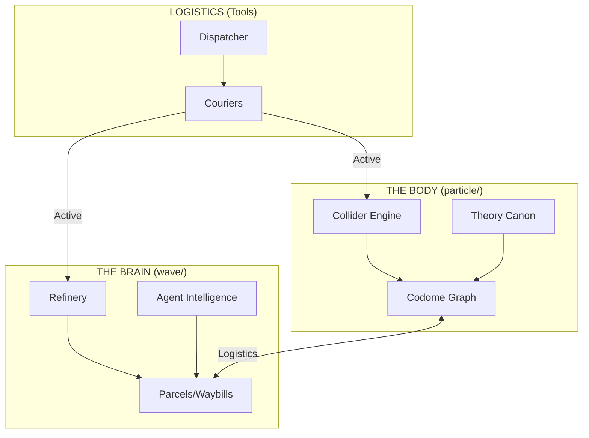

# 🗺️ PROJECT_elements - MASTER MAP (2026)

This map defines the "Intimate Properties" of our system. It distinguishes between the structural Core we must preserve and the "Debris" we must consolidate to achieve clarity.

---

## 🏗️ SYSTEM ARCHITECTURE

---

## 📂 THE CONSOLIDATION MAP

| Area | Status | Purpose | Action |
|------|--------|---------|--------|
| `particle/src/core/` | **KEEP** | The Engine (Collider) | Preserve, optimize |
| `wave/tools/ai/aci/` | **KEEP** | The Intelligence Layer | Preserve, refine |
| `particle/docs/theory/` | **KEEP** | The Canon (Source of Truth) | Maintain, verify |
| `governance/` | **KEEP** | Central Command | Canonical target for root docs |
| `root/` (Documentation) | **DEBRIS** | Redundant copies | Move to `/governance/` |
| `root/` (Samples) | **DEBRIS** | Binary clutter | Move to `/assets/` |
| `wave/intelligence/` | **DEBRIS** | Audit history | Archive to GCS |

---

## 🛑 SYMBOLS TO REMOVE (FOR CLARITY)

To achieve "less symbols describing that information," we will eliminate these redundant entries:

1.  **Duplicate Strategy Files**: `ROADMAP.md`, `DECISIONS.md`, etc. (1 copy only in `/governance`).
2.  **Top-level Binary Noise**: `sample_*.glb/stl` (Moved to `/assets`).
3.  **Historical Audit JSONs**: 40+ `socratic_audit_*.json` files (Consolidated into a single index).

---

## 🎯 NORTH STAR
By removing 95% of the file count (moving from 19K to 1K files), we surface the **intimate properties** of the code without the noise of historical research logs.

> [!TIP]
> **Definitive Structure**: For a full list of canonical folders and files, see the [REPO_STRUCTURE.md](file:///Users/lech/PROJECTS_all/PROJECT_elements/governance/REPO_STRUCTURE.md).
