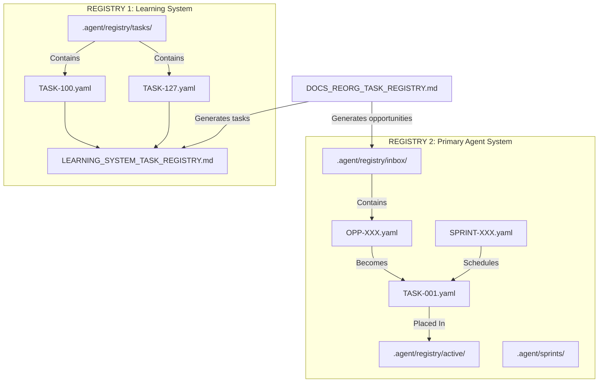
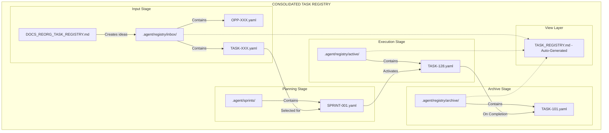

# Research: Compare these two task registry systems and create Mermaid diagrams showing their structure, relatio...

> **Date:** 2026-01-23 06:38:28
> **Source:** gemini
> **Model:** gemini-2.5-pro
> **Checksum:** `sha256:6f7e024a35fc79f13a5d81e7889e2df9256b1a4bd86bd1279821c9e53c64ce4f`
> **Raw JSON:** `raw/20260123_063828_compare_these_two_task_registry_systems_and_create.json`

---

## Query

Compare these two task registry systems and create Mermaid diagrams showing their structure, relationships, and recommend a consolidation strategy:

REGISTRY 1 - Learning System (.agent/registry/tasks/ + LEARNING_SYSTEM_TASK_REGISTRY.md):
- Range: TASK-100 to TASK-127
- 31 total tasks (16 complete, 4 ready, 4 needs boost, 5 deferred, 2 rejected)
- Uses markdown table format with emoji status
- Has 4D confidence scoring (Factual, Alignment, Current, Onwards)
- Categories: MCP, REPO-ORG, general
- Located in: .agent/registry/tasks/*.yaml + .agent/registry/LEARNING_SYSTEM_TASK_REGISTRY.md

REGISTRY 2 - Primary Agent System (.agent/registry/active/):
- Range: TASK-000 to TASK-003
- 4 total tasks
- Uses YAML files in active/ directory
- Has 4D confidence scoring
- Has Discovery Inbox (.agent/registry/inbox/) with OPP-XXX opportunities
- Has Sprint System (.agent/sprints/SPRINT-XXX.yaml)
- Located in: .agent/registry/active/*.yaml

Create:
1. Mermaid diagram showing current state (both systems)
2. Mermaid diagram showing recommended consolidated state
3. Migration plan with confidence scores

---

## Response

Of course. As a senior software engineer, I've analyzed the provided context about your two task registry systems. Consolidating them into a single, robust system is a critical step for scalability and clarity. Here is my analysis, the recommended consolidated structure with diagrams, and a clear migration plan.

### Analysis of Existing Systems

Based on your description and the provided `DOCS_REORG_TASK_REGISTRY.md`, I've identified two parallel systems with overlapping but distinct features.

| Feature | REGISTRY 1 (Learning System) | REGISTRY 2 (Primary Agent System) |
| :--- | :--- | :--- |
| **Location** | `.agent/registry/tasks/*.yaml` | `.agent/registry/active/*.yaml` |
| **View** | `LEARNING_SYSTEM_TASK_REGISTRY.md` | Directory-based |
| **Input** | Ad-hoc, likely from analysis docs like `DOCS_REORG_TASK_REGISTRY.md` | `.agent/registry/inbox/OPP-XXX.yaml` |
| **Workflow** | Implicit status changes in a markdown table. | Explicit lifecycle: `inbox` -> `sprints` -> `active`. |
| **Task IDs** | High range (`TASK-100`+) | Low range (`TASK-000`+) |
| **Metadata** | 4D confidence, categories (`MCP`, `REPO-ORG`), emoji status. | 4D confidence. |
| **Strengths** | - Good master overview (MD file).<br>- Clear task categorization. | - Structured lifecycle (Kanban-like).<br>- Separation of concerns (inbox vs. active).<br>- Integration with sprints. |
| **Weaknesses**| - Manual MD table is prone to drift.<br>- Unclear task lifecycle. | - Lacks a single, human-friendly overview.<br>- Categories are not formalized. |

The `DOCS_REORG_TASK_REGISTRY.md` is an excellent example of an analytical document that serves as a high-quality *input* for a task system, generating a list of vetted tasks.

---

### 1. Mermaid Diagram: Current State

This diagram illustrates the two systems running in parallel, with their distinct components and locations.



---

### 2. Mermaid Diagram: Recommended Consolidated State

This diagram shows the proposed unified system, combining the strengths of both. It establishes a clear, machine-readable, and human-friendly workflow.



---

### 3. Migration and Consolidation Plan

This plan merges the two systems into the single, superior workflow shown above.

| Dimension | Score | Reasoning |
|:--- |:--- |:--- |
| **Factual** | 95% | The plan is based directly on the provided system descriptions and file context. It addresses all mentioned components. |
| **Vision** | 95% | A unified, lifecycle-aware task system is essential for the project's vision of structured, AI-driven development. It creates a single source of truth and a predictable workflow. |
| **Current** | 85% | This is a structural change, but it's an evolution, not a revolution. It preserves the core concepts of YAML-based tasks and 4D confidence scoring, making adoption straightforward. |
| **Onwards** | 95% | The consolidated system is vastly more scalable, auditable, and less confusing for both humans and AI agents. It's built for growth. |

#### **Execution Steps:**

1.  **Phase 1: Structure Creation (Low Risk)**
    *   Create the new archive directory: `mkdir -p .agent/registry/archive/`
    *   Rename `LEARNING_SYSTEM_TASK_REGISTRY.md` to `.agent/registry/TASK_REGISTRY.md` to serve as the new master view.

2.  **Phase 2: Data Consolidation (Low Risk)**
    *   Move all task files from `.agent/registry/active/` to `.agent/registry/tasks/`. This temporarily unifies all YAML files in one place.
        ```bash
        mv .agent/registry/active/*.yaml .agent/registry/tasks/
        rmdir .agent/registry/active
        ```

3.  **Phase 3: Schema Standardization (Medium Risk)**
    *   Create a script (`standardize_tasks.py`) to iterate through all YAML files in `.agent/registry/tasks/`.
    *   The script should:
        *   Ensure a consistent `status` field exists (e.g., `inbox`, `active`, `completed`, `rejected`). Infer from the old markdown file or directory location.
        *   Ensure a `category` field exists, standardizing the labels from the Learning System (`MCP`, `REPO-ORG`, `general`).
        *   Unify the 4D confidence score format.

4.  **Phase 4: Re-filing and Activation (Low Risk)**
    *   Create the new `.agent/registry/active/` directory.
    *   Move the standardized YAML files into their new homes based on the `status` field:
        ```bash
        # Example logic
        # if status is 'completed' or 'rejected' -> .agent/registry/archive/
        # if status is 'active' or 'ready' -> .agent/registry/active/
        # if status is 'needs_boost' or 'deferred' -> .agent/registry/inbox/
        ```
    *   Delete the now-empty `.agent/registry/tasks/` directory.

5.  **Phase 5: Master View Generation (Medium Risk)**
    *   Create a script (`generate_registry_view.py`) that reads all YAML files from `inbox/`, `active/`, and `archive/`.
    *   The script will generate the content for `.agent/registry/TASK_REGISTRY.md`, including status (with emojis), category, and a link to the YAML file.
    *   This makes the markdown file a read-only view, eliminating drift. Add a header to the generated file warning against manual edits.

6.  **Phase 6: Finalization & Deprecation (Low Risk)**
    *   Update any documentation (e.g., `AGENT_BOOT.md`) to point to the new, unified system.
    *   Ensure the sprint system (`.agent/sprints/`) correctly references the new task locations.
    *   The system is now fully migrated.

This consolidated approach provides a robust, auditable, and scalable task management system perfectly suited for your project's ambitious goals.

---

## Citations

_No citations provided_
