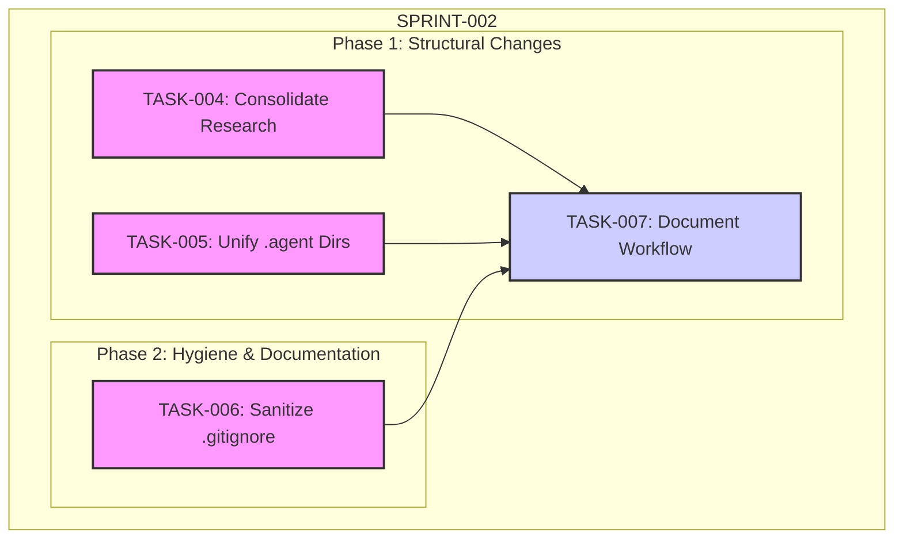

# Research: Based on the current state of PROJECT_elements, recommend the optimal CONSOLIDATION AND REPO ALIGNME...

> **Date:** 2026-01-23 07:02:44
> **Source:** gemini
> **Model:** gemini-2.5-pro
> **Checksum:** `sha256:2b138716676b34254b0d24c149414729eb39158618a0c8b372bbfb5a171d0453`
> **Raw JSON:** `raw/20260123_070244_based_on_the_current_state_of_project_elements__re.json`

---

## Query

Based on the current state of PROJECT_elements, recommend the optimal CONSOLIDATION AND REPO ALIGNMENT task track.

CURRENT STATE:
- Registry consolidated: Old Learning System (TASK-100 to TASK-127) archived to GCS
- New unified system: inbox/ (OPP-XXX), active/ (TASK-XXX), sprints/
- SPRINT-001 complete (Agent System Foundation)

PENDING IN INBOX:
- OPP-003: Consolidate research directories (research spread across 3 locations)
- OPP-004: Document registry architecture (partially done with README.md)

KNOWN REPO ISSUES (from old TASK-122 to TASK-127):
- Multiple .collider_* test directories need cleanup
- Two .agent directories exist (root vs context-management/)
- Research spread across: research/, tools/research/, docs/research/
- Multiple registry locations existed (now consolidated)
- .gitignore may be missing output patterns

DELIVERABLE REQUEST:
1. Prioritized task list for SPRINT-002 (repo alignment focus)
2. Dependency graph (which tasks must complete before others)
3. Estimated 4D confidence scores for each task
4. Risk assessment (what could go wrong)
5. Definition of Done criteria for each task

Format as a structured sprint plan ready for .agent/sprints/SPRINT-002.yaml

---

## Response

Of course. As a senior software engineer, here is my analysis and recommended plan for SPRINT-002, focusing on repository consolidation and alignment. This plan is designed to be directly actionable by the agent team.

### Executive Summary: SPRINT-002

**Name:** Repository Alignment & Consolidation
**Theme:** Pay down technical debt from initial project setup and establish a single source of truth for key artifacts. This sprint solidifies the foundation built in SPRINT-001, ensuring the repository structure is clean, logical, and ready for advanced automation by the BARE system.
**Goal:** Eliminate structural duplication and ambiguity within the repository, making it easier and safer for agents to operate.

---

### 1. Prioritized Task List for SPRINT-002

This list promotes pending opportunities and known issues into actionable tasks.

| Priority | ID | Title | Description | Source |
| :--- | :--- | :--- | :--- | :--- |
| **1** | **TASK-004** | Consolidate All Research Directories | Migrate all research from `research/`, `tools/research/`, and `docs/research/` into a single canonical location: `docs/research/`. | `OPP-003` |
| **2** | **TASK-005** | Unify Agent System Directories | Decommission the legacy `.agent/` directory within `context-management/`, ensuring only the root `.agent/` is used. | "Known Repo Issues" |
| **3** | **TASK-006** | Sanitize Ephemeral Artifacts & .gitignore | Remove all transient `.collider_*` test directories and update `.gitignore` to prevent them from being committed in the future. | "Known Repo Issues" |
| **4** | **TASK-007** | Document Agent Workflow Architecture | Create a canonical document explaining the full agent workflow: Inbox (OPP) -> Promotion -> Active Task (TASK) -> Sprint Execution. | `OPP-004` |

---

### 2. Dependency Graph

This sprint has a clear dependency flow. Structural changes must be completed before documentation is finalized.

**Execution Order:** `TASK-004`, `TASK-005`, and `TASK-006` can be worked on in parallel. `TASK-007` is blocked by the completion of all three.

---

### 3. Estimated 4D Confidence Scores

Confidence scores are high as these are well-understood refactoring tasks.

| Task | Factual | Alignment | Current | Onwards | **Overall** | Rationale |
| :--- | :---: | :---: | :---: | :---: | :---: | :--- |
| **TASK-004** | 95% | 95% | 90% | 95% | **90%** | **Factual:** Locations are known. **Alignment:** Critical for the "Research Refinery" (`OPEN_CONCERNS.md`). **Onwards:** A prerequisite for the BARE Concept Mapper. |
| **TASK-005** | 95% | 98% | 85% | 95% | **85%** | **Alignment:** Core to the "Git is truth" principle (`KERNEL.md`). **Current:** Risk of breaking hardcoded paths lowers this score slightly. |
| **TASK-006** | 90% | 90% | 95% | 90% | **90%** | A straightforward cleanup task. High confidence in its execution and positive impact. |
| **TASK-007** | 90% | 95% | 90% | 90% | **90%** | Documenting a just-completed system (`SPRINT-001`) is a high-confidence, high-value action. |

---

### 4. Risk Assessment

| Risk | Impact | Likelihood | Mitigation Strategy |
| :--- | :---: | :---: | :--- |
| **Broken Tooling** | High | Medium | Before committing file moves, perform a repository-wide `grep` for the old paths (e.g., `context-management/.agent/`, `tools/research/`). Update all identified scripts and configuration files in the same atomic commit. |
| **Agent Work Collision** | High | Low | Announce a brief code freeze for this sprint. All work should be performed on a single branch and merged atomically. Use the `claim_task.sh` tool to prevent other agents from starting conflicting work. |
| **Incomplete Consolidation** | Medium | Medium | Use `find . -type d -name "research"` and `find . -type d -name ".agent"` to ensure all instances are identified before deletion. Verify with a `git status` check that shows only expected deletions and moves. |
| **Data Loss During Moves** | High | Low | Strictly use `git mv` for all file relocations. This preserves history and makes changes verifiable. Before the final commit, run a `git diff --stat` to confirm that the number of file additions and deletions match and that no content was inadvertently dropped. |

---

### 5. Definition of Done (DoD) for Each Task

These criteria provide clear, verifiable completion states.

#### **TASK-004: Consolidate Research Directories**
- [ ] All content from `research/`, `tools/research/`, and `docs/research/perplexity/` is migrated to subdirectories under the single canonical path `docs/research/`.
- [ ] The old directory structures are completely removed from the repository.
- [ ] Any scripts or documentation referencing the old paths (e.g., `SUBSYSTEM_INTEGRATION.md`) are updated to point to `docs/research/`.
- [ ] A commit is produced with the message "refactor(repo): Consolidate all research artifacts into docs/research/".

#### **TASK-005: Unify Agent System Directories**
- [ ] The directory `context-management/.agent/` is deleted.
- [ ] All tools, schemas, and specs are confirmed to be operating from the root `.agent/` directory.
- [ ] `manifest.yaml` and `KERNEL.md` are reviewed to ensure all paths are consistent with the root-level `.agent/` structure.
- [ ] A commit is produced with the message "refactor(repo): Unify agent system into root .agent/ directory".

#### **TASK-006: Sanitize Ephemeral Artifacts & .gitignore**
- [ ] A search confirms no directories matching the pattern `.collider_*` exist in the repository.
- [ ] The root `.gitignore` file contains entries for `.collider_*` and other known ephemeral patterns.
- [ ] The BARE `TruthValidator` (`repo_truths.yaml`) has been re-run to reflect the cleaned file counts.
- [ ] A commit is produced with the message "chore(repo): Clean up ephemeral directories and update .gitignore".

#### **TASK-007: Document Agent Workflow Architecture**
- [ ] A new file, `docs/architecture/AGENT_WORKFLOW.md`, is created.
- [ ] The document clearly explains the lifecycle: `Opportunity (Inbox) -> Promotion -> Task (Active) -> Sprint`.
- [ ] It references key tools like `promote_opportunity.py` and the `sprints/` directory.
- [ ] A link to this new document is added to a relevant section in `.agent/KERNEL.md` (e.g., under "Task / Run Separation" or a new "Workflow" section).
- [ ] A commit is produced with the message "docs(agent): Document the full agent opportunity-to-sprint workflow".

---

## Citations

_No citations provided_
