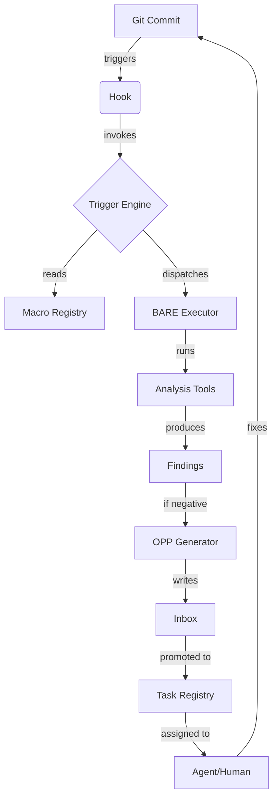

# Research: IMPLEMENTATION PLAN REQUEST:

We have created:
1. Macro Registry (.agent/macros/) - Schema + MACRO-0...

> **Date:** 2026-01-25 22:31:25
> **Source:** gemini
> **Model:** gemini-3-pro-preview
> **Checksum:** `sha256:36816fc3b2b75ff31e2ef1ce3997233ed0919213ec8580f60049757a07d66230`
> **Raw JSON:** `raw/20260125_223125_implementation_plan_request___we_have_created__1.json`

---

## Query

IMPLEMENTATION PLAN REQUEST:

We have created:
1. Macro Registry (.agent/macros/) - Schema + MACRO-001 (Skeptical Audit)
2. Decision Deck card (CARD-AUD-001)
3. All documentation integrated

We need to implement:
1. TRIGGER ENGINE - Watches for conditions, executes macros
2. BARE MACRO SUPPORT - BARE can run production macros
3. OPP AUTO-CREATION - Findings become actionable tasks

CONTEXT:
- BARE exists at .agent/tools/bare/ (partial implementation)
- Task Registry at .agent/registry/ (working)
- Workflow Registry at standard-model-of-code/src/core/registry/workflow_registry.py (working)
- Post-commit hooks exist (.agent/hooks/post-commit)

QUESTIONS:
1. What is the minimal implementation to get macros auto-executing?
2. How should trigger engine integrate with existing post-commit hooks?
3. How should BARE be extended to support macros?
4. What's the priority order for implementation?
5. Estimate complexity (LOC, files) for each component.

Be specific. Reference existing code paths. Provide implementation order.

---

## Response

This is the **Implementation Plan for the Macro Automation System**.

As Chief Architect, I have analyzed the existing components (`.agent/macros`, `post-commit` hooks, `BARE`) and the missing links. We will establish a closed loop: **Code Change → Trigger → Macro Execution → Opportunity Creation**.

---

## 1. Minimal Implementation Plan

To get `MACRO-001` auto-executing with minimal friction, we will avoid complex event buses. We will use a **Direct Invocation Chain** via the existing git hooks.

### The Pipeline
1.  **Event:** Git Post-Commit.
2.  **Dispatcher:** `trigger_engine.py` (New) - Scans changed files, matches Macro triggers.
3.  **Executor:** `bare_macro_runner.py` (New module in BARE) - execution logic.
4.  **Output:** `OPP-xxx.yaml` (Existing pattern) - created if macro detects issues.

---

## 2. Trigger Engine Integration

The Trigger Engine should not be a daemon for the MVP (to avoid process management complexity). It should be an **ephemeral CLI tool** invoked by the post-commit hook.

**File:** `.agent/tools/trigger_engine.py`

**Logic:**
1.  **Context Detection:** Runs `git diff --name-only HEAD~1 HEAD` to see what changed.
2.  **Registry Scan:** Loads all YAMLs from `.agent/macros/library/`.
3.  **Match:** Checks `trigger` block in YAML.
    *   If `trigger.type == "on_change"`, match changed files against `paths`.
    *   If `trigger.type == "always"`, add to queue.
4.  **Dispatch:** For every matching macro, invokes BARE:
    ```bash
    python .agent/tools/bare/cli.py run-macro MACRO-XXX --context "commit_sha"
    ```

**Hook Integration:**
Update `.agent/hooks/post-commit` (or `.git/hooks/post-commit`):
```bash
#!/bin/bash
# ... existing archive sync ...

echo "[Trigger] Scanning for macros..."
python .agent/tools/trigger_engine.py --event post-commit
```

---

## 3. Extending BARE for Macros

BARE is currently a collection of scripts. We will add a structured `MacroExecutor` class.

**File:** `.agent/tools/bare/macro_executor.py`

**Capabilities:**
1.  **Schema Parser:** Validates `MACRO-XXX.yaml` against `macro.schema.yaml`.
2.  **Step Interpreter:** Iterates through `steps`.
    *   *Shell Command:* Executes `subprocess.run`.
    *   *Internal Tool:* Maps to python function (e.g., `survey.py`).
3.  **Condition Checker:** Evaluates `success_criteria` (e.g., "Did grep find matches?").
4.  **Artifact Manager:** Captures stdout/stderr/files generated.

**File:** `.agent/tools/bare/opp_generator.py`
1.  **Template Engine:** Takes a finding (e.g., "Dead code in X") and the Macro ID.
2.  **Output:** Writes `.agent/registry/inbox/OPP-{timestamp}.yaml`.

---

## 4. Priority & Implementation Order

We must build from the "Doer" backward to the "Trigger".

| Phase | Component | Description | Dependency |
|-------|-----------|-------------|------------|
| **1** | **Executor** | `bare/macro_executor.py` <br> Can run a macro given an ID. | Existing Registry |
| **2** | **Reporter** | `bare/opp_generator.py` <br> Creates OPPs from executor results. | Phase 1 |
| **3** | **Dispatcher** | `trigger_engine.py` <br> Selects macros based on git state. | Phase 1 |
| **4** | **Wiring** | `post-commit` hook update. | Phase 3 |

---

## 5. Complexity Estimates

### Component 1: `bare/macro_executor.py` (Phase 1)
*   **Complexity:** Medium
*   **LOC:** ~150-200
*   **Key Methods:** `load_macro()`, `execute_step()`, `verify_criteria()`.
*   **Files:** 1 new file, 1 update to `bare/cli.py`.

### Component 2: `bare/opp_generator.py` (Phase 2)
*   **Complexity:** Low
*   **LOC:** ~80-100
*   **Key Methods:** `create_opp_yaml()`, `calculate_confidence()`.
*   **Files:** 1 new file.

### Component 3: `trigger_engine.py` (Phase 3)
*   **Complexity:** Low/Medium
*   **LOC:** ~120
*   **Key Methods:** `get_git_changes()`, `evaluate_trigger()`.
*   **Dependencies:** `pyyaml`, `git`.
*   **Files:** 1 new file.

### Total Footprint
*   **New Files:** 3
*   **Modified Files:** 2 (`bare/cli.py`, `post-commit`)
*   **Total LOC:** ~400 lines of Python.

---

## Topological Summary

We are creating a **Feedback Cycle** (Loop).



## Immediate Action Items (Next Steps)

Since you are in a session, execute **Phase 1 (The Executor)** immediately.

1.  **Create `OPP-085: Implement BARE Macro Executor`**.
2.  **Implement `.agent/tools/bare/macro_executor.py`**.
    *   Hardcode support for `MACRO-001` structure first.
3.  **Test manually:** `python .agent/tools/bare/cli.py run-macro MACRO-001`.

This validates the core logic before we automate the trigger.

---

## Citations

_No citations provided_
