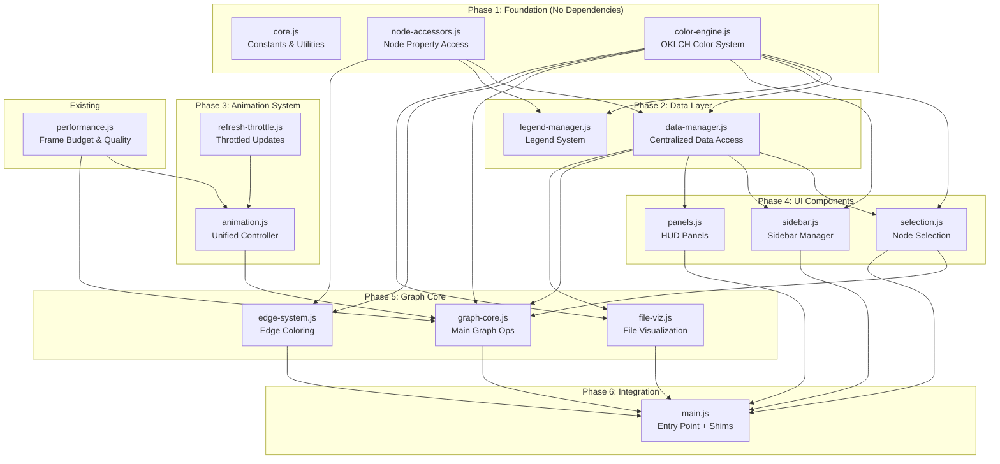
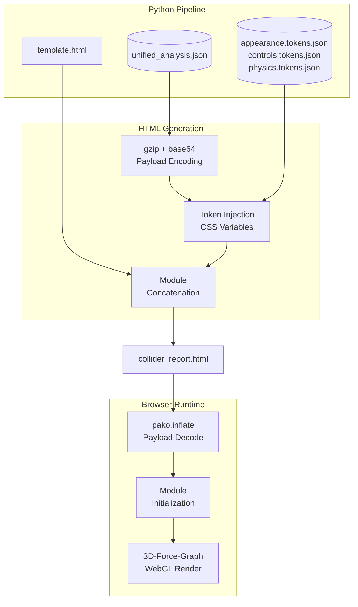
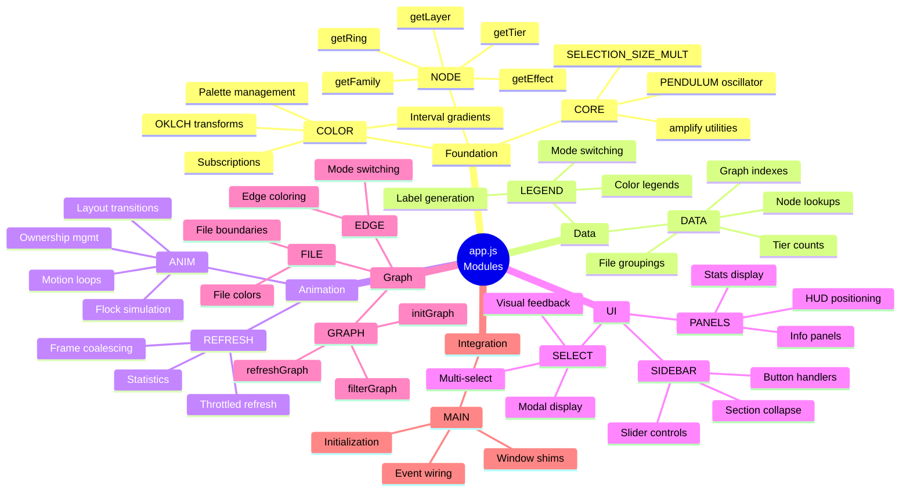
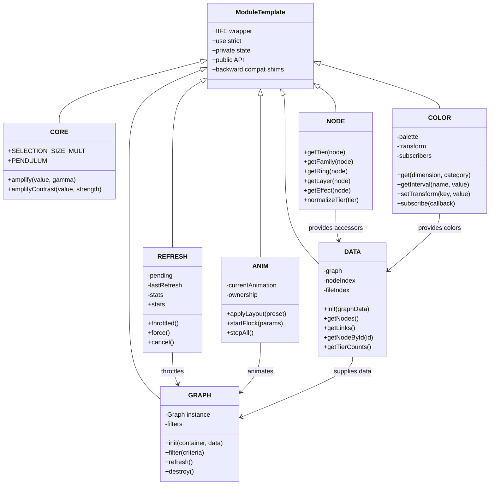
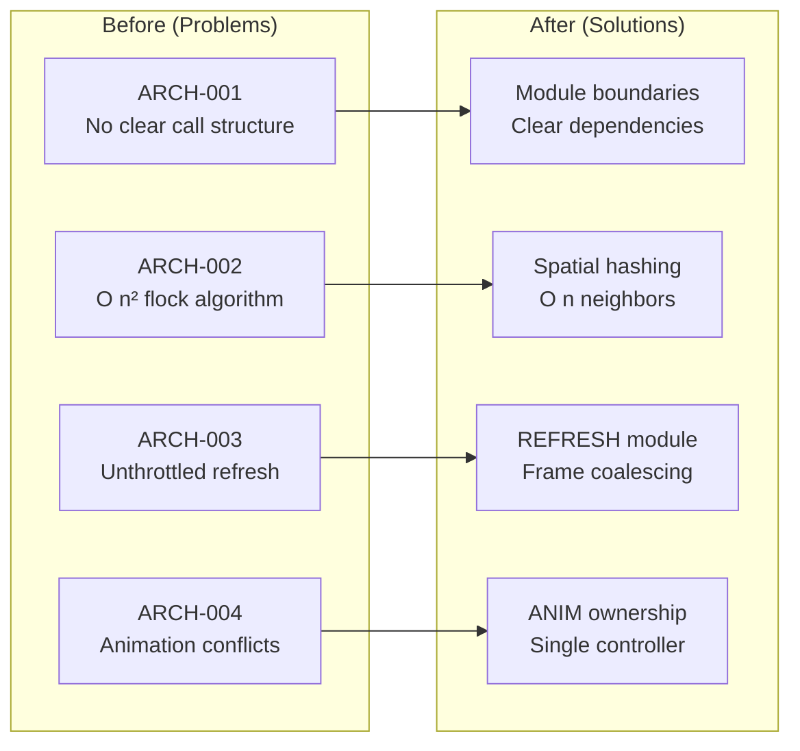
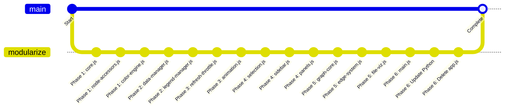

# Collider Visualization Architecture

> Modularization of the 10,481-line `app.js` monolith into maintainable IIFE modules.

## Module Dependency Graph



## Load Order (Concatenation Sequence)

```mermaid
flowchart LR
    subgraph "Build Time"
        PY[visualize_graph_webgl.py]
    end

    subgraph "Module Order"
        direction TB
        M1[1. performance.js]
        M2[2. core.js]
        M3[3. node-accessors.js]
        M4[4. color-engine.js]
        M5[5. data-manager.js]
        M6[6. legend-manager.js]
        M7[7. refresh-throttle.js]
        M8[8. animation.js]
        M9[9. selection.js]
        M10[10. sidebar.js]
        M11[11. panels.js]
        M12[12. edge-system.js]
        M13[13. file-viz.js]
        M14[14. graph-core.js]
        M15[15. main.js]
    end

    subgraph "Output"
        HTML[collider_report.html<br/>Single File]
    end

    PY --> M1 --> M2 --> M3 --> M4 --> M5 --> M6 --> M7 --> M8 --> M9 --> M10 --> M11 --> M12 --> M13 --> M14 --> M15 --> HTML
```



## Data Flow



## Module Responsibilities



## IIFE Module Pattern



## Architecture Debt Resolution



## File Structure

```
src/core/viz/assets/
├── modules/
│   ├── core.js              # Constants, utilities
│   ├── node-accessors.js    # Node property access
│   ├── color-engine.js      # OKLCH color system
│   ├── data-manager.js      # Centralized data
│   ├── legend-manager.js    # Legend system
│   ├── refresh-throttle.js  # Throttled updates
│   ├── animation.js         # Unified animation
│   ├── selection.js         # Node selection
│   ├── sidebar.js           # Sidebar UI
│   ├── panels.js            # HUD panels
│   ├── graph-core.js        # Main graph ops
│   ├── edge-system.js       # Edge coloring
│   └── file-viz.js          # File visualization
├── performance.js           # Frame budget (existing)
├── main.js                  # Entry point + shims
├── app.js                   # DEPRECATED (delete after migration)
├── styles.css               # Component styles
└── template.html            # HTML shell
```

## Migration Strategy



## Verification Checklist

| Phase | Module | Test Command | Success Criteria |
|-------|--------|--------------|------------------|
| 1.1 | core.js | `./collider full . --output .collider` | No JS errors |
| 1.2 | node-accessors.js | Open HTML, check console | Tier colors work |
| 1.3 | color-engine.js | Click color mode buttons | Colors change |
| 2.1 | data-manager.js | Check node info panel | Data displays |
| 2.2 | legend-manager.js | Toggle legend | Legend updates |
| 3.1 | refresh-throttle.js | Rapid interactions | No freeze |
| 3.2 | animation.js | Apply layout presets | Smooth animation |
| 4.x | UI modules | All controls | Responsive |
| 5.x | Graph modules | Full interaction | Everything works |
| 6 | main.js | Complete test | Identical to original |

---

*Generated for Collider app.js modularization project*
