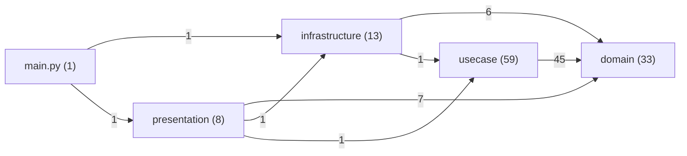

# Spectrometer Report — dddpy_real

- Generated: 2025-12-14T07:16:53
- Repo root: `/Users/lech/PROJECTS_all/PROJECT_elements/validation/dddpy_real`

## Summary
- Files analyzed: 65
- Components extracted: 114
- Recognized (non-Unknown): 28.1%
- Typed components: 32
- Unclassified components: 82

## Dependencies
- External packages (top): pytest(11), sqlalchemy(9), pydantic(7), fastapi(3)

## Outputs
- Full component list: `components.csv`
- Raw particles: `particles.csv` (no IDs/deps)
- Full JSON: `results.json`

## Architecture (Mermaid)

## Unclassified Samples
| component_id | kind | name | file | line | evidence |
|---|---|---|---|---|---|
| `783585582e10` | class | `TodoAlreadyCompletedError` | `dddpy/domain/todo/exceptions/todo_already_completed_error.py` | 4 | `class TodoAlreadyCompletedError(Exception):` |
| `17127381944f` | class | `TodoAlreadyStartedError` | `dddpy/domain/todo/exceptions/todo_already_started_error.py` | 4 | `class TodoAlreadyStartedError(Exception):` |
| `5d80623af857` | class | `TodoNotFoundError` | `dddpy/domain/todo/exceptions/todo_not_found_error.py` | 4 | `class TodoNotFoundError(Exception):` |
| `0e3912d18290` | class | `TodoNotStartedError` | `dddpy/domain/todo/exceptions/todo_not_started_error.py` | 4 | `class TodoNotStartedError(Exception):` |
| `272fe1e417d2` | function | `get_session` | `dddpy/infrastructure/di/injection.py` | 29 | `def get_session() -> Iterator[Session]:` |
| `95f50231ef4c` | function | `get_todo_repository` | `dddpy/infrastructure/di/injection.py` | 49 | `def get_todo_repository(session: Session = Depends(get_session)) -> TodoRepository:` |
| `e51f930fdd15` | function | `get_create_todo_usecase` | `dddpy/infrastructure/di/injection.py` | 61 | `def get_create_todo_usecase(` |
| `29883555e94b` | function | `get_start_todo_usecase` | `dddpy/infrastructure/di/injection.py` | 75 | `def get_start_todo_usecase(` |
| `ec4bb16eb1da` | function | `get_complete_todo_usecase` | `dddpy/infrastructure/di/injection.py` | 89 | `def get_complete_todo_usecase(` |
| `878ba48d2150` | function | `get_update_todo_usecase` | `dddpy/infrastructure/di/injection.py` | 103 | `def get_update_todo_usecase(` |
| `c7a40347db19` | function | `get_delete_todo_usecase` | `dddpy/infrastructure/di/injection.py` | 117 | `def get_delete_todo_usecase(` |
| `b1294ae02f3a` | function | `get_find_todo_by_id_usecase` | `dddpy/infrastructure/di/injection.py` | 131 | `def get_find_todo_by_id_usecase(` |
| `f7cbc8320778` | function | `get_find_todos_usecase` | `dddpy/infrastructure/di/injection.py` | 145 | `def get_find_todos_usecase(` |
| `66d7886f14d0` | function | `new_todo_repository` | `dddpy/infrastructure/sqlite/todo/todo_repository.py` | 86 | `def new_todo_repository(session: Session) -> TodoRepository:` |
| `1cf87759c42f` | function | `new_complete_todo_usecase` | `dddpy/usecase/todo/complete_todo_usecase.py` | 71 | `def new_complete_todo_usecase(todo_repository: TodoRepository) -> CompleteTodoUseCase:` |
| `7865a9278e20` | function | `new_create_todo_usecase` | `dddpy/usecase/todo/create_todo_usecase.py` | 57 | `def new_create_todo_usecase(todo_repository: TodoRepository) -> CreateTodoUseCase:` |
| `f45359516119` | function | `new_delete_todo_usecase` | `dddpy/usecase/todo/delete_todo_usecase.py` | 50 | `def new_delete_todo_usecase(todo_repository: TodoRepository) -> DeleteTodoUseCase:` |
| `a97c5e07a0c1` | function | `new_find_todo_by_id_usecase` | `dddpy/usecase/todo/find_todo_by_id_usecase.py` | 55 | `def new_find_todo_by_id_usecase(todo_repository: TodoRepository) -> FindTodoByIdUseCase:` |
| `9cca77471ce5` | function | `new_find_todos_usecase` | `dddpy/usecase/todo/find_todos_usecase.py` | 38 | `def new_find_todos_usecase(todo_repository: TodoRepository) -> FindTodosUseCase:` |
| `4f3089c29c0f` | function | `new_start_todo_usecase` | `dddpy/usecase/todo/start_todo_usecase.py` | 71 | `def new_start_todo_usecase(todo_repository: TodoRepository) -> StartTodoUseCase:` |
| `45dc59a51f16` | function | `new_update_todo_usecase` | `dddpy/usecase/todo/update_todo_usecase.py` | 78 | `def new_update_todo_usecase(todo_repository: TodoRepository) -> UpdateTodoUseCase:` |
| `7c513619327d` | function | `lifespan` | `main.py` | 19 | `async def lifespan(app: FastAPI):` |
| `16cc27ec697b` | function | `test_create_todo` | `tests/domain/todo/entities/test_todo.py` | 16 | `def test_create_todo():` |
| `aa19c1d5a858` | function | `test_todo_properties` | `tests/domain/todo/entities/test_todo.py` | 31 | `def test_todo_properties():` |
| `c4ae5467cd86` | function | `test_update_title` | `tests/domain/todo/entities/test_todo.py` | 57 | `def test_update_title():` |
| `74862f6b4314` | function | `test_update_description` | `tests/domain/todo/entities/test_todo.py` | 68 | `def test_update_description():` |
| `5ed37fad7f7b` | function | `test_clear_description` | `tests/domain/todo/entities/test_todo.py` | 79 | `def test_clear_description():` |
| `0e35dee03e13` | function | `test_start_todo` | `tests/domain/todo/entities/test_todo.py` | 89 | `def test_start_todo():` |
| `3acdc718baab` | function | `test_complete_todo` | `tests/domain/todo/entities/test_todo.py` | 99 | `def test_complete_todo():` |
| `0632dc759c79` | function | `test_complete_already_completed_todo` | `tests/domain/todo/entities/test_todo.py` | 111 | `def test_complete_already_completed_todo():` |
| `60a8c0cd077d` | function | `test_is_overdue` | `tests/domain/todo/entities/test_todo.py` | 120 | `def test_is_overdue():` |
| `581e7024621e` | function | `test_todo_equality` | `tests/domain/todo/entities/test_todo.py` | 155 | `def test_todo_equality():` |
| `b0a03ba04cc0` | function | `test_create_valid_description` | `tests/domain/todo/value_objects/test_todo_description.py` | 8 | `def test_create_valid_description():` |
| `4d3ffa6a1064` | function | `test_create_description_exceeding_length_limit` | `tests/domain/todo/value_objects/test_todo_description.py` | 14 | `def test_create_description_exceeding_length_limit():` |
| `1551a8b898a4` | function | `test_str_representation` | `tests/domain/todo/value_objects/test_todo_description.py` | 21 | `def test_str_representation():` |
| `221af638f24a` | function | `test_generate_creates_valid_uuid` | `tests/domain/todo/value_objects/test_todo_id.py` | 10 | `def test_generate_creates_valid_uuid():` |
| `86ce31032015` | function | `test_generate_creates_unique_ids` | `tests/domain/todo/value_objects/test_todo_id.py` | 17 | `def test_generate_creates_unique_ids():` |
| `04b9090468a4` | function | `test_str_representation` | `tests/domain/todo/value_objects/test_todo_id.py` | 24 | `def test_str_representation():` |
| `ded027d87258` | function | `test_todo_status_values` | `tests/domain/todo/value_objects/test_todo_status.py` | 6 | `def test_todo_status_values():` |
| `8d9c105872b3` | function | `test_todo_status_enum_members` | `tests/domain/todo/value_objects/test_todo_status.py` | 13 | `def test_todo_status_enum_members():` |
| `1f9b031ed6fc` | function | `test_str_representation` | `tests/domain/todo/value_objects/test_todo_status.py` | 21 | `def test_str_representation():` |
| `1c0b82858666` | function | `test_create_valid_title` | `tests/domain/todo/value_objects/test_todo_title.py` | 8 | `def test_create_valid_title():` |
| `1dbbb5477ed8` | function | `test_empty_title_raises_error` | `tests/domain/todo/value_objects/test_todo_title.py` | 14 | `def test_empty_title_raises_error():` |
| `9be2fbb9878d` | function | `test_title_too_long_raises_error` | `tests/domain/todo/value_objects/test_todo_title.py` | 20 | `def test_title_too_long_raises_error():` |
| `420b46c6b312` | function | `test_str_representation` | `tests/domain/todo/value_objects/test_todo_title.py` | 27 | `def test_str_representation():` |
| `412fee0c1413` | function | `todo_repository_mock` | `tests/usecase/todo/test_complete_todo_usecase.py` | 15 | `def todo_repository_mock():` |
| `f1b858ccfb14` | function | `complete_todo_usecase` | `tests/usecase/todo/test_complete_todo_usecase.py` | 21 | `def complete_todo_usecase(todo_repository_mock):` |
| `d1562dea2e90` | function | `todo` | `tests/usecase/todo/test_complete_todo_usecase.py` | 27 | `def todo():` |
| `394acc045984` | function | `test_complete_todo_success` | `tests/usecase/todo/test_complete_todo_usecase.py` | 38 | `def test_complete_todo_success(complete_todo_usecase, todo_repository_mock, todo):` |
| `5af8dc97517e` | function | `test_complete_todo_not_found` | `tests/usecase/todo/test_complete_todo_usecase.py` | 53 | `def test_complete_todo_not_found(complete_todo_usecase, todo_repository_mock):` |

(Showing 50/82 unclassified components; full list in `components.csv`.)
