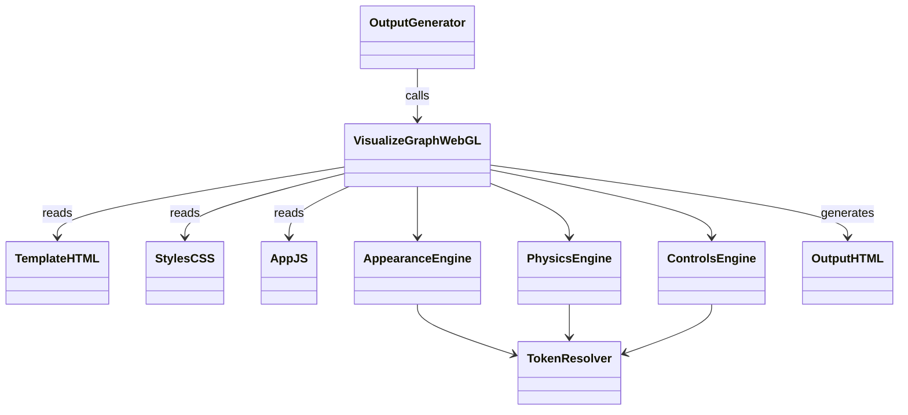

```mermaid
classDiagram
    class OutputGenerator
    class VisualizeGraphWebGL
    class TemplateHTML
    class StylesCSS
    class AppJS
    class TokenResolver
    class AppearanceEngine
    class PhysicsEngine
    class ControlsEngine
    class OutputHTML

    OutputGenerator --> VisualizeGraphWebGL : calls
    VisualizeGraphWebGL --> TemplateHTML : reads
    VisualizeGraphWebGL --> StylesCSS : reads
    VisualizeGraphWebGL --> AppJS : reads
    VisualizeGraphWebGL --> AppearanceEngine
    VisualizeGraphWebGL --> PhysicsEngine
    VisualizeGraphWebGL --> ControlsEngine
    AppearanceEngine --> TokenResolver
    PhysicsEngine --> TokenResolver
    ControlsEngine --> TokenResolver
    VisualizeGraphWebGL --> OutputHTML : generates
```
