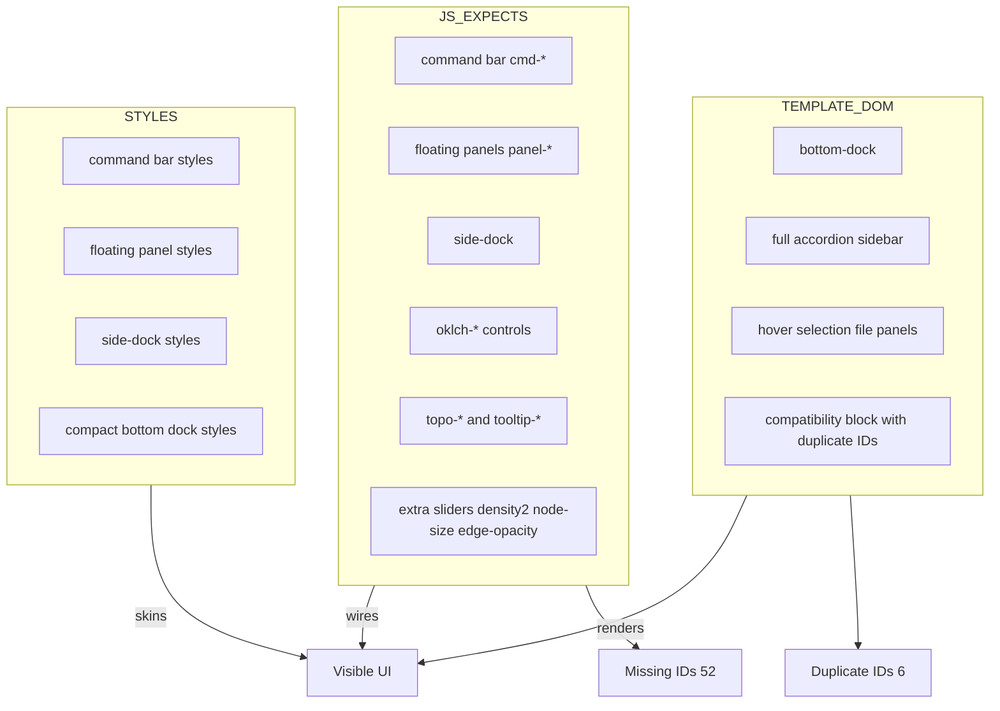

```mermaid
graph TD
    subgraph TEMPLATE_DOM
        TD1[bottom-dock]
        TD2[full accordion sidebar]
        TD3[hover selection file panels]
        TD4[compatibility block with duplicate IDs]
    end

    subgraph JS_EXPECTS
        JE1[command bar cmd-*]
        JE2[floating panels panel-*]
        JE3[side-dock]
        JE4[oklch-* controls]
        JE5[topo-* and tooltip-*]
        JE6[extra sliders density2 node-size edge-opacity]
    end

    subgraph STYLES
        S1[command bar styles]
        S2[floating panel styles]
        S3[side-dock styles]
        S4[compact bottom dock styles]
    end

    TEMPLATE_DOM -->|renders| R[Visible UI]
    JS_EXPECTS -->|wires| R
    STYLES -->|skins| R

    CONFLICT1[Missing IDs 52]
    CONFLICT2[Duplicate IDs 6]

    JS_EXPECTS --> CONFLICT1
    TEMPLATE_DOM --> CONFLICT2
```
