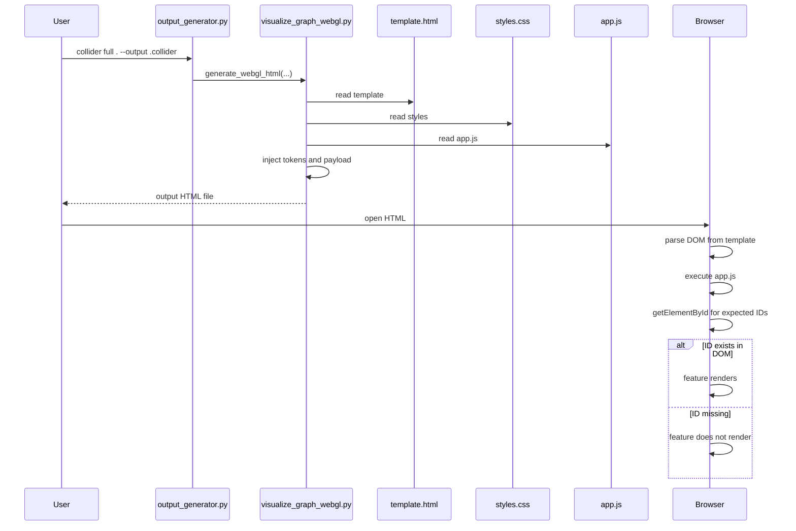

```mermaid
sequenceDiagram
    participant U as User
    participant OG as output_generator.py
    participant VG as visualize_graph_webgl.py
    participant T as template.html
    participant S as styles.css
    participant J as app.js
    participant B as Browser

    U->>OG: collider full . --output .collider
    OG->>VG: generate_webgl_html(...)
    VG->>T: read template
    VG->>S: read styles
    VG->>J: read app.js
    VG->>VG: inject tokens and payload
    VG-->>U: output HTML file

    U->>B: open HTML
    B->>B: parse DOM from template
    B->>B: execute app.js
    B->>B: getElementById for expected IDs
    alt ID exists in DOM
        B->>B: feature renders
    else ID missing
        B->>B: feature does not render
    end
```
