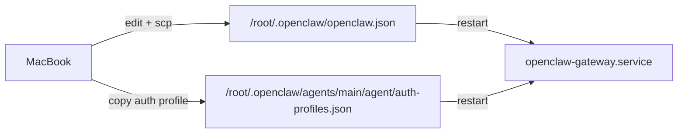
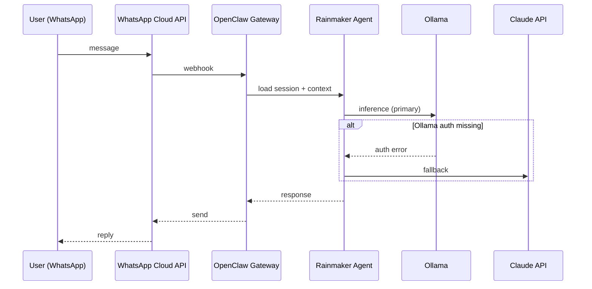
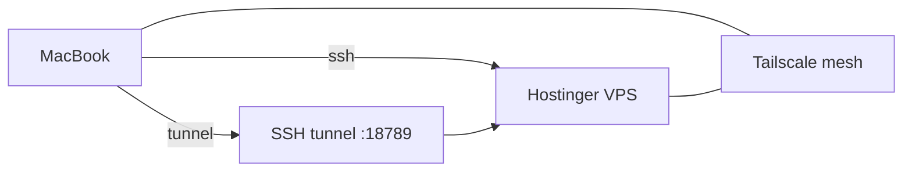
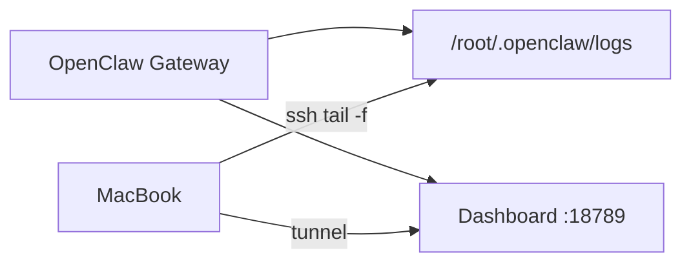

# Triplice Infrastructure Flows and Mermaids

## Purpose
Document the operational flows that connect MacBook, Hostinger VPS, and GCloud. This is a practical reference for debugging and implementation work.

## Control Plane and Config Flow

Notes
- Config is applied only after `systemctl --user restart openclaw-gateway`.
- If `auth-profiles.json` is missing for the agent, Ollama fails and fallback triggers.

## WhatsApp Message Flow (Observed Failure Path Included)

## Data Lifecycle Flow (Hot, Warm, Cold)

## Access Paths and Connectivity

## Observability Flow

