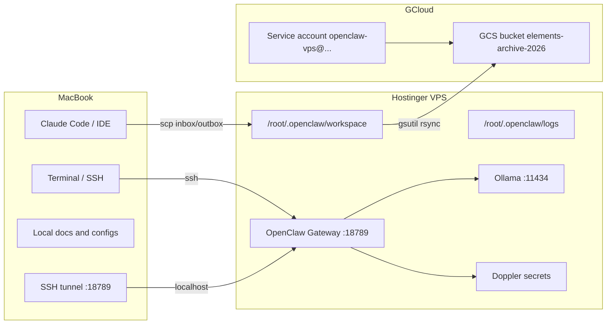

# OpenClaw Triplice Infrastructure Overview (MacBook + Hostinger + GCloud)

## Purpose
Provide a single, accurate, and comprehensive map of the three-tier infrastructure so implementation and debugging are aligned across MacBook, Hostinger VPS, and GCloud.

## Scope
This document maps the current production state and the intended architecture. It explicitly separates verified facts from aspirational design.

## Sources and Precedence
Primary (verified):
- `PROJECTS_all/PROJECT_elements/wave/tools/ai/OPENCLAW_CRITICAL_AUDIT_20260204.md`
- `PROJECTS_all/PROJECT_elements/wave/tools/ai/DIAGNOSTICS.md`
- `PROJECTS_all/PROJECT_elements/wave/tools/ai/ARQUITETURA_REAL.md`

Secondary (aspirational reference):
- `PROJECTS_all/PROJECT_elements/wave/tools/ai/_archive/OPENCLAW_ARCHITECTURE.md`

When sources conflict, prefer the audit and diagnostics.

## Current State Summary (Verified)
- Hostinger VPS is online and runs `openclaw-gateway`.
- OpenClaw config lives at `/root/.openclaw/openclaw.json`.
- Ollama is installed on the VPS, but auth is missing for the agent, so Ollama is not actually used in responses.
- Claude API is the practical primary model because Ollama auth is broken.
- GCS access via `gsutil` is authenticated and functional, but automated cron backup is not confirmed as active.
- MacBook is the control plane for SSH, config edits, and tunnel access.

## Topology (High Level)

## Responsibilities Per Tier

MacBook (control plane)
- SSH to VPS
- Edit and deploy config
- Access dashboard via tunnel
- Create tasks for agent inbox

Hostinger VPS (execution plane)
- OpenClaw gateway and agent runtime
- Local models (Ollama) when auth is correct
- Logs, sessions, and workspace
- WhatsApp integration (via gateway)

GCloud (archive plane)
- Cold storage backups in GCS
- Optional services (Secret Manager, Cloud Run) if later enabled

## Reality vs Intended (Truth Table)

| Area | Intended | Actual (Verified) |
| --- | --- | --- |
| Model routing | Ollama primary, Claude fallback | Claude primary due to Ollama auth missing |
| Mac to VPS sync | Automatic sync bridge | Manual SSH/SCP only |
| GCS backup | Automated daily cron | Auth works, cron not confirmed |
| OpenClaw status | Production stable | Partially functional (model failures) |
